# Architecture Overview

This diagram shows the high-level system architecture of the MCP server implementation in Rust, including all major components and their relationships. The architecture follows a clean separation of concerns with distinct layers for transport, protocol handling, and business logic.

```mermaid
graph TB
    subgraph "Client Layer"
        MC[MCP Inspector Client]
        HC[HTTP Client]
        SC[STDIO Client]
        WC[Web Client<br/>Browser/CORS]
    end

    subgraph "Transport Layer"
        HT[HTTP Transport<br/>Actix Web Server<br/>SSE Streaming]
        ST[STDIO Transport<br/>Subprocess Communication]
        SM[Session Manager<br/>Lifecycle & Cleanup]
        TM_LAYER[Transport Manager<br/>Multi-transport Support]

        HT --> SM
        HT --> TM_LAYER
        ST --> TM_LAYER
    end

    subgraph "Protocol Layer"
        PH[Protocol Handler<br/>JSON-RPC 2.0 Router]
        VM[Validation Module<br/>MCP Spec Compliance]
        PM[Protocol Messages<br/>Request/Response/Notification]

        PH --> VM
        PH --> PM
    end

    subgraph "Server Feature Managers"
        TM[Tool Manager<br/>Dynamic Registration]
        RM[Resource Manager<br/>File System & HTTP]
        PRM[Prompt Manager<br/>Handlebars Templates]
        LM[Logging Manager<br/>Structured Logging]
        CM[Completion Manager<br/>Argument Completion]
    end

    subgraph "Client Feature Managers"
        SAM[Sampling Manager<br/>LLM Integration]
        ROM[Roots Manager<br/>Directory Management]
    end

    subgraph "Business Logic Implementations"
        TH[Tool Handlers<br/>Echo, Calculator, Custom]
        RP[Resource Providers<br/>FileSystem, HTTP, Custom]
        PG[Prompt Generators<br/>Greeting, CodeReview, Custom]

        TM --> TH
        RM --> RP
        PRM --> PG
    end

    subgraph "Configuration & Cross-cutting"
        CFG[Config Manager<br/>TOML Configuration<br/>Validation & Defaults]
        AUTH[Auth Manager<br/>API Key, JWT, Bearer<br/>CORS Support]
        ERR[Error Handler<br/>MCP Error Codes<br/>Structured Responses]
        LOG[Logger<br/>Tracing Framework<br/>Multiple Formats]
    end

    subgraph "Storage & External"
        FS[File System<br/>Resources & Templates<br/>Configuration Files]
        MEM[In-Memory State<br/>Sessions & Cache<br/>Runtime Data]
        EXT[External APIs<br/>HTTP Resources<br/>Remote Services]
    end

    %% Client connections with enhanced styling
    MC -.->|HTTP POST/GET<br/>SSE Streaming| HT
    HC -.->|JSON-RPC over HTTP<br/>Session Management| HT
    WC -.->|CORS-enabled<br/>Web Requests| HT
    SC -.->|STDIN/STDOUT<br/>Line-based Protocol| ST

    %% Transport to Protocol with enhanced arrows
    HT -->|Transport Messages<br/>Session Context| PH
    ST -->|Transport Messages<br/>Process Context| PH
    TM_LAYER -->|Unified Message<br/>Channel| PH

    %% Protocol to Server Features
    PH -->|Tool Requests| TM
    PH -->|Resource Requests| RM
    PH -->|Prompt Requests| PRM
    PH -->|Logging Requests| LM
    PH -->|Completion Requests| CM

    %% Protocol to Client Features
    PH -->|Sampling Requests| SAM
    PH -->|Roots Requests| ROM

    %% Cross-cutting configuration
    CFG -.->|Transport Config| HT
    CFG -.->|Transport Config| ST
    CFG -.->|Server Config| PH
    CFG -.->|Feature Config| TM
    CFG -.->|Feature Config| RM
    CFG -.->|Feature Config| PRM
    CFG -.->|Auth Config| AUTH
    CFG -.->|Logging Config| LOG

    %% Authentication and authorization
    AUTH -.->|Request Validation| HT
    AUTH -.->|Protocol Security| PH
    AUTH -.->|CORS Headers| HT

    %% Error handling
    ERR -.->|Error Responses| PH
    ERR -.->|Tool Errors| TM
    ERR -.->|Resource Errors| RM
    ERR -.->|Prompt Errors| PRM
    ERR -.->|Transport Errors| HT
    ERR -.->|Transport Errors| ST

    %% Logging integration
    LOG -.->|Request Logging| HT
    LOG -.->|Protocol Logging| PH
    LOG -.->|Feature Logging| TM
    LOG -.->|Session Logging| SM

    %% Storage connections
    RP -->|File Access| FS
    RP -->|HTTP Requests| EXT
    SM -->|Session Storage| MEM
    TM -->|Tool Registry| MEM
    PRM -->|Template Files| FS
    CFG -->|Config Files| FS

    %% Enhanced styling with better contrast
    classDef client fill:#e3f2fd,stroke:#1976d2,stroke-width:2px,color:#000
    classDef transport fill:#f3e5f5,stroke:#7b1fa2,stroke-width:2px,color:#000
    classDef protocol fill:#e8f5e8,stroke:#388e3c,stroke-width:2px,color:#000
    classDef serverFeature fill:#fff3e0,stroke:#f57c00,stroke-width:2px,color:#000
    classDef clientFeature fill:#fce4ec,stroke:#c2185b,stroke-width:2px,color:#000
    classDef business fill:#f1f8e9,stroke:#689f38,stroke-width:2px,color:#000
    classDef config fill:#e0f2f1,stroke:#00796b,stroke-width:2px,color:#000
    classDef storage fill:#e8eaf6,stroke:#3f51b5,stroke-width:2px,color:#000

    class MC,HC,SC,WC client
    class HT,ST,SM,TM_LAYER transport
    class PH,VM,PM protocol
    class TM,RM,PRM,LM,CM serverFeature
    class SAM,ROM clientFeature
    class TH,RP,PG business
    class CFG,AUTH,ERR,LOG config
    class FS,MEM,EXT storage
```

## Component Descriptions

### Client Layer
- **MCP Inspector Client**: Official MCP client from modelcontextprotocol/inspector for testing and debugging
- **HTTP Client**: Any HTTP client supporting JSON-RPC over HTTP with optional SSE streaming
- **Web Client**: Browser-based clients with CORS support for web applications

### Transport Layer
- **HTTP Transport**: Actix Web-based HTTP server with Server-Sent Events (SSE) streaming support
- **Session Manager**: HTTP session lifecycle management with automatic cleanup and timeout handling
- **Transport Manager**: Unified transport abstraction supporting HTTP transport

### Protocol Layer
- **Protocol Handler**: Central JSON-RPC 2.0 message router and processor with comprehensive method support
- **Validation Module**: Request/response validation against MCP specification with detailed error reporting
- **Protocol Messages**: MCP message type definitions, serialization, and batch request support

### Server Feature Managers
- **Tool Manager**: Dynamic tool registration and execution framework with validation and error handling
- **Resource Manager**: File system and HTTP resource access with subscription support and caching
- **Prompt Manager**: Template-based prompt generation using Handlebars with argument validation
- **Logging Manager**: Structured logging with configurable levels and request/response tracking
- **Completion Manager**: Argument completion for prompts and resources with intelligent suggestions

### Client Feature Managers
- **Sampling Manager**: LLM sampling integration with multiple provider support and message creation
- **Roots Manager**: Root directory management for secure file access and path validation

### Business Logic Implementations
- **Tool Handlers**: Concrete tool implementations (Echo, Calculator, custom tools) with async execution
- **Resource Providers**: File system and HTTP resource access implementations with caching and validation
- **Prompt Generators**: Template-based prompt generation implementations with context-aware rendering

### Configuration & Cross-cutting Concerns
- **Config Manager**: TOML configuration loading, validation, and runtime updates with environment variable support
- **Auth Manager**: Authentication and authorization (API Key, JWT, Bearer tokens) with CORS configuration
- **Error Handler**: Structured error handling with proper MCP error codes and detailed error responses
- **Logger**: Tracing-based structured logging with multiple output formats and configurable levels

### Storage & External Integration
- **File System**: Local file access for resources, templates, and configuration files with watch capabilities
- **In-Memory State**: Session storage, caching, tool registry, and runtime state management
- **External APIs**: HTTP-based external resource access with connection pooling and retry logic

## Key Design Principles

1. **Separation of Concerns**: Clear boundaries between transport, protocol, and business logic layers
2. **Modularity**: Pluggable components with well-defined interfaces and dependency injection
3. **Thread Safety**: All components designed for concurrent access using Rust's ownership system
4. **Error Handling**: Comprehensive error propagation with structured responses and proper MCP error codes
5. **Configuration**: Flexible TOML-based configuration with validation, defaults, and runtime updates
6. **Extensibility**: Dynamic registration system for tools, resources, and prompts with hot-reloading
7. **Performance**: Async/await throughout with efficient resource management and connection pooling
8. **Security**: Built-in authentication, authorization, and CORS support with configurable policies
9. **Observability**: Comprehensive logging, tracing, and metrics with structured output formats
10. **Compatibility**: Full MCP specification compliance with extensive testing against MCP Inspector

## Implementation Highlights

- **Rust Language**: Memory safety, performance, and excellent async support
- **Actix Web Framework**: High-performance HTTP server with built-in SSE support
- **Tokio Runtime**: Efficient async runtime with excellent concurrency primitives
- **Serde Serialization**: Type-safe JSON serialization with comprehensive error handling
- **Tracing Framework**: Structured logging with multiple output formats and filtering
- **Configuration Management**: TOML-based configuration with validation and environment variable support
