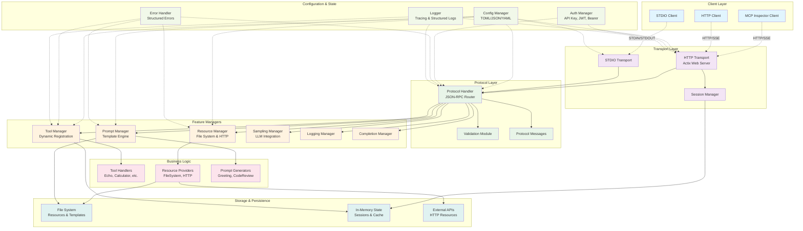

# Architecture Overview

This diagram shows the high-level system architecture of the MCP server implementation, including all major components and their relationships.

## Component Descriptions

### Client Layer
- **MCP Inspector Client**: Official MCP client for testing and debugging
- **HTTP Client**: Any HTTP client supporting JSON-RPC over HTTP/SSE
- **STDIO Client**: Clients using standard input/output communication

### Transport Layer
- **HTTP Transport**: Actix Web-based HTTP server with SSE support
- **STDIO Transport**: Standard input/output transport for subprocess communication
- **Session Manager**: HTTP session lifecycle management with automatic cleanup

### Protocol Layer
- **Protocol Handler**: Central JSON-RPC message router and processor
- **Validation Module**: Request/response validation against MCP specification
- **Protocol Messages**: MCP message type definitions and serialization

### Feature Managers
- **Tool Manager**: Dynamic tool registration and execution framework
- **Resource Manager**: File system and HTTP resource access with subscriptions
- **Prompt Manager**: Template-based prompt generation with Handlebars
- **Sampling Manager**: LLM sampling and message creation capabilities
- **Logging Manager**: Structured logging with configurable levels
- **Completion Manager**: Argument completion for prompts and resources

### Business Logic
- **Tool Handlers**: Concrete tool implementations (Echo, Calculator, etc.)
- **Resource Providers**: File system and HTTP resource access implementations
- **Prompt Generators**: Template-based prompt generation implementations

### Configuration & State
- **Config Manager**: TOML/JSON/YAML configuration loading and validation
- **Auth Manager**: Authentication and authorization (API Key, JWT, Bearer)
- **Error Handler**: Structured error handling and JSON-RPC error responses
- **Logger**: Tracing-based structured logging with multiple output formats

### Storage & Persistence
- **File System**: Local file access for resources and templates
- **In-Memory State**: Session storage, caching, and runtime state
- **External APIs**: HTTP-based external resource access

## Key Design Principles

1. **Separation of Concerns**: Clear boundaries between transport, protocol, and business logic
2. **Modularity**: Pluggable components with well-defined interfaces
3. **Thread Safety**: All components designed for concurrent access
4. **Error Handling**: Comprehensive error propagation with structured responses
5. **Configuration**: Flexible configuration with sensible defaults
6. **Extensibility**: Dynamic registration system for tools and resources
