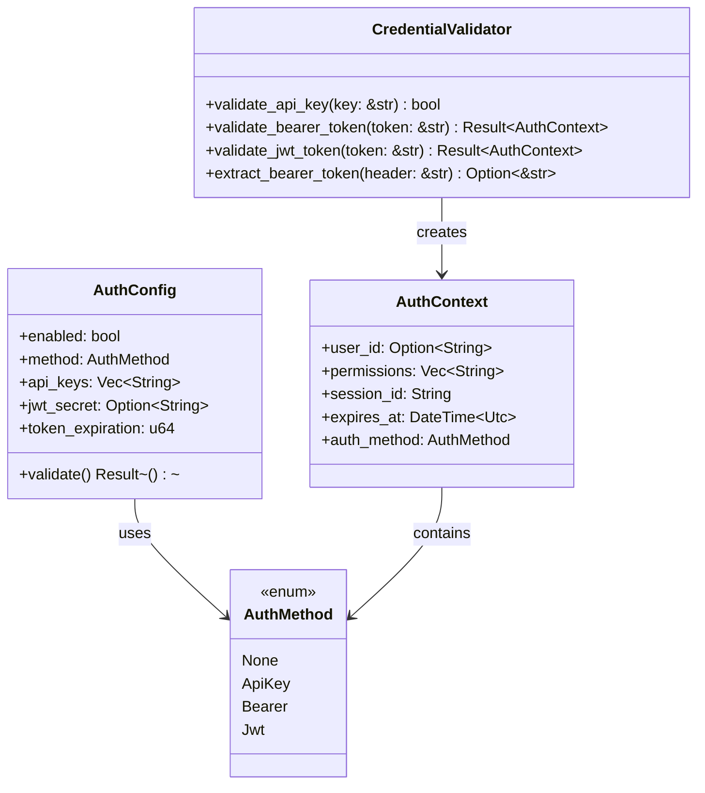

# Authentication Flow

This diagram shows the security mechanisms and authorization flow implemented in the MCP server.

```mermaid
flowchart TD
    subgraph "Authentication Methods"
        NONE[None - No Auth]
        API[API Key]
        BEARER[Bearer Token]
        JWT[JWT Token]
    end

    subgraph "Request Processing"
        REQ[Incoming Request]
        EXTRACT[Extract Credentials]
        VALIDATE[Validate Credentials]
        AUTHORIZE[Check Authorization]
        PROCEED[Proceed with Request]
    end

    subgraph "Credential Sources"
        HEADER[Authorization Header]
        QUERY[Query Parameter]
        COOKIE[Cookie]
        CUSTOM[Custom Header]
    end

    subgraph "Validation Process"
        CHECK_FORMAT[Check Format]
        VERIFY_SIG[Verify Signature]
        CHECK_EXP[Check Expiration]
        LOOKUP_KEY[Lookup API Key]
        VALIDATE_JWT[Validate JWT Claims]
    end

    subgraph "Authorization Levels"
        PUBLIC[Public Access]
        AUTHENTICATED[Authenticated User]
        ADMIN[Admin Access]
        SYSTEM[System Access]
    end

    subgraph "Security Features"
        CORS[CORS Validation]
        RATE_LIMIT[Rate Limiting]
        SESSION[Session Management]
        AUDIT[Audit Logging]
    end

    %% Flow connections
    REQ --> EXTRACT
    EXTRACT --> HEADER
    EXTRACT --> QUERY
    EXTRACT --> COOKIE
    EXTRACT --> CUSTOM

    EXTRACT --> VALIDATE
    VALIDATE --> CHECK_FORMAT
    VALIDATE --> VERIFY_SIG
    VALIDATE --> CHECK_EXP
    VALIDATE --> LOOKUP_KEY
    VALIDATE --> VALIDATE_JWT

    VALIDATE --> AUTHORIZE
    AUTHORIZE --> PUBLIC
    AUTHORIZE --> AUTHENTICATED
    AUTHORIZE --> ADMIN
    AUTHORIZE --> SYSTEM

    AUTHORIZE --> PROCEED

    %% Auth method connections
    NONE --> PROCEED
    API --> LOOKUP_KEY
    BEARER --> CHECK_FORMAT
    JWT --> VALIDATE_JWT

    %% Security features
    REQ --> CORS
    REQ --> RATE_LIMIT
    PROCEED --> SESSION
    VALIDATE --> AUDIT

    %% Styling
    classDef authMethod fill:#e3f2fd
    classDef processing fill:#f3e5f5
    classDef source fill:#e8f5e8
    classDef validation fill:#fff3e0
    classDef authorization fill:#fce4ec
    classDef security fill:#f1f8e9

    class NONE,API,BEARER,JWT authMethod
    class REQ,EXTRACT,VALIDATE,AUTHORIZE,PROCEED processing
    class HEADER,QUERY,COOKIE,CUSTOM source
    class CHECK_FORMAT,VERIFY_SIG,CHECK_EXP,LOOKUP_KEY,VALIDATE_JWT validation
    class PUBLIC,AUTHENTICATED,ADMIN,SYSTEM authorization
    class CORS,RATE_LIMIT,SESSION,AUDIT security
```



## Authentication Sequence

```mermaid
sequenceDiagram
    participant Client as MCP Client
    participant Middleware as Auth Middleware
    participant Config as Auth Config
    participant Validator as Credential Validator
    participant Session as Session Manager
    participant Handler as Request Handler
    participant Audit as Audit Logger

    Note over Client, Audit: Authentication Flow

    %% Request with Authentication
    Client->>+Middleware: HTTP Request with Credentials
    
    %% Check if authentication is enabled
    Middleware->>+Config: Check Auth Configuration
    Config->>Config: Get Auth Method
    Config->>-Middleware: Auth Method & Settings
    
    alt Authentication Disabled
        Middleware->>+Handler: Process Request (No Auth)
        Handler->>-Middleware: Response
        Middleware->>-Client: Response
    end

    %% Extract credentials
    Middleware->>Middleware: Extract Credentials from Request
    
    alt No Credentials Provided
        Middleware->>+Audit: Log Auth Attempt (No Credentials)
        Audit->>-Middleware: Logged
        Middleware-->>Client: 401 Unauthorized
    end

    %% Validate credentials based on method
    alt API Key Authentication
        Middleware->>+Validator: Validate API Key
        Validator->>+Config: Get Valid API Keys
        Config->>-Validator: API Key List
        Validator->>Validator: Check Key in List
        
        alt Invalid API Key
            Validator-->>Middleware: Invalid Key
            Middleware->>+Audit: Log Failed Auth (Invalid API Key)
            Audit->>-Middleware: Logged
            Middleware-->>Client: 401 Unauthorized
        end
        
        Validator->>-Middleware: Valid API Key
    
    else Bearer Token Authentication
        Middleware->>+Validator: Validate Bearer Token
        Validator->>Validator: Check Token Format
        Validator->>Validator: Validate Token (Custom Logic)
        
        alt Invalid Bearer Token
            Validator-->>Middleware: Invalid Token
            Middleware->>+Audit: Log Failed Auth (Invalid Bearer)
            Audit->>-Middleware: Logged
            Middleware-->>Client: 401 Unauthorized
        end
        
        Validator->>-Middleware: Valid Bearer Token
    
    else JWT Authentication
        Middleware->>+Validator: Validate JWT Token
        Validator->>+Config: Get JWT Secret
        Config->>-Validator: JWT Secret
        Validator->>Validator: Verify JWT Signature
        Validator->>Validator: Check JWT Expiration
        Validator->>Validator: Validate JWT Claims
        
        alt Invalid JWT
            Validator-->>Middleware: Invalid JWT
            Middleware->>+Audit: Log Failed Auth (Invalid JWT)
            Audit->>-Middleware: Logged
            Middleware-->>Client: 401 Unauthorized
        end
        
        Validator->>-Middleware: Valid JWT with Claims
    end

    %% Session management
    Middleware->>+Session: Create/Update Session
    Session->>Session: Store Auth Context
    Session->>Session: Set Session Expiration
    Session->>-Middleware: Session ID

    %% Authorization check
    Middleware->>Middleware: Check Resource Authorization
    alt Insufficient Permissions
        Middleware->>+Audit: Log Authorization Failure
        Audit->>-Middleware: Logged
        Middleware-->>Client: 403 Forbidden
    end

    %% Successful authentication
    Middleware->>+Audit: Log Successful Auth
    Audit->>-Middleware: Logged
    
    Middleware->>+Handler: Process Authenticated Request
    Handler->>Handler: Execute Business Logic
    Handler->>-Middleware: Response
    
    Middleware->>-Client: Authenticated Response

    Note over Client, Audit: CORS and Security Headers

    %% CORS validation
    rect rgb(240, 255, 240)
        Client->>Middleware: Preflight OPTIONS Request
        Middleware->>Middleware: Validate Origin
        Middleware->>+Config: Get CORS Configuration
        Config->>-Middleware: Allowed Origins
        
        alt Origin Not Allowed
            Middleware-->>Client: 403 Forbidden (CORS)
        end
        
        Middleware->>Client: 200 OK with CORS Headers
    end

    %% Rate limiting
    rect rgb(255, 240, 240)
        Client->>Middleware: Multiple Requests
        Middleware->>Middleware: Check Rate Limits
        
        alt Rate Limit Exceeded
            Middleware->>+Audit: Log Rate Limit Violation
            Audit->>-Middleware: Logged
            Middleware-->>Client: 429 Too Many Requests
        end
    end
```

## Authentication Configuration



## Security Implementation Details

### 1. API Key Authentication
```rust
pub fn validate_api_key(provided_key: &str, valid_keys: &[String]) -> bool {
    // Constant-time comparison to prevent timing attacks
    valid_keys.iter().any(|key| {
        use subtle::ConstantTimeEq;
        provided_key.as_bytes().ct_eq(key.as_bytes()).into()
    })
}
```

### 2. JWT Token Validation
```rust
pub fn validate_jwt_token(token: &str, secret: &str) -> Result<AuthContext> {
    use jsonwebtoken::{decode, DecodingKey, Validation, Algorithm};
    
    let key = DecodingKey::from_secret(secret.as_ref());
    let validation = Validation::new(Algorithm::HS256);
    
    match decode::<Claims>(token, &key, &validation) {
        Ok(token_data) => {
            let claims = token_data.claims;
            
            // Check custom claims
            if claims.exp < Utc::now().timestamp() {
                return Err(McpError::Auth("Token expired".to_string()));
            }
            
            Ok(AuthContext {
                user_id: claims.sub,
                permissions: claims.permissions.unwrap_or_default(),
                session_id: generate_session_id(),
                expires_at: DateTime::from_timestamp(claims.exp, 0)
                    .unwrap_or_else(|| Utc::now()),
                auth_method: AuthMethod::Jwt,
            })
        }
        Err(e) => Err(McpError::Auth(format!("JWT validation failed: {}", e))),
    }
}
```

### 3. Bearer Token Extraction
```rust
pub fn extract_bearer_token(auth_header: &str) -> Option<&str> {
    const BEARER_PREFIX: &str = "Bearer ";
    
    if auth_header.starts_with(BEARER_PREFIX) {
        Some(&auth_header[BEARER_PREFIX.len()])
    } else {
        None
    }
}
```

### 4. CORS Validation
```rust
fn is_origin_allowed(origin: &str, allowed_origins: &[String]) -> bool {
    // Allow wildcard or specific origins
    allowed_origins.iter().any(|allowed| {
        allowed == "*" || allowed == origin
    })
}
```

## Authorization Levels

### 1. Public Access
- No authentication required
- Access to public endpoints only
- Read-only operations

### 2. Authenticated User
- Valid credentials required
- Access to user-specific resources
- Standard operations

### 3. Admin Access
- Admin-level credentials required
- Access to management endpoints
- System configuration operations

### 4. System Access
- System-level credentials required
- Internal service communication
- Full system access

## Security Headers

### 1. CORS Headers
```http
Access-Control-Allow-Origin: https://example.com
Access-Control-Allow-Methods: GET, POST, DELETE, OPTIONS
Access-Control-Allow-Headers: Content-Type, Authorization, Mcp-Session-Id
Access-Control-Max-Age: 86400
```

### 2. Security Headers
```http
X-Content-Type-Options: nosniff
X-Frame-Options: DENY
X-XSS-Protection: 1; mode=block
Strict-Transport-Security: max-age=31536000; includeSubDomains
```

### 3. Session Headers
```http
Mcp-Session-Id: 550e8400-e29b-41d4-a716-446655440000
Set-Cookie: session_id=abc123; HttpOnly; Secure; SameSite=Strict
```

## Rate Limiting

### 1. Request Rate Limiting
```rust
struct RateLimiter {
    requests: HashMap<String, VecDeque<Instant>>,
    max_requests: usize,
    window_duration: Duration,
}

impl RateLimiter {
    fn check_rate_limit(&mut self, client_id: &str) -> bool {
        let now = Instant::now();
        let requests = self.requests.entry(client_id.to_string())
            .or_insert_with(VecDeque::new);
        
        // Remove old requests outside the window
        while let Some(&front) = requests.front() {
            if now.duration_since(front) > self.window_duration {
                requests.pop_front();
            } else {
                break;
            }
        }
        
        // Check if under limit
        if requests.len() < self.max_requests {
            requests.push_back(now);
            true
        } else {
            false
        }
    }
}
```

### 2. Connection Limiting
- Maximum concurrent connections per client
- Session timeout enforcement
- Resource usage monitoring

## Audit Logging

### 1. Authentication Events
```rust
#[derive(Debug, Serialize)]
struct AuthEvent {
    timestamp: DateTime<Utc>,
    event_type: AuthEventType,
    client_ip: IpAddr,
    user_agent: Option<String>,
    session_id: Option<String>,
    user_id: Option<String>,
    success: bool,
    error_message: Option<String>,
}

enum AuthEventType {
    Login,
    Logout,
    TokenRefresh,
    PermissionDenied,
    RateLimitExceeded,
}
```

### 2. Security Monitoring
- Failed authentication attempts
- Suspicious activity patterns
- Rate limit violations
- CORS policy violations

## Best Practices

### 1. Credential Management
- **Secure Storage**: Store secrets securely (environment variables, key management)
- **Rotation**: Regular credential rotation
- **Least Privilege**: Minimal required permissions
- **Expiration**: Time-limited tokens

### 2. Session Security
- **Secure Cookies**: HttpOnly, Secure, SameSite attributes
- **Session Timeout**: Automatic session expiration
- **Session Invalidation**: Proper logout handling
- **Session Fixation**: Generate new session IDs on auth

### 3. Transport Security
- **HTTPS Only**: Enforce encrypted connections
- **Certificate Validation**: Proper TLS certificate handling
- **HSTS**: HTTP Strict Transport Security
- **Certificate Pinning**: Pin certificates for critical connections

### 4. Input Validation
- **Sanitization**: Clean all input data
- **Length Limits**: Prevent buffer overflow attacks
- **Type Validation**: Ensure correct data types
- **Encoding**: Proper character encoding handling
