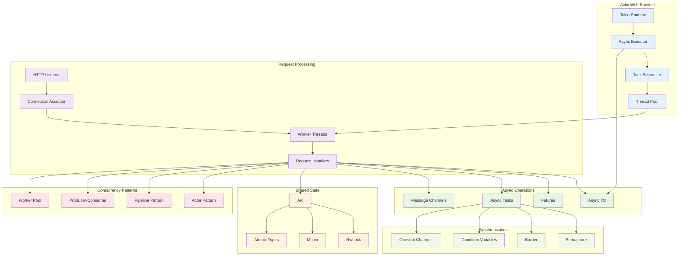
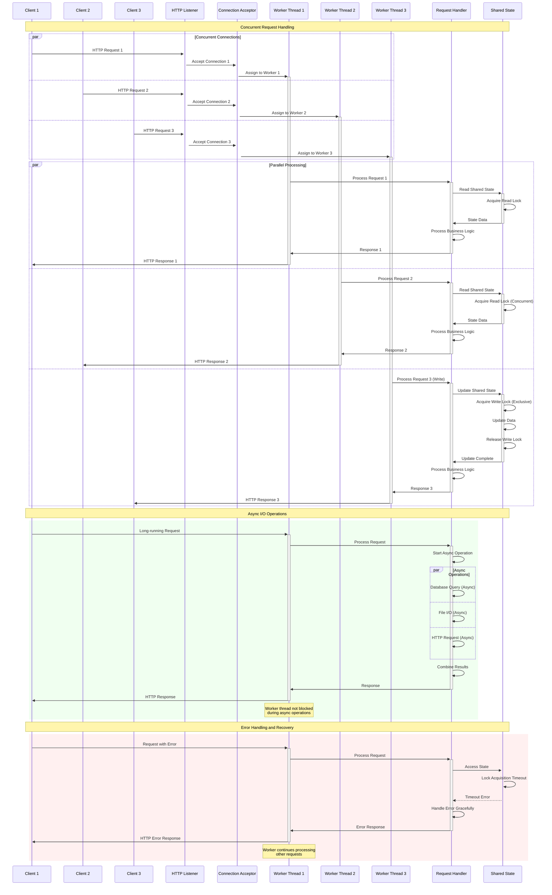
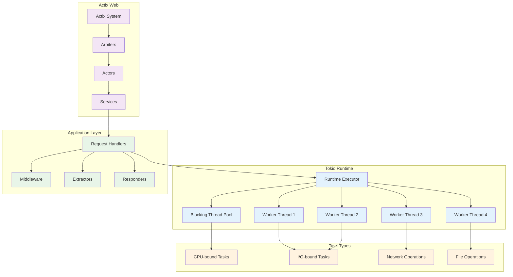

# Concurrency Model

This diagram shows how the Actix Web framework handles concurrent requests and the threading model used in the MCP server.



## Actix Web Concurrency Architecture



## Threading Model



## Shared State Management

```rust
// Example of thread-safe shared state
use std::sync::Arc;
use tokio::sync::RwLock;

#[derive(Clone)]
pub struct AppState {
    pub session_manager: Arc<SessionManager>,
    pub tool_manager: Arc<ToolManager>,
    pub config: Arc<RwLock<Config>>,
    pub metrics: Arc<AtomicMetrics>,
}

// Request handler with shared state access
async fn handle_request(
    req: HttpRequest,
    state: web::Data<AppState>,
) -> Result<HttpResponse> {
    // Multiple readers can access concurrently
    let sessions = state.session_manager.list_sessions().await;
    
    // Atomic operations for metrics
    state.metrics.increment_requests();
    
    // Configuration access with read lock
    let config = state.config.read().await;
    let timeout = config.server.request_timeout;
    drop(config); // Release lock early
    
    // Process request...
    Ok(HttpResponse::Ok().json(response))
}
```

## Concurrency Patterns Implementation

### 1. Actor Pattern
```rust
use actix::prelude::*;

#[derive(Message)]
#[rtype(result = "Result<String>")]
pub struct ProcessTool {
    pub name: String,
    pub input: serde_json::Value,
}

pub struct ToolActor {
    tool_manager: Arc<ToolManager>,
}

impl Actor for ToolActor {
    type Context = Context<Self>;
}

impl Handler<ProcessTool> for ToolActor {
    type Result = ResponseActFuture<Self, Result<String>>;

    fn handle(&mut self, msg: ProcessTool, _ctx: &mut Self::Context) -> Self::Result {
        let tool_manager = self.tool_manager.clone();
        
        Box::pin(async move {
            tool_manager.execute_tool(&msg.name, msg.input).await
                .map(|result| result.to_string())
        }.into_actor(self))
    }
}
```

### 2. Pipeline Pattern
```rust
pub struct RequestPipeline {
    stages: Vec<Box<dyn PipelineStage>>,
}

#[async_trait]
pub trait PipelineStage: Send + Sync {
    async fn process(&self, request: Request) -> Result<Request>;
}

impl RequestPipeline {
    pub async fn process(&self, mut request: Request) -> Result<Request> {
        for stage in &self.stages {
            request = stage.process(request).await?;
        }
        Ok(request)
    }
}

// Usage in request handler
async fn handle_request(req: HttpRequest) -> Result<HttpResponse> {
    let pipeline = RequestPipeline::new()
        .add_stage(AuthenticationStage::new())
        .add_stage(ValidationStage::new())
        .add_stage(ProcessingStage::new());
    
    let processed_request = pipeline.process(request).await?;
    Ok(HttpResponse::Ok().json(processed_request))
}
```

### 3. Producer-Consumer Pattern
```rust
use tokio::sync::mpsc;

pub struct TaskQueue {
    sender: mpsc::Sender<Task>,
    workers: Vec<tokio::task::JoinHandle<()>>,
}

impl TaskQueue {
    pub fn new(worker_count: usize) -> Self {
        let (sender, receiver) = mpsc::channel(1000);
        let receiver = Arc::new(Mutex::new(receiver));
        
        let mut workers = Vec::new();
        for i in 0..worker_count {
            let receiver = receiver.clone();
            let worker = tokio::spawn(async move {
                Self::worker_loop(i, receiver).await;
            });
            workers.push(worker);
        }
        
        Self { sender, workers }
    }
    
    pub async fn submit_task(&self, task: Task) -> Result<()> {
        self.sender.send(task).await
            .map_err(|_| McpError::InternalError("Task queue full".to_string()))
    }
    
    async fn worker_loop(
        worker_id: usize,
        receiver: Arc<Mutex<mpsc::Receiver<Task>>>,
    ) {
        loop {
            let task = {
                let mut rx = receiver.lock().await;
                rx.recv().await
            };
            
            match task {
                Some(task) => {
                    if let Err(e) = task.execute().await {
                        error!("Worker {} task failed: {}", worker_id, e);
                    }
                }
                None => break, // Channel closed
            }
        }
    }
}
```

### 4. Circuit Breaker Pattern
```rust
use std::sync::atomic::{AtomicUsize, AtomicBool, Ordering};
use std::time::{Duration, Instant};

pub struct CircuitBreaker {
    failure_count: AtomicUsize,
    last_failure_time: Arc<RwLock<Option<Instant>>>,
    is_open: AtomicBool,
    failure_threshold: usize,
    timeout: Duration,
}

impl CircuitBreaker {
    pub async fn call<F, T>(&self, operation: F) -> Result<T>
    where
        F: Future<Output = Result<T>>,
    {
        // Check if circuit is open
        if self.is_open.load(Ordering::Relaxed) {
            if self.should_attempt_reset().await {
                self.is_open.store(false, Ordering::Relaxed);
            } else {
                return Err(McpError::InternalError("Circuit breaker open".to_string()));
            }
        }
        
        match operation.await {
            Ok(result) => {
                self.on_success();
                Ok(result)
            }
            Err(e) => {
                self.on_failure().await;
                Err(e)
            }
        }
    }
    
    fn on_success(&self) {
        self.failure_count.store(0, Ordering::Relaxed);
    }
    
    async fn on_failure(&self) {
        let failures = self.failure_count.fetch_add(1, Ordering::Relaxed) + 1;
        
        if failures >= self.failure_threshold {
            self.is_open.store(true, Ordering::Relaxed);
            let mut last_failure = self.last_failure_time.write().await;
            *last_failure = Some(Instant::now());
        }
    }
    
    async fn should_attempt_reset(&self) -> bool {
        let last_failure = self.last_failure_time.read().await;
        match *last_failure {
            Some(time) => time.elapsed() > self.timeout,
            None => false,
        }
    }
}
```

## Performance Optimization

### 1. Connection Pooling
```rust
pub struct ConnectionPool {
    pool: Arc<RwLock<Vec<Connection>>>,
    max_size: usize,
    current_size: AtomicUsize,
}

impl ConnectionPool {
    pub async fn get_connection(&self) -> Result<Connection> {
        // Try to get existing connection
        {
            let mut pool = self.pool.write().await;
            if let Some(conn) = pool.pop() {
                return Ok(conn);
            }
        }
        
        // Create new connection if under limit
        let current = self.current_size.load(Ordering::Relaxed);
        if current < self.max_size {
            self.current_size.fetch_add(1, Ordering::Relaxed);
            Connection::new().await
        } else {
            Err(McpError::InternalError("Connection pool exhausted".to_string()))
        }
    }
    
    pub async fn return_connection(&self, conn: Connection) {
        let mut pool = self.pool.write().await;
        pool.push(conn);
    }
}
```

### 2. Request Batching
```rust
pub struct BatchProcessor<T> {
    batch: Arc<Mutex<Vec<T>>>,
    batch_size: usize,
    timeout: Duration,
    processor: Arc<dyn Fn(Vec<T>) -> BoxFuture<'static, Result<()>> + Send + Sync>,
}

impl<T> BatchProcessor<T> {
    pub async fn add_item(&self, item: T) {
        let should_process = {
            let mut batch = self.batch.lock().await;
            batch.push(item);
            batch.len() >= self.batch_size
        };
        
        if should_process {
            self.process_batch().await;
        }
    }
    
    async fn process_batch(&self) {
        let batch = {
            let mut batch_guard = self.batch.lock().await;
            std::mem::take(&mut *batch_guard)
        };
        
        if !batch.is_empty() {
            if let Err(e) = (self.processor)(batch).await {
                error!("Batch processing failed: {}", e);
            }
        }
    }
}
```

### 3. Async Resource Management
```rust
pub struct AsyncResourceManager {
    resources: Arc<RwLock<HashMap<String, Arc<dyn AsyncResource>>>>,
    cleanup_interval: Duration,
}

#[async_trait]
pub trait AsyncResource: Send + Sync {
    async fn is_healthy(&self) -> bool;
    async fn cleanup(&self) -> Result<()>;
}

impl AsyncResourceManager {
    pub fn new(cleanup_interval: Duration) -> Self {
        let manager = Self {
            resources: Arc::new(RwLock::new(HashMap::new())),
            cleanup_interval,
        };
        
        // Start cleanup task
        let resources = manager.resources.clone();
        let interval = cleanup_interval;
        tokio::spawn(async move {
            let mut interval_timer = tokio::time::interval(interval);
            loop {
                interval_timer.tick().await;
                Self::cleanup_resources(&resources).await;
            }
        });
        
        manager
    }
    
    async fn cleanup_resources(
        resources: &Arc<RwLock<HashMap<String, Arc<dyn AsyncResource>>>>
    ) {
        let resource_list = {
            let resources_guard = resources.read().await;
            resources_guard.values().cloned().collect::<Vec<_>>()
        };
        
        for resource in resource_list {
            if !resource.is_healthy().await {
                if let Err(e) = resource.cleanup().await {
                    error!("Resource cleanup failed: {}", e);
                }
            }
        }
    }
}
```

## Monitoring and Metrics

### 1. Concurrency Metrics
```rust
#[derive(Debug)]
pub struct ConcurrencyMetrics {
    pub active_requests: AtomicUsize,
    pub total_requests: AtomicUsize,
    pub average_response_time: AtomicU64,
    pub thread_pool_utilization: AtomicU8,
    pub queue_depth: AtomicUsize,
}

impl ConcurrencyMetrics {
    pub fn record_request_start(&self) {
        self.active_requests.fetch_add(1, Ordering::Relaxed);
        self.total_requests.fetch_add(1, Ordering::Relaxed);
    }
    
    pub fn record_request_end(&self, duration: Duration) {
        self.active_requests.fetch_sub(1, Ordering::Relaxed);
        
        // Update average response time (simplified)
        let duration_ms = duration.as_millis() as u64;
        self.average_response_time.store(duration_ms, Ordering::Relaxed);
    }
}
```

### 2. Performance Monitoring
```rust
pub struct PerformanceMonitor {
    metrics: Arc<ConcurrencyMetrics>,
    alert_thresholds: AlertThresholds,
}

impl PerformanceMonitor {
    pub async fn check_performance(&self) -> PerformanceReport {
        let active = self.metrics.active_requests.load(Ordering::Relaxed);
        let total = self.metrics.total_requests.load(Ordering::Relaxed);
        let avg_time = self.metrics.average_response_time.load(Ordering::Relaxed);
        
        PerformanceReport {
            active_requests: active,
            total_requests: total,
            average_response_time_ms: avg_time,
            alerts: self.check_alerts(active, avg_time),
        }
    }
    
    fn check_alerts(&self, active: usize, avg_time: u64) -> Vec<Alert> {
        let mut alerts = Vec::new();
        
        if active > self.alert_thresholds.max_active_requests {
            alerts.push(Alert::HighConcurrency(active));
        }
        
        if avg_time > self.alert_thresholds.max_response_time_ms {
            alerts.push(Alert::SlowResponse(avg_time));
        }
        
        alerts
    }
}
```

## Best Practices

### 1. Async Programming
- **Avoid Blocking**: Use async I/O operations
- **Task Spawning**: Spawn CPU-intensive tasks to blocking thread pool
- **Resource Management**: Proper cleanup of async resources
- **Error Handling**: Graceful error handling in async contexts

### 2. Shared State
- **Minimize Contention**: Use fine-grained locking
- **Lock Duration**: Hold locks for minimal time
- **Lock-Free Operations**: Use atomic operations where possible
- **Immutable Data**: Prefer immutable data structures

### 3. Performance
- **Connection Pooling**: Reuse expensive resources
- **Batching**: Batch operations to reduce overhead
- **Caching**: Cache frequently accessed data
- **Monitoring**: Continuous performance monitoring

### 4. Scalability
- **Horizontal Scaling**: Design for multiple instances
- **Load Balancing**: Distribute load across workers
- **Resource Limits**: Set appropriate resource limits
- **Graceful Degradation**: Handle overload gracefully
