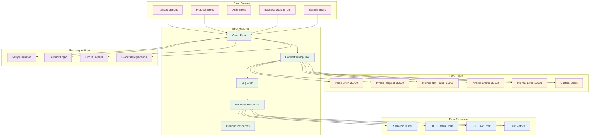
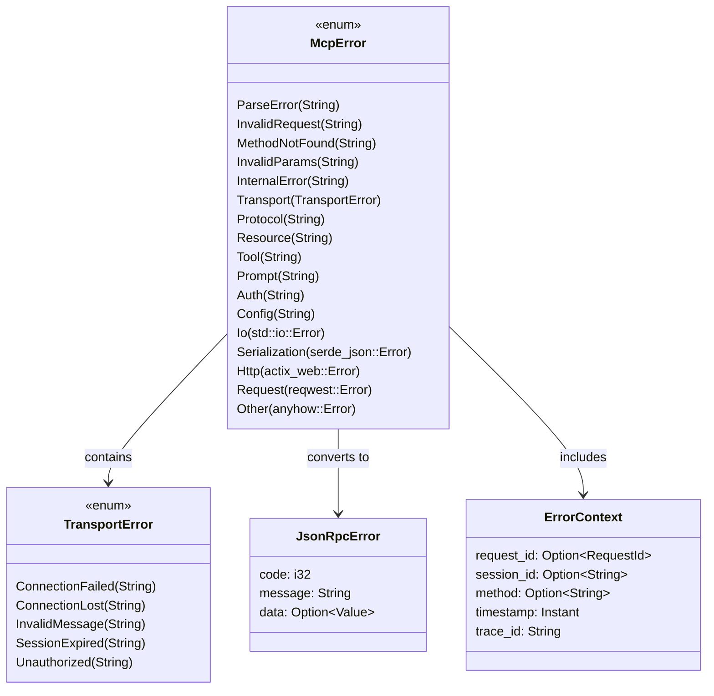

# Error Handling Flow

This diagram shows error propagation and handling throughout the MCP server system.



## Error Handling Sequence

```mermaid
sequenceDiagram
    participant Client as MCP Client
    participant Transport as Transport Layer
    participant Handler as Protocol Handler
    participant Feature as Feature Manager
    participant Logger as Error Logger
    participant Monitor as Error Monitor

    Note over Client, Monitor: Error Handling Flow

    %% Transport Error
    rect rgb(255, 240, 240)
        Client->>+Transport: Invalid HTTP Request
        Transport->>Transport: Parse Request
        Transport->>Transport: Detect Parse Error
        Transport->>+Logger: Log Transport Error
        Logger->>Logger: Record Error Details
        Logger->>-Transport: Logged
        Transport->>+Monitor: Update Error Metrics
        Monitor->>Monitor: Increment Parse Error Count
        Monitor->>-Transport: Metrics Updated
        Transport-->>Client: 400 Bad Request
    end

    %% Protocol Error
    rect rgb(255, 240, 240)
        Client->>+Transport: Valid HTTP, Invalid JSON-RPC
        Transport->>+Handler: Process Message
        Handler->>Handler: Parse JSON-RPC
        Handler->>Handler: Detect Invalid Request
        Handler->>+Logger: Log Protocol Error
        Logger->>Logger: Record Error Context
        Logger->>-Handler: Logged
        Handler->>Handler: Create JSON-RPC Error Response
        Handler->>-Transport: Error Response
        Transport->>+Monitor: Update Metrics
        Monitor->>-Transport: Updated
        Transport-->>Client: 200 OK (JSON-RPC Error)
    end

    %% Authentication Error
    rect rgb(255, 240, 240)
        Client->>+Transport: Request with Invalid Auth
        Transport->>Transport: Validate Authentication
        Transport->>Transport: Detect Auth Failure
        Transport->>+Logger: Log Auth Error
        Logger->>Logger: Record Security Event
        Logger->>-Transport: Logged
        Transport->>+Monitor: Update Security Metrics
        Monitor->>Monitor: Increment Auth Failure Count
        Monitor->>-Transport: Updated
        Transport-->>Client: 401 Unauthorized
    end

    %% Business Logic Error
    rect rgb(255, 240, 240)
        Client->>+Transport: Valid Request
        Transport->>+Handler: Process Message
        Handler->>+Feature: Execute Business Logic
        Feature->>Feature: Process Request
        Feature->>Feature: Encounter Business Error
        Feature->>+Logger: Log Business Error
        Logger->>Logger: Record Error Details
        Logger->>-Feature: Logged
        Feature-->>Handler: McpError::Tool("Tool not found")
        Handler->>Handler: Convert to JSON-RPC Error
        Handler->>+Logger: Log Error Conversion
        Logger->>-Handler: Logged
        Handler->>-Transport: JSON-RPC Error Response
        Transport->>+Monitor: Update Metrics
        Monitor->>-Transport: Updated
        Transport-->>Client: 200 OK (JSON-RPC Error)
    end

    %% System Error with Recovery
    rect rgb(255, 240, 240)
        Client->>+Transport: Request
        Transport->>+Handler: Process Message
        Handler->>+Feature: Execute Logic
        Feature->>Feature: System Resource Error
        Feature->>+Logger: Log System Error
        Logger->>Logger: Record Critical Error
        Logger->>-Feature: Logged
        Feature->>Feature: Attempt Recovery
        
        alt Recovery Successful
            Feature->>Feature: Fallback Logic
            Feature->>Handler: Success Response
            Handler->>Transport: JSON-RPC Response
            Transport-->>Client: 200 OK (Success)
        else Recovery Failed
            Feature-->>Handler: McpError::Internal("System error")
            Handler->>Handler: Convert to JSON-RPC Error
            Handler->>+Logger: Log Recovery Failure
            Logger->>-Handler: Logged
            Handler->>-Transport: JSON-RPC Error Response
            Transport->>+Monitor: Update Critical Metrics
            Monitor->>Monitor: Trigger Alert
            Monitor->>-Transport: Alert Sent
            Transport-->>Client: 200 OK (JSON-RPC Error)
        end
        
        Handler->>-Feature: Processing Complete
        Feature->>-Handler: Cleanup Complete
    end

    Note over Client, Monitor: Error Recovery Patterns

    %% Circuit Breaker Pattern
    rect rgb(240, 255, 240)
        Feature->>Feature: Check Circuit Breaker State
        alt Circuit Open
            Feature->>Feature: Return Cached/Default Response
        else Circuit Closed
            Feature->>Feature: Execute Normal Logic
            alt Error Rate High
                Feature->>Feature: Open Circuit Breaker
                Feature->>+Monitor: Circuit Breaker Opened
                Monitor->>-Feature: Recorded
            end
        end
    end

    %% Retry Pattern
    rect rgb(240, 255, 240)
        Feature->>Feature: Execute Operation
        alt Transient Error
            Feature->>Feature: Wait with Backoff
            Feature->>Feature: Retry Operation
            alt Max Retries Exceeded
                Feature->>+Logger: Log Retry Exhaustion
                Logger->>-Feature: Logged
                Feature->>Feature: Return Error
            end
        end
    end
```

## Error Type Hierarchy



## Error Code Mapping

| McpError Type | JSON-RPC Code | HTTP Status | Description |
|---------------|---------------|-------------|-------------|
| ParseError | -32700 | 400 | Invalid JSON received |
| InvalidRequest | -32600 | 400 | Invalid JSON-RPC request |
| MethodNotFound | -32601 | 200 | Method does not exist |
| InvalidParams | -32602 | 200 | Invalid method parameters |
| InternalError | -32603 | 200 | Internal server error |
| Transport | -32000 | 500 | Transport layer error |
| Auth | -32001 | 401/403 | Authentication/authorization error |
| Resource | -32002 | 200 | Resource access error |
| Tool | -32003 | 200 | Tool execution error |
| Prompt | -32004 | 200 | Prompt generation error |

## Error Handling Strategies

### 1. Graceful Degradation
```rust
async fn handle_tool_call(&self, request: &JsonRpcRequest) -> Result<JsonRpcResponse> {
    match self.tool_manager.execute_tool(name, input).await {
        Ok(result) => Ok(success_response(result)),
        Err(McpError::Tool(msg)) => {
            // Log error but provide fallback
            warn!("Tool execution failed: {}", msg);
            Ok(error_response(-32003, "Tool execution failed", Some(msg)))
        }
        Err(e) => {
            // Critical error - propagate up
            error!("Critical error in tool execution: {}", e);
            Err(e)
        }
    }
}
```

### 2. Circuit Breaker Pattern
```rust
struct CircuitBreaker {
    state: CircuitState,
    failure_count: usize,
    failure_threshold: usize,
    timeout: Duration,
    last_failure: Option<Instant>,
}

impl CircuitBreaker {
    async fn call<F, T>(&mut self, operation: F) -> Result<T>
    where
        F: Future<Output = Result<T>>,
    {
        match self.state {
            CircuitState::Open => {
                if self.should_attempt_reset() {
                    self.state = CircuitState::HalfOpen;
                } else {
                    return Err(McpError::InternalError("Circuit breaker open".to_string()));
                }
            }
            _ => {}
        }

        match operation.await {
            Ok(result) => {
                self.on_success();
                Ok(result)
            }
            Err(e) => {
                self.on_failure();
                Err(e)
            }
        }
    }
}
```

### 3. Retry with Exponential Backoff
```rust
async fn retry_with_backoff<F, T>(
    operation: F,
    max_retries: usize,
    base_delay: Duration,
) -> Result<T>
where
    F: Fn() -> Pin<Box<dyn Future<Output = Result<T>>>>,
{
    let mut delay = base_delay;
    
    for attempt in 0..max_retries {
        match operation().await {
            Ok(result) => return Ok(result),
            Err(e) if is_retryable(&e) && attempt < max_retries - 1 => {
                warn!("Operation failed (attempt {}), retrying in {:?}: {}", 
                      attempt + 1, delay, e);
                tokio::time::sleep(delay).await;
                delay *= 2; // Exponential backoff
            }
            Err(e) => return Err(e),
        }
    }
    
    unreachable!()
}
```

### 4. Error Context Enrichment
```rust
impl McpError {
    pub fn with_context(self, context: ErrorContext) -> Self {
        // Add contextual information to error
        match self {
            McpError::Tool(msg) => McpError::Tool(format!("{} (context: {:?})", msg, context)),
            other => other,
        }
    }
}

// Usage
let result = tool_manager.execute_tool(name, input).await
    .map_err(|e| e.with_context(ErrorContext {
        request_id: Some(request.id.clone()),
        session_id: session_id.clone(),
        method: Some(request.method.clone()),
        timestamp: Instant::now(),
        trace_id: generate_trace_id(),
    }))?;
```

## Error Monitoring and Alerting

### 1. Error Metrics Collection
- **Error Rate**: Errors per second/minute
- **Error Types**: Distribution of error types
- **Response Times**: Impact on performance
- **Recovery Success**: Recovery attempt outcomes

### 2. Structured Logging
```rust
#[derive(Debug, Serialize)]
struct ErrorLogEntry {
    timestamp: DateTime<Utc>,
    level: String,
    error_type: String,
    error_code: i32,
    message: String,
    context: ErrorContext,
    stack_trace: Option<String>,
}
```

### 3. Health Checks
- **Component Health**: Individual component status
- **Dependency Health**: External service availability
- **Resource Health**: Memory, CPU, disk usage
- **Error Thresholds**: Alert when error rates exceed limits

### 4. Recovery Procedures
- **Automatic Recovery**: Self-healing mechanisms
- **Manual Intervention**: Escalation procedures
- **Rollback Procedures**: Revert to previous state
- **Emergency Procedures**: Critical failure responses

## Best Practices

### 1. Error Handling Guidelines
- **Fail Fast**: Detect errors early in the pipeline
- **Fail Safe**: Provide safe defaults when possible
- **Fail Gracefully**: Degrade functionality rather than crash
- **Fail Transparently**: Provide clear error messages

### 2. Error Prevention
- **Input Validation**: Validate all inputs at boundaries
- **Type Safety**: Use Rust's type system to prevent errors
- **Resource Management**: Proper cleanup and resource limits
- **Testing**: Comprehensive error scenario testing

### 3. Error Recovery
- **Idempotency**: Operations should be safely retryable
- **State Consistency**: Maintain consistent state during errors
- **Resource Cleanup**: Always clean up resources on error
- **User Experience**: Provide helpful error messages to users
