# HTTP Request Flow

This diagram shows the complete request/response lifecycle from client to server for HTTP-based MCP communication.

```mermaid
sequenceDiagram
    participant Client as MCP Client
    participant ActixWeb as Actix Web Server
    participant Auth as Auth Middleware
    participant Session as Session Manager
    participant Handler as Protocol Handler
    participant Feature as Feature Manager
    participant Business as Business Logic

    Note over Client, Business: HTTP Request Flow

    %% Initial Request
    Client->>+ActixWeb: POST /mcp<br/>JSON-RPC Request
    
    %% CORS and Security Validation
    ActixWeb->>ActixWeb: Validate CORS Origin
    alt Invalid Origin
        ActixWeb-->>Client: 403 Forbidden
    end
    
    %% Authentication
    ActixWeb->>+Auth: Validate Request
    alt Authentication Enabled
        Auth->>Auth: Check API Key/JWT/Bearer
        alt Invalid Credentials
            Auth-->>ActixWeb: 401 Unauthorized
            ActixWeb-->>Client: 401 Unauthorized
        end
    end
    Auth->>-ActixWeb: Authentication OK
    
    %% Session Management
    ActixWeb->>+Session: Get/Create Session
    Session->>Session: Check Session ID in Headers
    alt No Session ID
        Session->>Session: Generate New Session ID
        Session->>Session: Store Session
    else Existing Session
        Session->>Session: Update Last Activity
    end
    Session->>-ActixWeb: Session ID
    
    %% Request Parsing
    ActixWeb->>ActixWeb: Parse Request Body
    alt Parse Error
        ActixWeb-->>Client: 400 Bad Request<br/>JSON-RPC Parse Error
    end
    
    %% Protocol Handling
    ActixWeb->>+Handler: Handle Message
    Handler->>Handler: Validate JSON-RPC Format
    alt Invalid JSON-RPC
        Handler-->>ActixWeb: JSON-RPC Error Response
        ActixWeb-->>Client: 200 OK<br/>JSON-RPC Error
    end
    
    %% Request Tracking
    Handler->>Handler: Add to Active Requests
    Handler->>Handler: Route by Method
    
    %% Method Routing
    alt initialize
        Handler->>Handler: Handle Initialize
        Handler->>Handler: Set Server Capabilities
        Handler->>Handler: Mark as Initialized
    else tools/list
        Handler->>+Feature: Tool Manager
        Feature->>Feature: Get Registered Tools
        Feature->>-Handler: Tool List
    else tools/call
        Handler->>+Feature: Tool Manager
        Feature->>+Business: Execute Tool
        Business->>Business: Validate Input Schema
        Business->>Business: Execute Tool Logic
        alt Tool Error
            Business-->>Feature: Tool Error
            Feature-->>Handler: Error Response
        end
        Business->>-Feature: Tool Result
        Feature->>-Handler: Success Response
    else resources/list
        Handler->>+Feature: Resource Manager
        Feature->>+Business: List Resources
        Business->>Business: Scan File System/HTTP
        Business->>-Feature: Resource List
        Feature->>-Handler: Resource Response
    else resources/read
        Handler->>+Feature: Resource Manager
        Feature->>+Business: Read Resource
        Business->>Business: Validate URI
        Business->>Business: Read Content
        alt Resource Not Found
            Business-->>Feature: Not Found Error
            Feature-->>Handler: Error Response
        end
        Business->>-Feature: Resource Content
        Feature->>-Handler: Success Response
    else prompts/list
        Handler->>+Feature: Prompt Manager
        Feature->>+Business: List Prompts
        Business->>Business: Get Available Templates
        Business->>-Feature: Prompt List
        Feature->>-Handler: Prompt Response
    else prompts/get
        Handler->>+Feature: Prompt Manager
        Feature->>+Business: Generate Prompt
        Business->>Business: Validate Arguments
        Business->>Business: Render Template
        Business->>-Feature: Rendered Prompt
        Feature->>-Handler: Prompt Response
    else Unknown Method
        Handler->>Handler: Method Not Found Error
    end
    
    %% Response Processing
    Handler->>Handler: Remove from Active Requests
    Handler->>-ActixWeb: JSON-RPC Response
    
    %% Session Update
    ActixWeb->>Session: Update Session Activity
    
    %% Response Headers
    ActixWeb->>ActixWeb: Add CORS Headers
    ActixWeb->>ActixWeb: Add Session ID Header
    ActixWeb->>ActixWeb: Set Content-Type: application/json
    
    %% Send Response
    ActixWeb->>-Client: 200 OK<br/>JSON-RPC Response

    Note over Client, Business: Error Handling Paths

    %% Error Scenarios
    rect rgb(255, 240, 240)
        Note over Handler, Business: Error Propagation
        alt Any Internal Error
            Business-->>Feature: Structured Error
            Feature-->>Handler: McpError
            Handler->>Handler: Convert to JSON-RPC Error
            Handler-->>ActixWeb: Error Response
            ActixWeb-->>Client: 200 OK<br/>JSON-RPC Error
        end
    end

    %% Concurrent Request Handling
    Note over ActixWeb: Actix Web handles multiple<br/>concurrent requests using<br/>async/await and thread pools
```

## Request Flow Details

### 1. Initial Request Processing
- Client sends HTTP POST request to `/mcp` endpoint
- Actix Web receives and validates CORS origin headers
- Request body is parsed as JSON-RPC message

### 2. Security and Authentication
- CORS origin validation against configured allowed origins
- Authentication middleware checks credentials based on configured method:
  - **API Key**: Validates against configured API keys
  - **JWT**: Validates JWT token signature and expiration
  - **Bearer**: Validates bearer token
  - **None**: Skips authentication

### 3. Session Management
- Session ID extracted from `Mcp-Session-Id` header
- If no session exists, new session is created with UUID
- Session activity timestamp is updated
- Session cleanup runs periodically to remove expired sessions

### 4. Protocol Message Handling
- JSON-RPC message validation (version, method, params, id)
- Request tracking for timeout and monitoring
- Method routing to appropriate feature managers

### 5. Feature Processing
- **Tools**: Dynamic tool discovery, validation, and execution
- **Resources**: File system and HTTP resource access
- **Prompts**: Template rendering with Handlebars
- **Sampling**: LLM integration for message creation

### 6. Response Generation
- Business logic results converted to JSON-RPC responses
- Error handling with structured error codes and messages
- Session headers added to response
- CORS headers applied

### 7. Concurrency Handling
- Actix Web uses async/await for non-blocking I/O
- Thread pool for CPU-intensive operations
- RwLock for shared state access
- Channel-based message passing between components

## Error Handling

The system implements comprehensive error handling:

1. **Transport Errors**: Network, parsing, and protocol errors
2. **Authentication Errors**: Invalid credentials or expired tokens
3. **Protocol Errors**: Invalid JSON-RPC messages or unsupported methods
4. **Business Logic Errors**: Tool execution failures, resource access errors
5. **System Errors**: Internal server errors and resource exhaustion

All errors are converted to appropriate JSON-RPC error responses with structured error codes and descriptive messages.
