# Protocol Message Flow

This diagram shows the MCP protocol message types and their processing sequence according to the MCP 2025-03-26 specification.

```mermaid
flowchart TD
    subgraph "Message Types"
        REQ[JSON-RPC Request]
        RESP[JSON-RPC Response]
        NOTIF[JSON-RPC Notification]
        BATCH[Batch Messages]
    end

    subgraph "Message Processing"
        PARSE[Parse Message]
        VALIDATE[Validate Format]
        ROUTE[Route by Method]
        TRACK[Track Request]
    end

    subgraph "Core Protocol Methods"
        INIT[initialize]
        PING[ping]
        CAPS[Server Capabilities]
    end

    subgraph "Resource Methods"
        RES_LIST[resources/list]
        RES_TMPL[resources/templates/list]
        RES_READ[resources/read]
        RES_SUB[resources/subscribe]
        RES_UNSUB[resources/unsubscribe]
    end

    subgraph "Tool Methods"
        TOOL_LIST[tools/list]
        TOOL_CALL[tools/call]
    end

    subgraph "Prompt Methods"
        PROMPT_LIST[prompts/list]
        PROMPT_GET[prompts/get]
    end

    subgraph "Sampling Methods"
        SAMP_CREATE[sampling/createMessage]
    end

    subgraph "Logging Methods"
        LOG_SET[logging/setLevel]
    end

    subgraph "Completion Methods"
        COMP_COMPLETE[completion/complete]
    end

    subgraph "Roots Methods"
        ROOTS_LIST[roots/list]
    end

    subgraph "Notification Methods"
        NOTIF_INIT[notifications/initialized]
        NOTIF_PROGRESS[notifications/progress]
        NOTIF_RES_UPDATE[notifications/resources/updated]
        NOTIF_RES_LIST[notifications/resources/list_changed]
        NOTIF_TOOL_LIST[notifications/tools/list_changed]
        NOTIF_PROMPT_LIST[notifications/prompts/list_changed]
        NOTIF_LOG[notifications/message]
    end

    %% Message Flow
    REQ --> PARSE
    RESP --> PARSE
    NOTIF --> PARSE
    BATCH --> PARSE

    PARSE --> VALIDATE
    VALIDATE --> ROUTE
    ROUTE --> TRACK

    %% Method Routing
    ROUTE --> INIT
    ROUTE --> PING
    ROUTE --> RES_LIST
    ROUTE --> RES_TMPL
    ROUTE --> RES_READ
    ROUTE --> RES_SUB
    ROUTE --> RES_UNSUB
    ROUTE --> TOOL_LIST
    ROUTE --> TOOL_CALL
    ROUTE --> PROMPT_LIST
    ROUTE --> PROMPT_GET
    ROUTE --> SAMP_CREATE
    ROUTE --> LOG_SET
    ROUTE --> COMP_COMPLETE
    ROUTE --> ROOTS_LIST

    %% Notification Routing
    ROUTE --> NOTIF_INIT
    ROUTE --> NOTIF_PROGRESS
    ROUTE --> NOTIF_RES_UPDATE
    ROUTE --> NOTIF_RES_LIST
    ROUTE --> NOTIF_TOOL_LIST
    ROUTE --> NOTIF_PROMPT_LIST
    ROUTE --> NOTIF_LOG

    %% Capabilities Flow
    INIT --> CAPS

    %% Styling
    classDef messageType fill:#e3f2fd
    classDef processing fill:#f3e5f5
    classDef core fill:#e8f5e8
    classDef resource fill:#fff3e0
    classDef tool fill:#fce4ec
    classDef prompt fill:#f1f8e9
    classDef sampling fill:#e0f2f1
    classDef logging fill:#fff8e1
    classDef completion fill:#fde7f3
    classDef roots fill:#e1f5fe
    classDef notification fill:#ffebee

    class REQ,RESP,NOTIF,BATCH messageType
    class PARSE,VALIDATE,ROUTE,TRACK processing
    class INIT,PING,CAPS core
    class RES_LIST,RES_TMPL,RES_READ,RES_SUB,RES_UNSUB resource
    class TOOL_LIST,TOOL_CALL tool
    class PROMPT_LIST,PROMPT_GET prompt
    class SAMP_CREATE sampling
    class LOG_SET logging
    class COMP_COMPLETE completion
    class ROOTS_LIST roots
    class NOTIF_INIT,NOTIF_PROGRESS,NOTIF_RES_UPDATE,NOTIF_RES_LIST,NOTIF_TOOL_LIST,NOTIF_PROMPT_LIST,NOTIF_LOG notification
```



## Message Processing Sequence

```mermaid
sequenceDiagram
    participant Client as MCP Client
    participant Handler as Protocol Handler
    participant Validator as Message Validator
    participant Router as Method Router
    participant Feature as Feature Manager
    participant Tracker as Request Tracker

    Note over Client, Tracker: Message Processing Flow

    %% Message Reception
    Client->>+Handler: JSON-RPC Message
    Handler->>+Validator: Validate Message
    
    %% Validation Steps
    Validator->>Validator: Check JSON-RPC Version
    Validator->>Validator: Validate Message Structure
    Validator->>Validator: Check Required Fields
    
    alt Invalid Message
        Validator-->>Handler: Parse Error (-32700)
        Handler-->>Client: Error Response
    else Invalid Request
        Validator-->>Handler: Invalid Request (-32600)
        Handler-->>Client: Error Response
    end
    
    Validator->>-Handler: Validation Success
    
    %% Request Tracking
    alt Request Message
        Handler->>+Tracker: Track Request
        Tracker->>Tracker: Store Request ID
        Tracker->>Tracker: Set Timestamp
        Tracker->>-Handler: Tracking Started
    end
    
    %% Method Routing
    Handler->>+Router: Route by Method
    
    %% Core Protocol Methods
    alt initialize
        Router->>Router: Check Initialization State
        Router->>+Feature: Get Server Capabilities
        Feature->>Feature: Collect Feature Capabilities
        Feature->>-Router: Capabilities
        Router->>Router: Create Initialize Result
        Router->>Router: Mark as Initialized
    
    else ping
        Router->>Router: Return Pong
    
    %% Resource Methods
    else resources/list
        Router->>+Feature: Resource Manager
        Feature->>Feature: Get Available Resources
        Feature->>Feature: Apply Cursor Pagination
        Feature->>-Router: Resource List
    
    else resources/read
        Router->>+Feature: Resource Manager
        Feature->>Feature: Validate URI
        Feature->>Feature: Read Resource Content
        alt Resource Not Found
            Feature-->>Router: Resource Error
        end
        Feature->>-Router: Resource Content
    
    else resources/subscribe
        Router->>+Feature: Resource Manager
        Feature->>Feature: Add Subscription
        Feature->>-Router: Subscription Confirmed
    
    %% Tool Methods
    else tools/list
        Router->>+Feature: Tool Manager
        Feature->>Feature: Get Registered Tools
        Feature->>Feature: Apply Cursor Pagination
        Feature->>-Router: Tool List
    
    else tools/call
        Router->>+Feature: Tool Manager
        Feature->>Feature: Validate Tool Name
        Feature->>Feature: Validate Input Schema
        Feature->>Feature: Execute Tool
        alt Tool Error
            Feature-->>Router: Tool Error
        end
        Feature->>-Router: Tool Result
    
    %% Prompt Methods
    else prompts/list
        Router->>+Feature: Prompt Manager
        Feature->>Feature: Get Available Prompts
        Feature->>Feature: Apply Cursor Pagination
        Feature->>-Router: Prompt List
    
    else prompts/get
        Router->>+Feature: Prompt Manager
        Feature->>Feature: Validate Prompt Name
        Feature->>Feature: Validate Arguments
        Feature->>Feature: Render Template
        Feature->>-Router: Rendered Prompt
    
    %% Other Methods
    else sampling/createMessage
        Router->>+Feature: Sampling Manager
        Feature->>Feature: Create LLM Message
        Feature->>-Router: Message Result
    
    else logging/setLevel
        Router->>+Feature: Logging Manager
        Feature->>Feature: Update Log Level
        Feature->>-Router: Level Updated
    
    else completion/complete
        Router->>+Feature: Completion Manager
        Feature->>Feature: Generate Completions
        Feature->>-Router: Completion List
    
    else roots/list
        Router->>+Feature: Root Manager
        Feature->>Feature: Get Root Directories
        Feature->>-Router: Root List
    
    else Unknown Method
        Router->>Router: Method Not Found (-32601)
    end
    
    Router->>-Handler: Method Result
    
    %% Response Generation
    alt Request Message
        Handler->>Tracker: Remove from Tracking
        Handler->>Handler: Create JSON-RPC Response
        Handler->>-Client: Response Message
    else Notification Message
        Handler->>-Client: No Response (204)
    end

    Note over Client, Tracker: Error Handling

    %% Error Scenarios
    rect rgb(255, 240, 240)
        alt Method Not Found
            Router-->>Handler: Method Not Found (-32601)
            Handler-->>Client: Error Response
        else Invalid Params
            Feature-->>Router: Invalid Params (-32602)
            Router-->>Handler: Parameter Error
            Handler-->>Client: Error Response
        else Internal Error
            Feature-->>Router: Internal Error (-32603)
            Router-->>Handler: Server Error
            Handler-->>Client: Error Response
        end
    end
```

## Protocol Message Types

### 1. JSON-RPC Request
```json
{
  "jsonrpc": "2.0",
  "method": "tools/call",
  "params": {
    "name": "calculator",
    "arguments": {"operation": "add", "a": 5, "b": 3}
  },
  "id": 1
}
```

### 2. JSON-RPC Response
```json
{
  "jsonrpc": "2.0",
  "result": {
    "content": [
      {
        "type": "text",
        "text": "Result: 8"
      }
    ]
  },
  "id": 1
}
```

### 3. JSON-RPC Notification
```json
{
  "jsonrpc": "2.0",
  "method": "notifications/tools/list_changed"
}
```

### 4. JSON-RPC Error
```json
{
  "jsonrpc": "2.0",
  "error": {
    "code": -32602,
    "message": "Invalid params",
    "data": "Tool 'unknown' not found"
  },
  "id": 1
}
```

## Method Categories

### Core Protocol
- **initialize**: Establish connection and exchange capabilities
- **ping**: Connection health check

### Resources
- **resources/list**: List available resources with pagination
- **resources/templates/list**: List resource URI templates
- **resources/read**: Read resource content by URI
- **resources/subscribe**: Subscribe to resource change notifications
- **resources/unsubscribe**: Unsubscribe from resource notifications

### Tools
- **tools/list**: List available tools with pagination
- **tools/call**: Execute a tool with validated parameters

### Prompts
- **prompts/list**: List available prompts with pagination
- **prompts/get**: Get rendered prompt with arguments

### Sampling
- **sampling/createMessage**: Create LLM message for sampling

### Logging
- **logging/setLevel**: Set server logging level

### Completion
- **completion/complete**: Get argument completions

### Roots
- **roots/list**: List root directories

### Notifications
- **notifications/initialized**: Client initialization complete
- **notifications/progress**: Progress updates for long operations
- **notifications/resources/updated**: Resource content changed
- **notifications/resources/list_changed**: Available resources changed
- **notifications/tools/list_changed**: Available tools changed
- **notifications/prompts/list_changed**: Available prompts changed
- **notifications/message**: Log message from client

## Error Codes

| Code | Name | Description |
|------|------|-------------|
| -32700 | Parse error | Invalid JSON received |
| -32600 | Invalid Request | JSON-RPC request invalid |
| -32601 | Method not found | Method does not exist |
| -32602 | Invalid params | Invalid method parameters |
| -32603 | Internal error | Internal JSON-RPC error |

## Validation Rules

1. **JSON-RPC Version**: Must be "2.0"
2. **Method**: Required string for requests and notifications
3. **Params**: Optional object or array
4. **ID**: Required for requests, forbidden for notifications
5. **Result/Error**: Exactly one required for responses
