# MCP Server Sequence Interaction Flow

This sequence diagram provides a comprehensive temporal view of component interactions during MCP server initialization, operation, and shutdown. It complements the [System Initialization Flow](./system-initialization-flow.md) by focusing on **when** and **how** components communicate rather than the logical process flow.

## Overview

The sequence diagram illustrates the complete lifecycle of component interactions in the MCP server, showing:
- **Temporal Relationships**: When each component becomes active and how long operations take
- **Message Exchanges**: Synchronous and asynchronous communication between components
- **State Transitions**: Key moments when the system changes state
- **Error Handling**: How exceptions propagate through the component hierarchy
- **Concurrent Operations**: Parallel processing and event handling

## Sequence Diagram

```mermaid
sequenceDiagram
    participant Main as Main/CLI Entry
    participant Builder as McpServerBuilder
    participant Server as McpServer
    participant TM as ToolManager
    participant RM as ResourceManager
    participant PM as PromptManager
    participant SM as SamplingManager
    participant PH as ProtocolHandler
    participant TransMgr as TransportManager
    participant HTTP as HttpTransport
    participant Session as SessionManager
    participant Client as MCP Client

    %% === INITIALIZATION PHASE ===
    Note over Main, Client: 🚀 INITIALIZATION PHASE
    
    Main->>+Main: Initialize Logging
    Main->>+Builder: McpServerBuilder::new()
    Builder-->>-Main: builder instance
    
    Main->>+Builder: config(Config::default())
    Builder-->>-Main: configured builder
    
    Main->>+Builder: build()
    activate Builder
    
    Builder->>+Server: McpServer::new(config)
    activate Server
    
    Server->>Server: validate_configuration()
    
    %% Feature Manager Creation
    par Feature Manager Creation
        Server->>+TM: ToolManager::new()
        TM-->>-Server: tool_manager
    and
        Server->>+RM: ResourceManager::new()
        RM-->>-Server: resource_manager
    and
        Server->>+PM: PromptManager::new()
        PM-->>-Server: prompt_manager
    and
        Server->>+SM: SamplingManager::new()
        SM-->>-Server: sampling_manager
    end
    
    Server->>+PH: ProtocolHandler::new(managers)
    PH-->>-Server: protocol_handler
    
    Server->>+TransMgr: TransportManager::new()
    TransMgr-->>-Server: transport_manager
    
    Server->>+TransMgr: add_transport(HttpTransport)
    TransMgr->>+HTTP: HttpTransport::new(config)
    HTTP->>+Session: SessionManager::new()
    Session-->>-HTTP: session_manager
    HTTP-->>-TransMgr: http_transport
    TransMgr-->>-Server: transport added
    
    Server-->>-Builder: server instance
    deactivate Server
    Builder-->>-Main: McpServer
    deactivate Builder

    %% === REGISTRATION PHASE ===
    Note over Main, Client: 🔧 REGISTRATION PHASE
    
    Main->>+Server: setup_tools()
    activate Server
    
    loop Tool Registration
        Server->>+TM: register_handler_with_tool(handler)
        activate TM
        TM->>TM: create_tool_definition()
        TM->>TM: register_tool(definition)
        TM->>TM: register_handler(handler)
        TM-->>-Server: registration complete
        deactivate TM
    end
    
    Server-->>-Main: tools registered
    deactivate Server

    %% === SERVER STARTUP ===
    Note over Main, Client: 🌐 SERVER STARTUP
    
    Main->>+Server: run()
    activate Server
    
    Server->>+TransMgr: start()
    activate TransMgr
    
    TransMgr->>+HTTP: start()
    activate HTTP
    HTTP->>HTTP: bind_to_address()
    HTTP->>HTTP: setup_sse_endpoint(/sse)
    HTTP->>HTTP: setup_jsonrpc_endpoints()
    HTTP-->>-TransMgr: (receiver, sender)
    
    TransMgr-->>-Server: message_receiver
    deactivate TransMgr
    
    Note over Server: Server enters main message loop
    
    %% === OPERATIONAL PHASE ===
    Note over Main, Client: 🔄 OPERATIONAL PHASE
    
    Client->>+HTTP: Connect to /sse
    activate HTTP
    HTTP->>+Session: get_or_create_session(request)
    Session-->>-HTTP: session_id
    HTTP-->>-Client: SSE Connection Established
    deactivate HTTP
    
    Client->>+HTTP: POST JSON-RPC Message
    activate HTTP
    HTTP->>HTTP: parse_message()
    HTTP->>+TransMgr: send(TransportMessage)
    TransMgr-->>-HTTP: message queued
    HTTP-->>-Client: HTTP 200 OK
    deactivate HTTP
    
    loop Main Message Processing Loop
        TransMgr->>+Server: receive_message()
        Server->>+PH: handle_message(message)
        activate PH
        
        alt Message Type: Request
            PH->>PH: handle_request()
            
            alt Method: tools/call
                PH->>+TM: call_tool(name, arguments)
                activate TM
                TM->>TM: validate_tool_exists()
                TM->>TM: find_tool_handler()
                TM->>TM: validate_arguments()
                TM->>TM: execute_tool_handler()
                TM-->>-PH: ToolResult
                deactivate TM
            else Method: tools/list
                PH->>+TM: list_tools()
                TM-->>-PH: tool_list
            else Method: resources/list
                PH->>+RM: list_resources()
                RM-->>-PH: resource_list
            else Method: prompts/list
                PH->>+PM: list_prompts()
                PM-->>-PH: prompt_list
            end
            
            PH->>PH: generate_response()
        else Message Type: Notification
            PH->>PH: handle_notification()
        end
        
        PH-->>-Server: response_message
        deactivate PH
        
        opt Response Available
            Server->>+HTTP: send_response(response)
            HTTP->>+Client: Stream SSE Response
            Client-->>-HTTP: response received
            HTTP-->>-Server: response sent
        end
        
        Server-->>-TransMgr: continue processing
    end

    %% === ERROR HANDLING ===
    Note over Main, Client: ❌ ERROR HANDLING SCENARIOS
    
    alt Tool Execution Error
        Client->>+HTTP: Invalid Tool Call
        HTTP->>+TransMgr: send(message)
        TransMgr->>+Server: receive_message()
        Server->>+PH: handle_message()
        PH->>+TM: call_tool(invalid_name)
        TM->>TM: validate_tool_exists()
        TM-->>-PH: Error: Tool Not Found
        PH->>PH: generate_error_response()
        PH-->>-Server: error_response
        Server->>+HTTP: send_response(error)
        HTTP->>+Client: Stream Error Response
        Client-->>-HTTP: error received
        HTTP-->>-Server: error sent
        Server-->>-TransMgr: continue processing
        TransMgr-->>-HTTP: processing complete
        HTTP-->>-Client: HTTP 200 OK
    end

    %% === SHUTDOWN PHASE ===
    Note over Main, Client: 🛑 SHUTDOWN PHASE
    
    Main->>+Server: shutdown_signal()
    Server->>Server: set_running(false)
    
    Server->>+TransMgr: stop()
    activate TransMgr
    TransMgr->>+HTTP: stop()
    HTTP->>+Session: cleanup_sessions()
    Session-->>-HTTP: sessions cleaned
    HTTP->>HTTP: close_connections()
    HTTP-->>-TransMgr: transport stopped
    TransMgr-->>-Server: all transports stopped
    deactivate TransMgr
    
    Server->>Server: cleanup_resources()
    Server-->>-Main: server stopped
    deactivate Server
    
    Main->>Main: exit_application()

    %% === ADAPTIVE STYLING FOR LIGHT AND DARK MODES ===
    %%{init: {
        'theme': 'base',
        'themeVariables': {
            'primaryColor': '#1976d2',
            'primaryTextColor': '#ffffff',
            'primaryBorderColor': '#0d47a1',
            'lineColor': '#1565c0',
            'secondaryColor': '#f57c00',
            'tertiaryColor': '#388e3c',
            'background': 'transparent',
            'mainBkg': 'transparent',
            'secondBkg': 'rgba(25, 118, 210, 0.1)',
            'tertiaryBkg': 'rgba(56, 142, 60, 0.1)',
            'actorBkg': '#1976d2',
            'actorBorder': '#0d47a1',
            'actorTextColor': '#ffffff',
            'actorLineColor': '#1565c0',
            'signalColor': '#1565c0',
            'signalTextColor': 'currentColor',
            'c0': '#1976d2',
            'c1': '#7b1fa2',
            'c2': '#388e3c',
            'c3': '#f57c00',
            'c4': '#c2185b',
            'c5': '#d32f2f',
            'c6': '#455a64',
            'c7': '#616161',
            'cScale0': '#ffffff',
            'cScale1': '#ffffff',
            'cScale2': '#ffffff',
            'cScale3': '#ffffff',
            'cScale4': '#ffffff',
            'cScale5': '#ffffff',
            'cScale6': '#ffffff',
            'cScale7': '#ffffff',
            'labelBoxBkgColor': 'rgba(255, 255, 255, 0.95)',
            'labelBoxBorderColor': '#1976d2',
            'labelTextColor': '#1976d2',
            'loopTextColor': 'currentColor',
            'noteBkgColor': 'rgba(227, 242, 253, 0.95)',
            'noteTextColor': '#1976d2',
            'noteBorderColor': '#1976d2',
            'activationBkgColor': 'rgba(227, 242, 253, 0.8)',
            'activationBorderColor': '#1976d2',
            'sectionBkgColor': 'rgba(245, 245, 245, 0.8)',
            'altSectionBkgColor': 'rgba(255, 255, 255, 0.8)',
            'gridColor': 'currentColor',
            'gridTextColor': 'currentColor',
            'sequenceNumberColor': '#1976d2',
            'messageLine0': '#1565c0',
            'messageLine1': '#1565c0',
            'messageText': 'currentColor',
            'loopLine': '#1976d2',
            'labelColor': '#1976d2',
            'errorBkgColor': 'rgba(211, 47, 47, 0.1)',
            'errorTextColor': '#d32f2f',
            'fillType0': '#1976d2',
            'fillType1': '#7b1fa2',
            'fillType2': '#388e3c',
            'fillType3': '#f57c00',
            'fillType4': '#c2185b',
            'fillType5': '#d32f2f',
            'fillType6': '#455a64',
            'fillType7': '#616161'
        }
    }}%%
```

## Visual Design Features

The sequence diagram uses enhanced styling for optimal readability and accessibility:

### 🎨 **Adaptive Participant Styling**
- **High Contrast Actors**: Participant boxes use dark blue background (#1976d2) with white text (#ffffff)
- **Strong Borders**: Enhanced borders (#0d47a1) around participant boxes for clear definition in all modes
- **Adaptive Colors**: Each participant type uses colors that work in both light and dark environments
- **Professional Appearance**: Clean, technical documentation quality styling across all viewing modes

### 📊 **Enhanced Cross-Mode Readability**
- **Adaptive Text**: Uses `currentColor` for text that adapts to the viewing environment
- **Transparent Backgrounds**: Semi-transparent backgrounds work well against any interface theme
- **High Contrast Elements**: Critical elements maintain strong contrast in both light and dark modes
- **Universal Accessibility**: Color scheme designed for optimal visibility across all viewing preferences

### 🔗 **Adaptive Message Styling**
- **Smart Signal Colors**: Message arrows use consistent blue (#1565c0) with adaptive text
- **Context-Aware Text**: Message labels use `currentColor` to adapt to interface themes
- **Semi-Transparent Boxes**: Activation boxes use transparency (0.8 alpha) for background compatibility
- **Adaptive Annotations**: Notes and labels adapt to both light and dark interface themes

### 🌓 **Light/Dark Mode Optimization**
- **Transparent Backgrounds**: Main backgrounds use `transparent` to inherit interface theme
- **Semi-Transparent Elements**: UI elements use RGBA colors for better theme integration
- **Adaptive Text Colors**: `currentColor` ensures text inherits appropriate colors from the interface
- **Border Enhancement**: Strong borders provide definition regardless of background color

### 🎯 **Universal Visual Consistency**
- **Theme Agnostic**: Works seamlessly in light mode, dark mode, and high contrast modes
- **Professional Standards**: Maintains quality appearance across all viewing environments
- **Accessibility Excellence**: Exceeds WCAG guidelines for both light and dark interface themes
- **Future-Proof Design**: Adaptive approach works with emerging interface themes and preferences

## Adaptive Design Features

### 🔧 **Technical Implementation**
- **`currentColor` Usage**: Text elements inherit color from the parent interface theme
- **Transparent Backgrounds**: Main diagram background adapts to interface theme
- **RGBA Transparency**: Semi-transparent elements (0.8-0.95 alpha) blend with any background
- **Strong Actor Contrast**: Participant boxes maintain high contrast with white text on blue backgrounds

### 🌓 **Cross-Mode Compatibility**
- **Light Mode**: Semi-transparent elements blend naturally with light backgrounds
- **Dark Mode**: Transparent backgrounds inherit dark theme colors while maintaining readability
- **High Contrast**: Strong borders and defined colors work well in accessibility modes
- **Custom Themes**: Adaptive approach works with any interface color scheme

### 📊 **Element-Specific Adaptations**
- **Participant Labels**: Fixed high-contrast blue backgrounds with white text for consistency
- **Message Text**: Uses `currentColor` to adapt to interface theme
- **Loop Annotations**: Adaptive text color inherits from interface
- **Notes and Labels**: Semi-transparent backgrounds with strong borders for definition
- **Activation Boxes**: Light transparency allows background theme to show through

### 🎨 **Visual Hierarchy Maintenance**
- **Critical Elements**: Participant boxes and borders maintain strong contrast
- **Adaptive Elements**: Message text and annotations adapt to viewing environment
- **Background Integration**: Transparent elements integrate seamlessly with interface themes
- **Professional Consistency**: Maintains technical documentation quality across all modes

## Sequence Phases Explained

### 🚀 **Initialization Phase**
**Timeline**: Application startup to component creation
- **Main Entry**: Logging initialization and builder pattern setup
- **Configuration**: Server configuration loading and validation
- **Component Creation**: Parallel creation of feature managers for optimal startup time
- **Protocol Setup**: Protocol handler creation with manager dependencies
- **Transport Preparation**: Transport manager and HTTP transport initialization

**Key Interactions**:
- **Synchronous Creation**: All components created synchronously for dependency management
- **Parallel Managers**: Feature managers created in parallel for performance
- **Session Setup**: Session manager initialized as part of HTTP transport setup

### 🔧 **Registration Phase**
**Timeline**: Component setup to tool/resource registration
- **Dynamic Registration**: Tools registered using handler pattern
- **Automatic Definition**: Tool definitions automatically generated from handlers
- **Bulk Operations**: Multiple tools registered efficiently in loops

**Key Interactions**:
- **Loop Processing**: Tool registration happens in iterative loops
- **State Building**: Each registration builds up the server's capability state
- **Validation**: Each tool handler validated during registration

### 🌐 **Server Startup**
**Timeline**: Transport binding to ready state
- **Transport Activation**: HTTP server binding and endpoint setup
- **Message Channel**: Communication channels established between components
- **Ready State**: Server enters operational mode and begins accepting connections

**Key Interactions**:
- **Async Startup**: Transport starts asynchronously
- **Channel Creation**: Message passing channels established
- **Endpoint Binding**: SSE and JSON-RPC endpoints configured

### 🔄 **Operational Phase**
**Timeline**: Client connections to ongoing message processing
- **Client Connection**: SSE connection establishment and session management
- **Message Processing**: Continuous loop processing incoming JSON-RPC messages
- **Tool Execution**: Dynamic tool discovery, validation, and execution
- **Response Streaming**: Real-time response delivery via SSE

**Key Interactions**:
- **Async Processing**: Message processing happens asynchronously
- **Conditional Routing**: Different message types routed to appropriate handlers
- **State Management**: Session state maintained across interactions
- **Streaming Responses**: Real-time response delivery to clients

### ❌ **Error Handling**
**Timeline**: Error detection to recovery
- **Error Propagation**: Errors bubble up through component hierarchy
- **Error Responses**: Structured error responses generated and delivered
- **Graceful Recovery**: System continues operation after handling errors

**Key Interactions**:
- **Error Bubbling**: Errors propagate from tool layer to transport layer
- **Structured Responses**: Consistent error response format
- **Continued Operation**: System remains operational after errors

### 🛑 **Shutdown Phase**
**Timeline**: Shutdown signal to application exit
- **Graceful Shutdown**: Orderly shutdown of all components
- **Resource Cleanup**: Proper cleanup of connections and resources
- **State Persistence**: Important state saved before shutdown

**Key Interactions**:
- **Cascade Shutdown**: Shutdown propagates through component hierarchy
- **Resource Cleanup**: Each component cleans up its resources
- **Synchronous Shutdown**: Shutdown happens synchronously for reliability

## Sequence Elements Used

### 📋 **Participants**
- **Main/CLI Entry**: Application entry point and orchestration
- **McpServerBuilder**: Server construction using builder pattern
- **McpServer**: Core server instance managing overall lifecycle
- **Feature Managers**: Specialized managers for tools, resources, prompts, sampling
- **ProtocolHandler**: JSON-RPC message processing and routing
- **TransportManager**: Transport lifecycle and message routing
- **HttpTransport**: HTTP/SSE transport implementation
- **SessionManager**: Client session state management
- **MCP Client**: External client connections and interactions

### 🔄 **Interaction Types**
- **Synchronous Messages** (`->>+`): Blocking calls with activation
- **Asynchronous Messages** (`->>>`): Non-blocking notifications
- **Return Messages** (`-->>-`): Response with deactivation
- **Self Messages** (`->>Self`): Internal processing
- **Activation Boxes**: Show when components are actively processing
- **Notes**: Provide context and phase transitions

### 🎛️ **Control Structures**
- **par/end**: Parallel execution (feature manager creation)
- **loop/end**: Iterative processing (tool registration, message processing)
- **alt/else/end**: Conditional flows (message type routing)
- **opt/end**: Optional operations (response sending)

## Temporal Insights

### ⏱️ **Performance Characteristics**
- **Parallel Initialization**: Feature managers created concurrently
- **Async Message Processing**: Non-blocking message handling
- **Streaming Responses**: Real-time response delivery
- **Efficient Registration**: Bulk tool registration in loops

### 🔄 **Concurrency Patterns**
- **Producer-Consumer**: Transport manager and message processing
- **Request-Response**: Client interactions and tool execution
- **Event-Driven**: SSE connections and real-time updates
- **State Management**: Session isolation and thread safety

### 📊 **Scalability Factors**
- **Session Isolation**: Multiple clients handled independently
- **Async Processing**: Non-blocking operations for high throughput
- **Resource Pooling**: Efficient resource utilization
- **Graceful Degradation**: Error handling without system failure

## Complementary Relationship with Flowchart

### 🔄 **Flowchart Focus**: Process and Logic Flow
- **What happens**: Logical sequence of operations and decisions
- **Process Flow**: Step-by-step progression through system states
- **Decision Points**: Conditional routing and branching logic
- **Component Relationships**: How components are connected and depend on each other

### ⏰ **Sequence Focus**: Temporal Interactions and Communication
- **When it happens**: Timing and duration of operations
- **Message Exchange**: Communication patterns between components
- **Concurrency**: Parallel operations and async processing
- **Lifecycle Management**: Component activation and deactivation

### 🎯 **Combined Understanding**
Using both diagrams together provides:
- **Complete Picture**: Both logical flow and temporal interactions
- **Implementation Guidance**: How to structure code and when to call methods
- **Debugging Support**: Trace both logic flow and message timing
- **Architecture Validation**: Ensure design consistency across both views

## Integration with MCP Inspector

### 🔍 **Client Interaction Patterns**
- **Connection Establishment**: SSE connection setup and session management
- **Message Exchange**: JSON-RPC request/response patterns
- **Tool Discovery**: Dynamic tool listing and capability discovery
- **Real-time Updates**: Streaming responses and event notifications

### 🛠️ **Development Benefits**
- **API Understanding**: Clear view of client-server communication
- **Timing Analysis**: Understand when operations occur
- **Error Scenarios**: See how errors propagate and are handled
- **Performance Optimization**: Identify bottlenecks and optimization opportunities

## Usage Guidelines

### 👥 **For Developers**
- **Implementation Reference**: Use sequence for method call timing and parameters
- **Debugging Guide**: Trace message flow during troubleshooting
- **Integration Planning**: Understand component interaction patterns
- **Performance Analysis**: Identify async opportunities and bottlenecks

### 🏗️ **For Architects**
- **System Design**: Validate component communication patterns
- **Scalability Planning**: Understand concurrency and resource usage
- **Error Handling**: Design robust error propagation strategies
- **Integration Points**: Plan external system integration

### 📚 **For Documentation**
- **API Documentation**: Reference for client integration
- **Troubleshooting Guides**: Error scenario documentation
- **Performance Guides**: Optimization recommendations
- **Training Materials**: System behavior explanation

This sequence diagram, combined with the [System Initialization Flow](./system-initialization-flow.md), provides a complete understanding of the MCP server's architecture, behavior, and implementation patterns.
