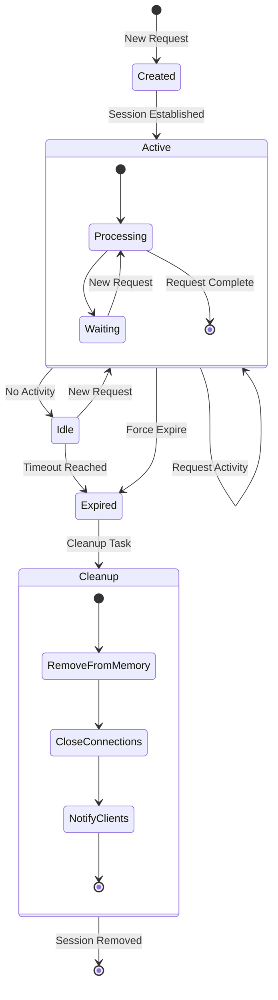
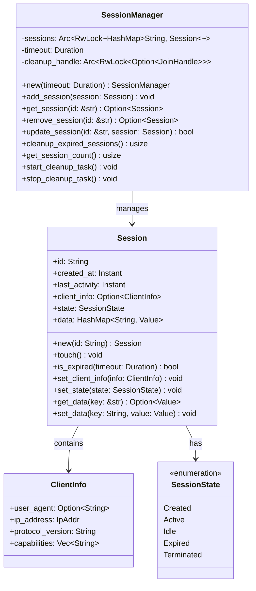

# Session Management

This diagram shows the HTTP session lifecycle and cleanup mechanisms for maintaining client connections.



## Session Lifecycle Flow

```mermaid
sequenceDiagram
    participant Client as MCP Client
    participant Server as HTTP Server
    participant SessionMgr as Session Manager
    participant Cleanup as Cleanup Task
    participant Storage as Session Storage
    participant Monitor as Session Monitor

    Note over Client, Monitor: Session Creation

    %% Initial request without session
    Client->>+Server: HTTP Request (No Session ID)
    Server->>+SessionMgr: Get/Create Session
    SessionMgr->>SessionMgr: Generate Session ID
    SessionMgr->>SessionMgr: Create Session Object
    SessionMgr->>+Storage: Store Session
    Storage->>Storage: Add to HashMap
    Storage->>-SessionMgr: Session Stored
    SessionMgr->>+Monitor: Record Session Creation
    Monitor->>Monitor: Update Metrics
    Monitor->>-SessionMgr: Metrics Updated
    SessionMgr->>-Server: Session ID
    Server->>-Client: Response with Session ID Header

    Note over Client, Monitor: Session Usage

    %% Subsequent requests with session
    Client->>+Server: HTTP Request (With Session ID)
    Server->>+SessionMgr: Get Session
    SessionMgr->>+Storage: Lookup Session
    Storage->>Storage: Find by ID
    Storage->>-SessionMgr: Session Found
    SessionMgr->>SessionMgr: Update Last Activity
    SessionMgr->>+Storage: Update Session
    Storage->>Storage: Update Timestamp
    Storage->>-SessionMgr: Session Updated
    SessionMgr->>-Server: Session Valid
    Server->>Server: Process Request
    Server->>-Client: Response

    Note over Client, Monitor: Session Activity Tracking

    %% Multiple requests updating activity
    loop Multiple Requests
        Client->>+Server: HTTP Request
        Server->>+SessionMgr: Touch Session
        SessionMgr->>SessionMgr: Update Last Activity
        SessionMgr->>+Monitor: Record Activity
        Monitor->>Monitor: Update Session Metrics
        Monitor->>-SessionMgr: Recorded
        SessionMgr->>-Server: Session Active
        Server->>-Client: Response
    end

    Note over Client, Monitor: Session Cleanup Process

    %% Periodic cleanup task
    rect rgb(255, 240, 240)
        loop Every 60 seconds
            Cleanup->>+SessionMgr: Run Cleanup
            SessionMgr->>+Storage: Get All Sessions
            Storage->>-SessionMgr: Session List
            SessionMgr->>SessionMgr: Find Expired Sessions
            
            alt Has Expired Sessions
                SessionMgr->>+Storage: Remove Expired Sessions
                Storage->>Storage: Delete from HashMap
                Storage->>-SessionMgr: Sessions Removed
                SessionMgr->>+Monitor: Record Cleanup
                Monitor->>Monitor: Update Cleanup Metrics
                Monitor->>-SessionMgr: Recorded
                SessionMgr->>SessionMgr: Log Cleanup Results
            end
            
            SessionMgr->>-Cleanup: Cleanup Complete
        end
    end

    Note over Client, Monitor: Session Expiration

    %% Client session expires
    rect rgb(255, 240, 240)
        Client->>+Server: HTTP Request (Expired Session)
        Server->>+SessionMgr: Get Session
        SessionMgr->>+Storage: Lookup Session
        Storage->>Storage: Check Session
        alt Session Expired
            Storage-->>SessionMgr: Session Not Found/Expired
            SessionMgr->>+Monitor: Record Expiration
            Monitor->>-SessionMgr: Recorded
            SessionMgr-->>Server: Session Expired Error
            Server-->>Client: 401 Session Expired
        else Session Valid
            Storage->>-SessionMgr: Session Found
            SessionMgr->>-Server: Session Valid
            Server->>-Client: Response
        end
    end

    Note over Client, Monitor: Graceful Session Termination

    %% Client explicitly terminates session
    Client->>+Server: DELETE /session
    Server->>+SessionMgr: Remove Session
    SessionMgr->>+Storage: Delete Session
    Storage->>Storage: Remove from HashMap
    Storage->>-SessionMgr: Session Deleted
    SessionMgr->>+Monitor: Record Termination
    Monitor->>Monitor: Update Termination Metrics
    Monitor->>-SessionMgr: Recorded
    SessionMgr->>-Server: Session Removed
    Server->>-Client: 200 OK

    Note over Client, Monitor: Server Shutdown

    %% Server shutdown cleanup
    rect rgb(240, 240, 255)
        Server->>+SessionMgr: Shutdown Cleanup
        SessionMgr->>+Storage: Get All Sessions
        Storage->>-SessionMgr: All Sessions
        SessionMgr->>SessionMgr: Mark All as Expired
        SessionMgr->>+Storage: Clear All Sessions
        Storage->>Storage: Clear HashMap
        Storage->>-SessionMgr: Storage Cleared
        SessionMgr->>+Monitor: Record Shutdown
        Monitor->>-SessionMgr: Recorded
        SessionMgr->>-Server: Cleanup Complete
    end
```



## Session Data Structure



## Session Implementation

### 1. Session Creation and Management
```rust
use std::collections::HashMap;
use std::sync::Arc;
use std::time::{Duration, Instant};
use tokio::sync::RwLock;
use uuid::Uuid;

#[derive(Debug, Clone)]
pub struct Session {
    pub id: String,
    pub created_at: Instant,
    pub last_activity: Instant,
    pub client_info: Option<ClientInfo>,
    pub state: SessionState,
    pub data: HashMap<String, serde_json::Value>,
}

impl Session {
    pub fn new(id: String) -> Self {
        let now = Instant::now();
        Self {
            id,
            created_at: now,
            last_activity: now,
            client_info: None,
            state: SessionState::Created,
            data: HashMap::new(),
        }
    }

    pub fn touch(&mut self) {
        self.last_activity = Instant::now();
        if self.state == SessionState::Created {
            self.state = SessionState::Active;
        }
    }

    pub fn is_expired(&self, timeout: Duration) -> bool {
        self.last_activity.elapsed() > timeout
    }
}

pub struct SessionManager {
    sessions: Arc<RwLock<HashMap<String, Session>>>,
    timeout: Duration,
    cleanup_handle: Arc<RwLock<Option<tokio::task::JoinHandle<()>>>>,
}

impl SessionManager {
    pub fn new(timeout: Duration) -> Self {
        let manager = Self {
            sessions: Arc::new(RwLock::new(HashMap::new())),
            timeout,
            cleanup_handle: Arc::new(RwLock::new(None)),
        };
        
        manager.start_cleanup_task();
        manager
    }

    pub async fn add_session(&self, session: Session) {
        let session_id = session.id.clone();
        {
            let mut sessions = self.sessions.write().await;
            sessions.insert(session_id.clone(), session);
        }
        info!("Added session: {}", session_id);
    }

    pub async fn get_session(&self, session_id: &str) -> Option<Session> {
        let sessions = self.sessions.read().await;
        sessions.get(session_id).cloned()
    }

    pub async fn update_session(&self, session_id: &str, mut session: Session) -> bool {
        session.touch();
        let mut sessions = self.sessions.write().await;
        if sessions.contains_key(session_id) {
            sessions.insert(session_id.to_string(), session);
            true
        } else {
            false
        }
    }
}
```

### 2. Session Cleanup Implementation
```rust
impl SessionManager {
    pub async fn cleanup_expired_sessions(&self) -> usize {
        let mut expired_sessions = Vec::new();
        
        // Find expired sessions
        {
            let sessions = self.sessions.read().await;
            for (id, session) in sessions.iter() {
                if session.is_expired(self.timeout) {
                    expired_sessions.push(id.clone());
                }
            }
        }
        
        // Remove expired sessions
        let removed_count = expired_sessions.len();
        if removed_count > 0 {
            let mut sessions = self.sessions.write().await;
            for id in expired_sessions {
                if let Some(mut session) = sessions.remove(&id) {
                    session.state = SessionState::Expired;
                    info!("Removed expired session: {}", id);
                }
            }
        }
        
        removed_count
    }

    fn start_cleanup_task(&self) {
        let sessions = self.sessions.clone();
        let timeout = self.timeout;
        let cleanup_interval = Duration::from_secs(60); // Cleanup every minute
        
        let handle = tokio::spawn(async move {
            let mut interval = tokio::time::interval(cleanup_interval);
            
            loop {
                interval.tick().await;
                
                let manager = SessionManager {
                    sessions: sessions.clone(),
                    timeout,
                    cleanup_handle: Arc::new(RwLock::new(None)),
                };
                
                let removed = manager.cleanup_expired_sessions().await;
                if removed > 0 {
                    info!("Cleanup removed {} expired sessions", removed);
                }
            }
        });
        
        // Store the handle for potential cancellation
        tokio::spawn(async move {
            let mut cleanup_handle_guard = self.cleanup_handle.write().await;
            *cleanup_handle_guard = Some(handle);
        });
    }

    pub async fn stop_cleanup_task(&self) {
        let mut handle_guard = self.cleanup_handle.write().await;
        if let Some(handle) = handle_guard.take() {
            handle.abort();
            info!("Session cleanup task stopped");
        }
    }
}
```

### 3. Session Middleware Integration
```rust
use actix_web::{dev::ServiceRequest, Error, HttpMessage};

pub async fn get_or_create_session(
    req: &HttpRequest,
    session_manager: &Arc<SessionManager>,
) -> Result<String, Error> {
    // Try to get session ID from header
    let session_id = req
        .headers()
        .get("Mcp-Session-Id")
        .and_then(|h| h.to_str().ok())
        .map(|s| s.to_string());

    match session_id {
        Some(id) => {
            // Check if session exists and is valid
            if let Some(mut session) = session_manager.get_session(&id).await {
                if !session.is_expired(Duration::from_secs(3600)) {
                    // Update session activity
                    session.touch();
                    session_manager.update_session(&id, session).await;
                    return Ok(id);
                } else {
                    // Session expired, remove it
                    session_manager.remove_session(&id).await;
                }
            }
            
            // Create new session with same ID if expired/not found
            create_new_session(session_manager, Some(id)).await
        }
        None => {
            // Create new session
            create_new_session(session_manager, None).await
        }
    }
}

async fn create_new_session(
    session_manager: &Arc<SessionManager>,
    session_id: Option<String>,
) -> Result<String, Error> {
    let id = session_id.unwrap_or_else(|| Uuid::new_v4().to_string());
    let session = Session::new(id.clone());
    
    session_manager.add_session(session).await;
    Ok(id)
}
```

### 4. Session Metrics and Monitoring
```rust
#[derive(Debug, Default)]
pub struct SessionMetrics {
    pub total_sessions_created: AtomicUsize,
    pub active_sessions: AtomicUsize,
    pub expired_sessions: AtomicUsize,
    pub average_session_duration: AtomicU64,
    pub cleanup_runs: AtomicUsize,
}

impl SessionMetrics {
    pub fn record_session_created(&self) {
        self.total_sessions_created.fetch_add(1, Ordering::Relaxed);
        self.active_sessions.fetch_add(1, Ordering::Relaxed);
    }

    pub fn record_session_expired(&self, duration: Duration) {
        self.active_sessions.fetch_sub(1, Ordering::Relaxed);
        self.expired_sessions.fetch_add(1, Ordering::Relaxed);
        
        // Update average duration (simplified)
        let duration_secs = duration.as_secs();
        self.average_session_duration.store(duration_secs, Ordering::Relaxed);
    }

    pub fn record_cleanup_run(&self, removed_count: usize) {
        self.cleanup_runs.fetch_add(1, Ordering::Relaxed);
        self.expired_sessions.fetch_add(removed_count, Ordering::Relaxed);
    }

    pub fn get_snapshot(&self) -> SessionMetricsSnapshot {
        SessionMetricsSnapshot {
            total_created: self.total_sessions_created.load(Ordering::Relaxed),
            active: self.active_sessions.load(Ordering::Relaxed),
            expired: self.expired_sessions.load(Ordering::Relaxed),
            average_duration_secs: self.average_session_duration.load(Ordering::Relaxed),
            cleanup_runs: self.cleanup_runs.load(Ordering::Relaxed),
        }
    }
}
```

## Session Security

### 1. Session ID Generation
```rust
use rand::{thread_rng, Rng};
use sha2::{Sha256, Digest};

pub fn generate_secure_session_id() -> String {
    let mut rng = thread_rng();
    let random_bytes: [u8; 32] = rng.gen();
    let timestamp = std::time::SystemTime::now()
        .duration_since(std::time::UNIX_EPOCH)
        .unwrap()
        .as_nanos();
    
    let mut hasher = Sha256::new();
    hasher.update(&random_bytes);
    hasher.update(&timestamp.to_be_bytes());
    
    let result = hasher.finalize();
    hex::encode(result)
}
```

### 2. Session Validation
```rust
pub fn validate_session_id(session_id: &str) -> bool {
    // Check format (64 character hex string)
    if session_id.len() != 64 {
        return false;
    }
    
    // Check if all characters are valid hex
    session_id.chars().all(|c| c.is_ascii_hexdigit())
}

pub async fn validate_session_security(
    session: &Session,
    request: &HttpRequest,
) -> Result<(), SessionSecurityError> {
    // Check session age
    if session.created_at.elapsed() > Duration::from_secs(24 * 3600) {
        return Err(SessionSecurityError::SessionTooOld);
    }
    
    // Check for suspicious activity patterns
    if let Some(client_info) = &session.client_info {
        let request_ip = get_client_ip(request);
        if client_info.ip_address != request_ip {
            return Err(SessionSecurityError::IpAddressMismatch);
        }
    }
    
    Ok(())
}
```

### 3. Session Hijacking Prevention
```rust
pub struct SessionSecurityManager {
    ip_tracking: Arc<RwLock<HashMap<String, IpAddr>>>,
    user_agent_tracking: Arc<RwLock<HashMap<String, String>>>,
}

impl SessionSecurityManager {
    pub async fn validate_request(
        &self,
        session_id: &str,
        request: &HttpRequest,
    ) -> Result<(), SecurityViolation> {
        let current_ip = get_client_ip(request);
        let current_ua = get_user_agent(request);
        
        // Check IP consistency
        {
            let ip_tracking = self.ip_tracking.read().await;
            if let Some(&stored_ip) = ip_tracking.get(session_id) {
                if stored_ip != current_ip {
                    warn!("IP address mismatch for session {}: {} != {}", 
                          session_id, stored_ip, current_ip);
                    return Err(SecurityViolation::IpMismatch);
                }
            }
        }
        
        // Check User-Agent consistency
        {
            let ua_tracking = self.user_agent_tracking.read().await;
            if let Some(stored_ua) = ua_tracking.get(session_id) {
                if stored_ua != &current_ua {
                    warn!("User-Agent mismatch for session {}", session_id);
                    return Err(SecurityViolation::UserAgentMismatch);
                }
            }
        }
        
        Ok(())
    }

    pub async fn register_session_fingerprint(
        &self,
        session_id: &str,
        request: &HttpRequest,
    ) {
        let ip = get_client_ip(request);
        let ua = get_user_agent(request);
        
        {
            let mut ip_tracking = self.ip_tracking.write().await;
            ip_tracking.insert(session_id.to_string(), ip);
        }
        
        {
            let mut ua_tracking = self.user_agent_tracking.write().await;
            ua_tracking.insert(session_id.to_string(), ua);
        }
    }
}
```

## Session Persistence

### 1. Session Serialization
```rust
use serde::{Deserialize, Serialize};

#[derive(Serialize, Deserialize)]
pub struct SessionSnapshot {
    pub sessions: HashMap<String, SerializableSession>,
    pub timestamp: DateTime<Utc>,
    pub version: String,
}

#[derive(Serialize, Deserialize)]
pub struct SerializableSession {
    pub id: String,
    pub created_at: u64, // Unix timestamp
    pub last_activity: u64,
    pub client_info: Option<ClientInfo>,
    pub state: SessionState,
    pub data: HashMap<String, serde_json::Value>,
}

impl From<Session> for SerializableSession {
    fn from(session: Session) -> Self {
        Self {
            id: session.id,
            created_at: session.created_at.elapsed().as_secs(),
            last_activity: session.last_activity.elapsed().as_secs(),
            client_info: session.client_info,
            state: session.state,
            data: session.data,
        }
    }
}
```

### 2. Session Recovery
```rust
impl SessionManager {
    pub async fn save_sessions_to_disk(&self, path: &Path) -> Result<()> {
        let sessions = self.sessions.read().await;
        let serializable_sessions: HashMap<String, SerializableSession> = 
            sessions.iter()
                .map(|(k, v)| (k.clone(), v.clone().into()))
                .collect();
        
        let snapshot = SessionSnapshot {
            sessions: serializable_sessions,
            timestamp: Utc::now(),
            version: env!("CARGO_PKG_VERSION").to_string(),
        };
        
        let json = serde_json::to_string_pretty(&snapshot)?;
        tokio::fs::write(path, json).await?;
        
        info!("Saved {} sessions to disk", sessions.len());
        Ok(())
    }

    pub async fn load_sessions_from_disk(&self, path: &Path) -> Result<()> {
        if !path.exists() {
            return Ok(()); // No sessions to load
        }
        
        let json = tokio::fs::read_to_string(path).await?;
        let snapshot: SessionSnapshot = serde_json::from_str(&json)?;
        
        let mut sessions = self.sessions.write().await;
        for (id, serializable_session) in snapshot.sessions {
            let session = Session::from(serializable_session);
            if !session.is_expired(self.timeout) {
                sessions.insert(id, session);
            }
        }
        
        info!("Loaded {} sessions from disk", sessions.len());
        Ok(())
    }
}
```

## Best Practices

### 1. Session Security
- **Secure ID Generation**: Use cryptographically secure random session IDs
- **Session Validation**: Validate session format and security properties
- **Fingerprinting**: Track client fingerprints to detect hijacking
- **Timeout Management**: Implement appropriate session timeouts

### 2. Performance Optimization
- **Efficient Cleanup**: Regular cleanup of expired sessions
- **Memory Management**: Limit session data size and count
- **Concurrent Access**: Use appropriate locking strategies
- **Metrics Collection**: Monitor session usage patterns

### 3. Reliability
- **Graceful Degradation**: Handle session failures gracefully
- **Persistence**: Optional session persistence for recovery
- **Error Handling**: Comprehensive error handling for session operations
- **Monitoring**: Real-time monitoring of session health

### 4. Scalability
- **Distributed Sessions**: Design for multi-instance deployment
- **Session Affinity**: Consider session affinity in load balancing
- **Resource Limits**: Set appropriate limits on session resources
- **Cleanup Efficiency**: Efficient cleanup algorithms for large session counts
