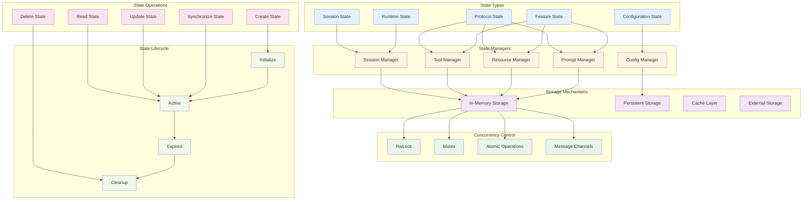
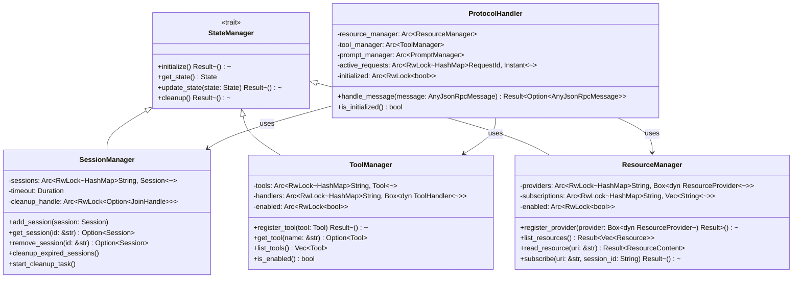

# State Management

This diagram shows how server state is maintained across requests and the various state storage mechanisms.



## State Management Architecture



## State Synchronization Flow

```mermaid
sequenceDiagram
    participant Client as MCP Client
    participant Handler as Protocol Handler
    participant StateManager as State Manager
    participant Storage as Storage Layer
    participant Cleanup as Cleanup Task
    participant Monitor as State Monitor

    Note over Client, Monitor: State Lifecycle Management

    %% State Initialization
    Handler->>+StateManager: Initialize State
    StateManager->>+Storage: Load Persistent State
    Storage->>Storage: Read Configuration
    Storage->>Storage: Load Previous Sessions
    Storage->>-StateManager: State Data
    StateManager->>StateManager: Initialize In-Memory State
    StateManager->>+Cleanup: Start Cleanup Task
    Cleanup->>Cleanup: Schedule Periodic Cleanup
    Cleanup->>-StateManager: Task Started
    StateManager->>+Monitor: Register State Metrics
    Monitor->>-StateManager: Monitoring Active
    StateManager->>-Handler: Initialization Complete

    %% State Read Operations
    Client->>+Handler: Request (tools/list)
    Handler->>+StateManager: Read Tool State
    StateManager->>StateManager: Acquire Read Lock
    StateManager->>StateManager: Access Tools HashMap
    StateManager->>StateManager: Release Read Lock
    StateManager->>-Handler: Tool List
    Handler->>-Client: Response

    %% State Write Operations
    Client->>+Handler: Request (register tool)
    Handler->>+StateManager: Update Tool State
    StateManager->>StateManager: Acquire Write Lock
    StateManager->>StateManager: Validate Tool
    StateManager->>StateManager: Update Tools HashMap
    StateManager->>StateManager: Release Write Lock
    StateManager->>+Monitor: Update Metrics
    Monitor->>Monitor: Record State Change
    Monitor->>-StateManager: Metrics Updated
    StateManager->>-Handler: Update Complete
    Handler->>-Client: Success Response

    %% Concurrent Access
    rect rgb(240, 255, 240)
        Note over Handler, StateManager: Concurrent Read Operations
        par Multiple Readers
            Handler->>StateManager: Read Request 1
            StateManager->>StateManager: Acquire Read Lock 1
        and
            Handler->>StateManager: Read Request 2
            StateManager->>StateManager: Acquire Read Lock 2
        and
            Handler->>StateManager: Read Request 3
            StateManager->>StateManager: Acquire Read Lock 3
        end
        
        Note over StateManager: Multiple readers can access concurrently
        
        par Release Locks
            StateManager->>Handler: Response 1
        and
            StateManager->>Handler: Response 2
        and
            StateManager->>Handler: Response 3
        end
    end

    %% State Cleanup
    rect rgb(255, 240, 240)
        loop Every 60 seconds
            Cleanup->>+StateManager: Cleanup Expired State
            StateManager->>StateManager: Acquire Write Lock
            StateManager->>StateManager: Find Expired Sessions
            StateManager->>StateManager: Remove Expired Entries
            StateManager->>StateManager: Release Write Lock
            StateManager->>+Storage: Persist State Changes
            Storage->>Storage: Write to Disk
            Storage->>-StateManager: Persistence Complete
            StateManager->>+Monitor: Update Cleanup Metrics
            Monitor->>-StateManager: Metrics Updated
            StateManager->>-Cleanup: Cleanup Complete
        end
    end

    %% State Synchronization
    rect rgb(240, 240, 255)
        Note over StateManager, Storage: State Persistence
        StateManager->>+Storage: Sync Critical State
        Storage->>Storage: Write Session Data
        Storage->>Storage: Write Configuration
        Storage->>Storage: Write Metrics
        Storage->>-StateManager: Sync Complete
    end

    %% Error Recovery
    rect rgb(255, 240, 240)
        alt State Corruption Detected
            Monitor->>+StateManager: State Corruption Alert
            StateManager->>StateManager: Lock All State
            StateManager->>+Storage: Reload from Backup
            Storage->>Storage: Restore Previous State
            Storage->>-StateManager: State Restored
            StateManager->>StateManager: Unlock State
            StateManager->>+Monitor: Recovery Complete
            Monitor->>-StateManager: Monitoring Resumed
            StateManager->>-Monitor: Recovery Successful
        end
    end
```



## State Storage Patterns

### 1. Session State Management
```rust
pub struct SessionManager {
    sessions: Arc<RwLock<HashMap<String, Session>>>,
    timeout: Duration,
    cleanup_handle: Arc<RwLock<Option<tokio::task::JoinHandle<()>>>>,
}

impl SessionManager {
    pub async fn add_session(&self, session: Session) {
        let session_id = session.id.clone();
        
        {
            let mut sessions = self.sessions.write().await;
            sessions.insert(session_id.clone(), session);
        }
        
        info!("Added session: {}", session_id);
    }

    pub async fn get_session(&self, session_id: &str) -> Option<Session> {
        let sessions = self.sessions.read().await;
        sessions.get(session_id).cloned()
    }

    pub async fn cleanup_expired_sessions(&self) {
        let mut expired_sessions = Vec::new();
        
        {
            let sessions = self.sessions.read().await;
            for (id, session) in sessions.iter() {
                if session.is_expired(self.timeout) {
                    expired_sessions.push(id.clone());
                }
            }
        }
        
        if !expired_sessions.is_empty() {
            let mut sessions = self.sessions.write().await;
            for id in expired_sessions {
                sessions.remove(&id);
                info!("Removed expired session: {}", id);
            }
        }
    }
}
```

### 2. Feature State Management
```rust
pub struct ToolManager {
    tools: Arc<RwLock<HashMap<String, Tool>>>,
    handlers: Arc<RwLock<HashMap<String, Box<dyn ToolHandler>>>>,
    enabled: Arc<RwLock<bool>>,
}

impl ToolManager {
    pub async fn register_tool(&self, tool: Tool) -> Result<()> {
        if !self.is_enabled() {
            return Err(McpError::Tool("Tool feature is disabled".to_string()));
        }

        let name = tool.name.clone();

        {
            let mut tools = self.tools.write().await;
            tools.insert(name.clone(), tool);
        }

        info!("Registered tool: {}", name);
        Ok(())
    }

    pub async fn list_tools(&self) -> Vec<Tool> {
        let tools = self.tools.read().await;
        tools.values().cloned().collect()
    }

    pub fn is_enabled(&self) -> bool {
        self.enabled
            .try_read()
            .map(|enabled| *enabled)
            .unwrap_or(true)
    }
}
```

### 3. Configuration State Management
```rust
pub struct ConfigManager {
    config: Arc<RwLock<Config>>,
    watchers: Arc<RwLock<Vec<ConfigWatcher>>>,
}

impl ConfigManager {
    pub async fn update_config(&self, new_config: Config) -> Result<()> {
        // Validate configuration
        new_config.validate()?;
        
        let old_config = {
            let mut config = self.config.write().await;
            let old = config.clone();
            *config = new_config;
            old
        };
        
        // Notify watchers of config changes
        self.notify_watchers(&old_config).await;
        
        Ok(())
    }

    pub async fn get_config(&self) -> Config {
        let config = self.config.read().await;
        config.clone()
    }

    async fn notify_watchers(&self, old_config: &Config) {
        let watchers = self.watchers.read().await;
        for watcher in watchers.iter() {
            if let Err(e) = watcher.on_config_changed(old_config).await {
                error!("Config watcher error: {}", e);
            }
        }
    }
}
```

## Concurrency Patterns

### 1. Reader-Writer Locks (RwLock)
```rust
// Multiple readers, single writer pattern
let data = Arc::new(RwLock::new(HashMap::new()));

// Read operation (multiple concurrent readers allowed)
{
    let reader = data.read().await;
    let value = reader.get(&key);
}

// Write operation (exclusive access)
{
    let mut writer = data.write().await;
    writer.insert(key, value);
}
```

### 2. Message Passing
```rust
// Channel-based state updates
pub struct StateUpdater {
    sender: mpsc::Sender<StateUpdate>,
}

pub enum StateUpdate {
    AddSession(Session),
    RemoveSession(String),
    UpdateTool(Tool),
    ConfigChange(Config),
}

impl StateUpdater {
    pub async fn handle_updates(&mut self, mut receiver: mpsc::Receiver<StateUpdate>) {
        while let Some(update) = receiver.recv().await {
            match update {
                StateUpdate::AddSession(session) => {
                    self.session_manager.add_session(session).await;
                }
                StateUpdate::RemoveSession(id) => {
                    self.session_manager.remove_session(&id).await;
                }
                StateUpdate::UpdateTool(tool) => {
                    self.tool_manager.register_tool(tool).await?;
                }
                StateUpdate::ConfigChange(config) => {
                    self.config_manager.update_config(config).await?;
                }
            }
        }
    }
}
```

### 3. Atomic Operations
```rust
use std::sync::atomic::{AtomicBool, AtomicUsize, Ordering};

pub struct ServerMetrics {
    active_connections: AtomicUsize,
    total_requests: AtomicUsize,
    is_healthy: AtomicBool,
}

impl ServerMetrics {
    pub fn increment_connections(&self) {
        self.active_connections.fetch_add(1, Ordering::Relaxed);
    }

    pub fn decrement_connections(&self) {
        self.active_connections.fetch_sub(1, Ordering::Relaxed);
    }

    pub fn get_active_connections(&self) -> usize {
        self.active_connections.load(Ordering::Relaxed)
    }
}
```

## State Persistence

### 1. Session Persistence
```rust
#[derive(Serialize, Deserialize)]
pub struct SessionSnapshot {
    pub sessions: HashMap<String, Session>,
    pub timestamp: DateTime<Utc>,
    pub version: String,
}

impl SessionManager {
    pub async fn save_snapshot(&self, path: &Path) -> Result<()> {
        let sessions = self.sessions.read().await;
        let snapshot = SessionSnapshot {
            sessions: sessions.clone(),
            timestamp: Utc::now(),
            version: env!("CARGO_PKG_VERSION").to_string(),
        };
        
        let json = serde_json::to_string_pretty(&snapshot)?;
        tokio::fs::write(path, json).await?;
        
        Ok(())
    }

    pub async fn load_snapshot(&self, path: &Path) -> Result<()> {
        let json = tokio::fs::read_to_string(path).await?;
        let snapshot: SessionSnapshot = serde_json::from_str(&json)?;
        
        let mut sessions = self.sessions.write().await;
        *sessions = snapshot.sessions;
        
        info!("Loaded {} sessions from snapshot", sessions.len());
        Ok(())
    }
}
```

### 2. Configuration Persistence
```rust
impl Config {
    pub async fn save_to_file(&self, path: &Path) -> Result<()> {
        let toml = toml::to_string_pretty(self)?;
        tokio::fs::write(path, toml).await?;
        Ok(())
    }

    pub async fn load_from_file(path: &Path) -> Result<Self> {
        let content = tokio::fs::read_to_string(path).await?;
        let config: Config = toml::from_str(&content)?;
        config.validate()?;
        Ok(config)
    }
}
```

## State Monitoring

### 1. Health Checks
```rust
pub struct StateHealthChecker {
    session_manager: Arc<SessionManager>,
    tool_manager: Arc<ToolManager>,
    resource_manager: Arc<ResourceManager>,
}

impl StateHealthChecker {
    pub async fn check_health(&self) -> HealthStatus {
        let mut status = HealthStatus::new();
        
        // Check session manager health
        let session_count = self.session_manager.get_session_count().await;
        status.add_metric("active_sessions", session_count);
        
        // Check tool manager health
        let tool_count = self.tool_manager.get_tool_count().await;
        status.add_metric("registered_tools", tool_count);
        
        // Check resource manager health
        let resource_count = self.resource_manager.get_resource_count().await;
        status.add_metric("available_resources", resource_count);
        
        status
    }
}
```

### 2. State Metrics
```rust
#[derive(Debug, Serialize)]
pub struct StateMetrics {
    pub timestamp: DateTime<Utc>,
    pub memory_usage: usize,
    pub session_count: usize,
    pub tool_count: usize,
    pub resource_count: usize,
    pub active_requests: usize,
    pub error_count: usize,
}

impl StateMetrics {
    pub async fn collect(
        session_manager: &SessionManager,
        tool_manager: &ToolManager,
        resource_manager: &ResourceManager,
        protocol_handler: &ProtocolHandler,
    ) -> Self {
        Self {
            timestamp: Utc::now(),
            memory_usage: get_memory_usage(),
            session_count: session_manager.get_session_count().await,
            tool_count: tool_manager.get_tool_count().await,
            resource_count: resource_manager.get_resource_count().await,
            active_requests: protocol_handler.get_active_request_count().await,
            error_count: get_error_count(),
        }
    }
}
```

## Best Practices

### 1. State Design Principles
- **Immutability**: Prefer immutable state where possible
- **Isolation**: Separate concerns with clear boundaries
- **Consistency**: Maintain consistent state across operations
- **Durability**: Persist critical state for recovery

### 2. Concurrency Best Practices
- **Lock Ordering**: Consistent lock acquisition order to prevent deadlocks
- **Lock Granularity**: Use fine-grained locks to reduce contention
- **Lock Duration**: Minimize time holding locks
- **Lock-Free Operations**: Use atomic operations where possible

### 3. Memory Management
- **Resource Cleanup**: Proper cleanup of expired state
- **Memory Limits**: Set limits on state size
- **Garbage Collection**: Regular cleanup of unused state
- **Memory Monitoring**: Track memory usage patterns

### 4. Error Handling
- **State Validation**: Validate state consistency
- **Recovery Procedures**: Handle state corruption gracefully
- **Backup Strategies**: Regular state backups
- **Rollback Mechanisms**: Ability to revert to previous state
