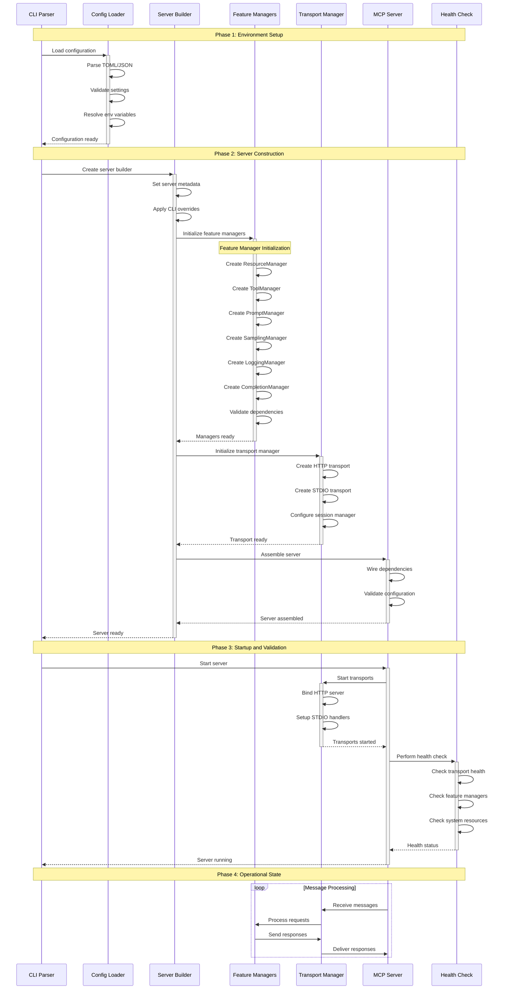
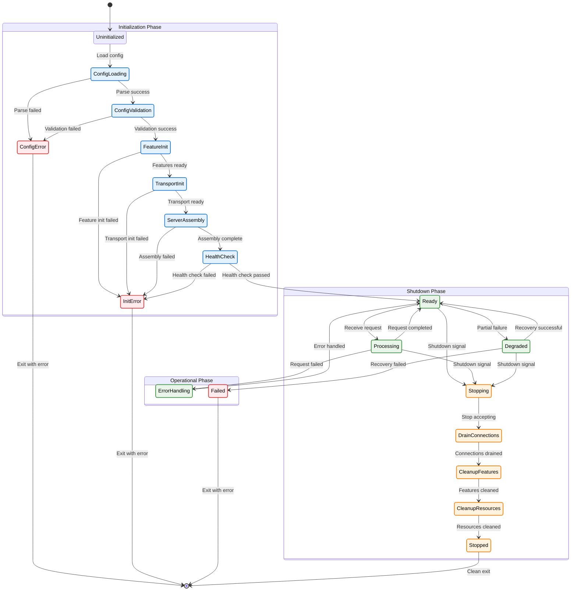
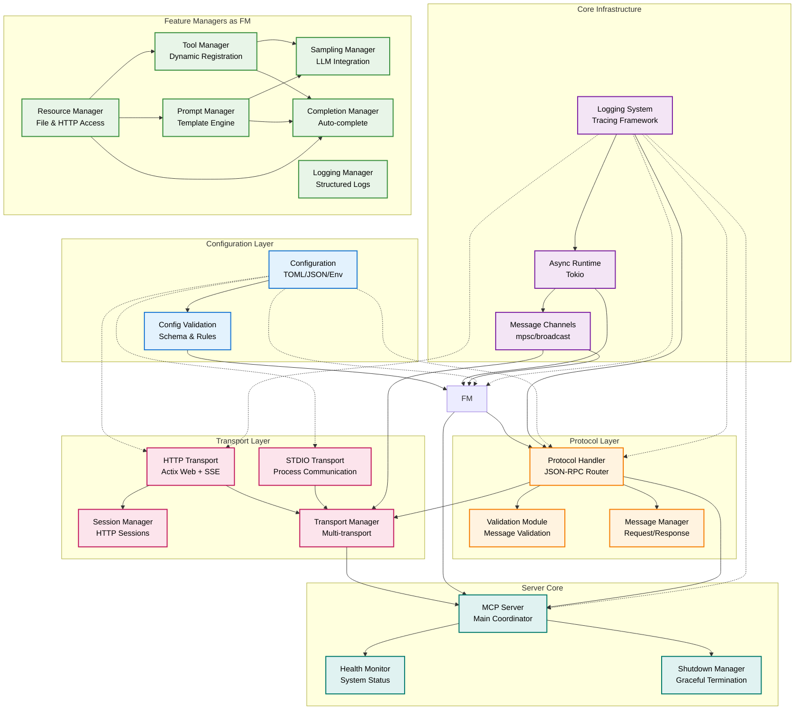

# MCP Server System Initialization and Operational Flow

This document provides a comprehensive technical reference for the complete MCP server initialization and operational flow, covering every aspect from startup to request processing. It serves as the definitive guide for understanding the server's architecture, initialization sequence, error handling, and operational characteristics.

## Overview

This document covers the complete lifecycle of the MCP server, including:

- **Initialization Phase**: Detailed server startup, component creation, configuration validation, and resource allocation
- **Operational Phase**: Client connections, message processing, tool execution, and session management
- **Component Interactions**: How transport, protocol, and business logic layers interact with dependency injection
- **Error Handling**: Comprehensive error scenarios and recovery mechanisms at each initialization step
- **Resource Management**: Memory allocation patterns, cleanup procedures, and resource lifecycle management
- **Performance Optimization**: Startup timing considerations, async task management, and thread pool configuration

```mermaid
flowchart TD
    %% Entry Point and Environment Setup
    A[Main Function Entry Point<br/>src/main.rs] --> A1[Parse CLI Arguments<br/>clap::Parser]
    A1 --> A2[Set Log Level<br/>RUST_LOG Environment]
    A2 --> B[Initialize Logging<br/>tracing_subscriber]

    %% Configuration Loading with Validation
    B --> C1[Load Configuration<br/>Config::from_file or Default]
    C1 --> C2{Config File<br/>Exists?}
    C2 -->|Yes| C3[Parse TOML Configuration<br/>toml::from_str]
    C2 -->|No| C4[Use Default Configuration<br/>Config::default]
    C3 --> C5[Validate Configuration<br/>Config::validate]
    C4 --> C5
    C5 --> C6{Validation<br/>Successful?}
    C6 -->|No| ERR1[Configuration Error<br/>Exit with Error Code]
    C6 -->|Yes| D[Create McpServerBuilder<br/>Builder Pattern]

    %% Server Builder Phase with Dependency Injection
    D --> E[McpServerBuilder::new<br/>Initialize Builder State]
    E --> F1[Set Server Config<br/>Name, Version, Instructions]
    F1 --> F2[Override with CLI Args<br/>Command Line Priority]
    F2 --> F3[Validate Server Settings<br/>Required Fields Check]
    F3 --> F4{Server Config<br/>Valid?}
    F4 -->|No| ERR2[Server Config Error<br/>Invalid Name/Version]
    F4 -->|Yes| G[Build Server Instance<br/>McpServerBuilder::build]

    %% Memory Allocation and Resource Setup
    G --> H1[Allocate Server Memory<br/>Arc<RwLock> Structures]
    H1 --> H2[Initialize Async Runtime<br/>Tokio Runtime Setup]
    H2 --> H3[Create Channel Infrastructure<br/>mpsc::channel Setup]
    H3 --> I[Validate Full Configuration<br/>Cross-Component Validation]
    I --> I1{All Components<br/>Compatible?}
    I1 -->|No| ERR3[Component Compatibility Error<br/>Transport/Feature Mismatch]
    I1 -->|Yes| J[Create Feature Managers<br/>Dependency Injection]

    %% Feature Manager Creation with Error Handling
    J --> K1[Create ResourceManager<br/>Arc<ResourceManager>]
    K1 --> K2{Resource Manager<br/>Creation Success?}
    K2 -->|No| ERR4[Resource Manager Error<br/>File System Access Failed]
    K2 -->|Yes| L1[Create ToolManager<br/>Arc<ToolManager>]
    L1 --> L2{Tool Manager<br/>Creation Success?}
    L2 -->|No| ERR5[Tool Manager Error<br/>Handler Registry Failed]
    L2 -->|Yes| M1[Create PromptManager<br/>Arc<PromptManager>]
    M1 --> M2{Prompt Manager<br/>Creation Success?}
    M2 -->|No| ERR6[Prompt Manager Error<br/>Template Engine Failed]
    M2 -->|Yes| N1[Create SamplingManager<br/>Arc<SamplingManager>]
    N1 --> N2{Sampling Manager<br/>Creation Success?}
    N2 -->|No| ERR7[Sampling Manager Error<br/>LLM Integration Failed]
    N2 -->|Yes| O[Create ProtocolHandler<br/>Dependency Injection]

    %% Protocol Handler Setup with Validation
    O --> O1[Inject Feature Managers<br/>Constructor Injection]
    O1 --> O2[Initialize Message Router<br/>Method Dispatch Table]
    O2 --> O3[Setup Validation Rules<br/>JSON-RPC Schema]
    O3 --> O4{Protocol Handler<br/>Ready?}
    O4 -->|No| ERR8[Protocol Handler Error<br/>Router Setup Failed]
    O4 -->|Yes| P[Create TransportManager<br/>Multi-Transport Support]

    %% Transport Factory and Configuration
    P --> Q1[TransportFactory::create<br/>Factory Pattern]
    Q1 --> Q2[Read Transport Config<br/>transport.transport_type]
    Q2 --> R{Transport Type<br/>Selection}

    %% HTTP Transport Path with Detailed Setup
    R -->|HTTP| S1[Create HttpTransport<br/>Actix Web Integration]
    S1 --> S2[Validate HTTP Config<br/>bind_address, port, endpoint_path]
    S2 --> S3{HTTP Config<br/>Valid?}
    S3 -->|No| ERR9[HTTP Config Error<br/>Invalid Address/Port]
    S3 -->|Yes| T1[Configure Actix Web App<br/>Application Factory]
    T1 --> T2[Setup CORS Middleware<br/>actix_cors Configuration]
    T2 --> T3[Setup Authentication<br/>Auth Middleware Chain]
    T3 --> U1[Setup MCP Endpoint /mcp<br/>Resource Configuration]
    U1 --> U2[Configure POST Handler<br/>JSON-RPC Processing]
    U2 --> U3[Configure GET Handler<br/>SSE Streaming]
    U3 --> U4[Configure DELETE Handler<br/>Session Termination]
    U4 --> V1[Setup JSON-RPC Support<br/>Message Parsing]
    V1 --> V2[Setup SSE Support<br/>Server-Sent Events]
    V2 --> W1[Configure Session Manager<br/>Session Lifecycle]
    W1 --> W2[Start Cleanup Tasks<br/>Background Processes]

    %% STDIO Transport Path with Error Handling
    R -->|STDIO| X1[Create StdioTransport<br/>Process Communication]
    X1 --> X2[Validate STDIO Config<br/>buffer_size, stderr_logging]
    X2 --> X3{STDIO Config<br/>Valid?}
    X3 -->|No| ERR10[STDIO Config Error<br/>Invalid Buffer Size]
    X3 -->|Yes| Y1[Setup STDIN Handler<br/>Async Reader]
    Y1 --> Y2[Setup STDOUT Handler<br/>Async Writer]
    Y2 --> Y3[Configure Line Protocol<br/>JSON-RPC over Lines]

    %% Tool Registration Phase with Validation
    W2 --> Z1[Dynamic Tool Registration<br/>Runtime Registration]
    Y3 --> Z1
    Z1 --> Z2[Initialize Tool Registry<br/>HashMap<String, Tool>]
    Z2 --> AA1[Register Built-in Tools<br/>Default Tool Handlers]
    AA1 --> BB1[Register EchoToolHandler<br/>Basic Echo Functionality]
    BB1 --> BB2{Echo Tool<br/>Registration Success?}
    BB2 -->|No| ERR11[Echo Tool Error<br/>Handler Creation Failed]
    BB2 -->|Yes| CC1[Register CalculatorToolHandler<br/>Math Operations]
    CC1 --> CC2{Calculator Tool<br/>Registration Success?}
    CC2 -->|No| ERR12[Calculator Tool Error<br/>Schema Validation Failed]
    CC2 -->|Yes| DD1[Register Custom Tools<br/>User-Defined Handlers]
    DD1 --> DD2{Custom Tools<br/>Registration Success?}
    DD2 -->|No| ERR13[Custom Tool Error<br/>Invalid Tool Definition]
    DD2 -->|Yes| EE1[ToolManager::register_handler<br/>Handler Registration]

    %% Tool Definition and Validation Process
    EE1 --> FF1[Create Tool Definition<br/>Auto-generate from Handler]
    FF1 --> FF2[Validate Tool Schema<br/>JSON Schema Validation]
    FF2 --> FF3{Tool Schema<br/>Valid?}
    FF3 -->|No| ERR14[Tool Schema Error<br/>Invalid Input/Output Schema]
    FF3 -->|Yes| GG1[Register Tool in HashMap<br/>tools: HashMap<String, Tool>]
    GG1 --> GG2[Register Handler in HashMap<br/>handlers: HashMap<String, Handler>]
    GG2 --> HH1[Verify Tool-Handler Mapping<br/>Consistency Check]
    HH1 --> HH2{Mapping<br/>Consistent?}
    HH2 -->|No| ERR15[Mapping Error<br/>Tool-Handler Mismatch]
    HH2 -->|Yes| II[Server::run<br/>Start Operational Phase]

    %% Server Startup and Transport Binding
    II --> II1[Validate All Components<br/>Final System Check]
    II1 --> II2{System<br/>Ready?}
    II2 -->|No| ERR16[System Error<br/>Component Not Ready]
    II2 -->|Yes| JJ1[Start TransportManager<br/>Multi-Transport Coordination]
    JJ1 --> JJ2[Spawn Transport Tasks<br/>Async Task Management]
    JJ2 --> KK1[Start HTTP Server<br/>Bind to Address:Port]
    KK1 --> KK2{Bind<br/>Successful?}
    KK2 -->|No| ERR17[Bind Error<br/>Address Already in Use]
    KK2 -->|Yes| KK3[Server Ready<br/>Accepting Connections]

    %% Operational Flow - Client Connection Handling
    KK3 --> LL1[Client Connects to /mcp<br/>HTTP Connection]
    LL1 --> LL2[Validate Origin Header<br/>CORS Check]
    LL2 --> LL3{Origin<br/>Allowed?}
    LL3 -->|No| ERR18[CORS Error<br/>Origin Not Allowed]
    LL3 -->|Yes| MM1[Handle HTTP/SSE Connection<br/>Connection Type Detection]
    MM1 --> MM2[Authenticate Request<br/>Auth Middleware]
    MM2 --> MM3{Authentication<br/>Success?}
    MM3 -->|No| ERR19[Auth Error<br/>Invalid Credentials]
    MM3 -->|Yes| NN1[Create/Get Session<br/>Session Management]
    NN1 --> NN2[Generate Session ID<br/>UUID Generation]
    NN2 --> OO1[Send Connection Event<br/>Initial Response]

    %% Message Processing Loop with Error Handling
    OO1 --> PP1[Main Message Loop<br/>Continuous Processing]
    PP1 --> QQ1[Receive Transport Message<br/>Channel Receiver]
    QQ1 --> QQ2{Message<br/>Received?}
    QQ2 -->|No| SHUTDOWN1[Shutdown Signal<br/>Graceful Termination]
    QQ2 -->|Yes| RR1[ProtocolHandler::handle_message<br/>Message Processing]
    RR1 --> RR2[Parse JSON-RPC<br/>Message Validation]
    RR2 --> RR3{Valid<br/>JSON-RPC?}
    RR3 -->|No| ERR20[Parse Error<br/>Invalid Message Format]
    RR3 -->|Yes| SS{Message Type<br/>Classification}

    %% Message Type Routing with Error Paths
    SS -->|Request| TT1[Handle JSON-RPC Request<br/>Request Processing]
    SS -->|Notification| UU1[Handle Notification<br/>No Response Required]
    SS -->|Response| VV1[Handle Response<br/>Response Processing]
    SS -->|Batch| WW1[Handle Batch Messages<br/>Multiple Message Processing]

    %% Request Method Routing with Validation
    TT1 --> XX{Request Method<br/>Dispatch}
    XX -->|initialize| YY1[Handle Initialize<br/>Capability Negotiation]
    XX -->|tools/list| ZZ1[Handle Tools List<br/>Tool Discovery]
    XX -->|tools/call| AAA1[Handle Tool Call<br/>Tool Execution]
    XX -->|resources/list| BBB1[Handle Resources List<br/>Resource Discovery]
    XX -->|prompts/list| CCC1[Handle Prompts List<br/>Prompt Discovery]
    XX -->|Unknown| ERR21[Method Not Found<br/>Unsupported Method]

    %% Tool Execution Flow with Comprehensive Error Handling
    AAA1 --> DDD1[ToolManager::call_tool<br/>Tool Invocation]
    DDD1 --> DDD2[Extract Tool Name<br/>Parameter Parsing]
    DDD2 --> EEE1[Validate Tool Exists<br/>Registry Lookup]
    EEE1 --> EEE2{Tool<br/>Found?}
    EEE2 -->|No| ERR22[Tool Not Found<br/>Unknown Tool Name]
    EEE2 -->|Yes| FFF1[Find Tool Handler<br/>Handler Lookup]
    FFF1 --> FFF2{Handler<br/>Available?}
    FFF2 -->|No| ERR23[Handler Not Found<br/>Missing Implementation]
    FFF2 -->|Yes| GGG1[Validate Arguments<br/>Schema Validation]
    GGG1 --> GGG2{Arguments<br/>Valid?}
    GGG2 -->|No| ERR24[Invalid Arguments<br/>Schema Mismatch]
    GGG2 -->|Yes| HHH1[Execute Tool Handler<br/>Business Logic]
    HHH1 --> HHH2{Execution<br/>Success?}
    HHH2 -->|No| ERR25[Execution Error<br/>Runtime Failure]
    HHH2 -->|Yes| III1[Generate Tool Result<br/>Result Formatting]

    %% Response Generation and Delivery
    YY1 --> JJJ1[Generate Response<br/>JSON-RPC Response]
    ZZ1 --> JJJ1
    III1 --> JJJ1
    BBB1 --> JJJ1
    CCC1 --> JJJ1
    JJJ1 --> JJJ2[Serialize Response<br/>JSON Serialization]
    JJJ2 --> KKK1[Send Response via Transport<br/>Transport Layer]
    KKK1 --> KKK2{Transport<br/>Type?}
    KKK2 -->|HTTP| LLL1[Stream via HTTP/SSE<br/>HTTP Response]
    KKK2 -->|STDIO| LLL2[Write to STDOUT<br/>Line Protocol]

    %% Loop Back - Continuous Processing
    LLL1 ==> PP1
    LLL2 ==> PP1
    UU1 ==> PP1
    VV1 ==> PP1
    WW1 ==> PP1

    %% Error Response Generation
    ERR20 --> MMM1[Generate Error Response<br/>JSON-RPC Error]
    ERR21 --> MMM1
    ERR22 --> MMM1
    ERR23 --> MMM1
    ERR24 --> MMM1
    ERR25 --> MMM1
    MMM1 --> KKK1

    %% Graceful Shutdown Flow
    SHUTDOWN1 --> NNN1[Stop Transport Manager<br/>Transport Shutdown]
    NNN1 --> NNN2[Cancel Background Tasks<br/>Task Cancellation]
    NNN2 --> OOO1[Close Active Connections<br/>Connection Cleanup]
    OOO1 --> OOO2[Flush Pending Messages<br/>Message Queue Drain]
    OOO2 --> PPP1[Cleanup Resources<br/>Memory Deallocation]
    PPP1 --> PPP2[Stop Session Manager<br/>Session Cleanup]
    PPP2 --> QQQ1[Server Stopped<br/>Clean Exit]

    %% Enhanced Styling with High Contrast and Accessibility
    classDef entryPoint fill:#1976d2,stroke:#0d47a1,stroke-width:3px,color:#ffffff
    classDef initialization fill:#7b1fa2,stroke:#4a148c,stroke-width:2px,color:#ffffff
    classDef validation fill:#9c27b0,stroke:#6a1b9a,stroke-width:2px,color:#ffffff
    classDef transport fill:#388e3c,stroke:#1b5e20,stroke-width:2px,color:#ffffff
    classDef protocol fill:#f57c00,stroke:#e65100,stroke-width:2px,color:#ffffff
    classDef business fill:#c2185b,stroke:#880e4f,stroke-width:2px,color:#ffffff
    classDef error fill:#d32f2f,stroke:#b71c1c,stroke-width:3px,color:#ffffff
    classDef decision fill:#455a64,stroke:#263238,stroke-width:2px,color:#ffffff
    classDef shutdown fill:#616161,stroke:#424242,stroke-width:2px,color:#ffffff
    classDef success fill:#2e7d32,stroke:#1b5e20,stroke-width:2px,color:#ffffff

    %% Apply styling classes
    class A,A1,A2 entryPoint
    class B,C1,C3,C4,D,E,F1,F2,F3,G,H1,H2,H3,I initialization
    class C5,C6,F4,I1,K2,L2,M2,N2,O4,S3,X3,BB2,CC2,DD2,FF3,HH2,II2,KK2,LL3,MM3,QQ2,RR3,EEE2,FFF2,GGG2,HHH2 validation
    class S1,S2,T1,T2,T3,U1,U2,U3,U4,V1,V2,W1,W2,X1,X2,Y1,Y2,Y3,KK1,KK3,LL1,LL2,MM1,MM2,NN1,NN2,OO1,KKK1,KKK2,LLL1,LLL2 transport
    class O,O1,O2,O3,P,Q1,Q2,RR1,RR2,SS,TT1,UU1,VV1,WW1,XX,YY1,ZZ1,BBB1,CCC1,JJJ1,JJJ2 protocol
    class J,K1,L1,M1,N1,Z1,Z2,AA1,BB1,CC1,DD1,EE1,FF1,FF2,GG1,GG2,HH1,AAA1,DDD1,DDD2,EEE1,FFF1,GGG1,HHH1,III1 business
    class ERR1,ERR2,ERR3,ERR4,ERR5,ERR6,ERR7,ERR8,ERR9,ERR10,ERR11,ERR12,ERR13,ERR14,ERR15,ERR16,ERR17,ERR18,ERR19,ERR20,ERR21,ERR22,ERR23,ERR24,ERR25,MMM1 error
    class C2,R,SS,XX decision
    class SHUTDOWN1,NNN1,NNN2,OOO1,OOO2,PPP1,PPP2,QQQ1 shutdown
    class II1,JJ1,JJ2,PP1,QQ1 success
```



## Visual Design Features

The comprehensive initialization flow diagram uses enhanced visual styling for optimal readability and technical clarity:

### 🎨 **Enhanced Color Scheme & Accessibility**

- **High Contrast Colors**: All text uses white text on dark backgrounds for maximum readability and accessibility compliance
- **Distinct Categories**: Each component type has a unique color with strong borders for clear visual separation:
   - 🔵 **Entry Point** (Blue): Main function entry and CLI parsing - `#1976d2` with thick border
   - 🟣 **Initialization** (Purple): Server setup and configuration loading - `#7b1fa2`
   - 🟪 **Validation** (Dark Purple): Configuration and component validation - `#9c27b0`
   - 🟢 **Transport Layer** (Green): Network and connection handling - `#388e3c`
   - 🟠 **Protocol Layer** (Orange): JSON-RPC message processing - `#f57c00`
   - 🔴 **Business Logic** (Pink): Tool execution and core functionality - `#c2185b`
   - 🔴 **Error Handling** (Red): Error responses and recovery - `#d32f2f`
   - ⚫ **Decision Points** (Dark Gray): Routing and branching logic - `#455a64`
   - ⚫ **Shutdown Flow** (Gray): Cleanup and termination - `#616161`
   - 🟢 **Success States** (Dark Green): Successful completion states - `#2e7d32`

### 🔗 **Advanced Connection Patterns**

- **Solid Arrows** (`-->`): Main execution flow and sequential operations
- **Labeled Arrows** (`-->|condition|`): Conditional branches with specific conditions
- **Thick Arrows** (`==>`): Loop-back connections for continuous processing
- **Error Paths** (`-->|Error Type|`): Specific error conditions with detailed labels
- **Decision Points**: Diamond shapes with multiple labeled exits
- **Parallel Flows**: Multiple arrows from one node indicating concurrent operations

### 📐 **Enhanced Border and Visual Hierarchy**

- **Thick Borders**: All nodes have 2-3px stroke width for clear definition
- **Contrasting Borders**: Border colors are darker shades of fill colors for depth
- **Error Nodes**: Extra thick borders (3px) for critical error conditions
- **Decision Nodes**: Diamond shapes with enhanced borders for routing clarity
- **State Grouping**: Related states visually grouped through consistent styling

### 🔄 **Comprehensive Flow Pattern Legend**

- **Main Flow** (`A --> B`): Sequential execution steps in the primary initialization flow
- **Conditional Branches** (`A -->|condition| B`): Decision-based routing with specific conditions
- **Error Paths** (`A -->|Error Type| ERR`): Exception handling with detailed error descriptions
- **Loop Returns** (`A ==> B`): Continuous processing loops for operational phase
- **Shutdown Flows** (`A -->|Shutdown Signal| B`): Graceful termination and cleanup paths
- **Validation Flows** (`A -->|Valid| B`): Validation success/failure routing
- **Parallel Initialization**: Multiple components initialized concurrently

### 🎯 **Technical Clarity Benefits**

- **Error Categorization**: 25+ specific error types with detailed descriptions
- **Validation Steps**: Explicit validation at each critical initialization step
- **Resource Management**: Clear resource allocation and cleanup procedures
- **Async Task Management**: Visible async task spawning and coordination
- **Memory Allocation**: Explicit memory allocation patterns and lifecycle management
- **Configuration Hierarchy**: Clear configuration loading and validation sequence

## Detailed Implementation Sections

### 1. Startup Sequence and Timing Considerations

#### Phase 1: Environment and CLI Setup (0-50ms)

```rust
// Main entry point with comprehensive error handling
#[tokio::main]
async fn main() -> Result<(), Box<dyn std::error::Error>> {
    // Parse CLI arguments with validation
    let cli = Cli::parse();

    // Initialize logging with environment variable support
    init_logging(&cli.log_level, cli.verbose)?;

    // Early validation of critical parameters
    validate_cli_args(&cli)?;

    Ok(())
}

fn init_logging(level: &str, verbose: bool) -> Result<(), Box<dyn std::error::Error>> {
    let log_level = if verbose { "debug" } else { level };

    // Environment variable override support
    let filter = tracing_subscriber::EnvFilter::try_from_default_env()
        .unwrap_or_else(|_| tracing_subscriber::EnvFilter::new(log_level));

    tracing_subscriber::fmt()
        .with_env_filter(filter)
        .with_target(false)
        .with_thread_ids(true)
        .with_file(true)
        .with_line_number(true)
        .init();

    Ok(())
}
```

#### Phase 2: Configuration Loading and Validation (50-150ms)

```rust
// Configuration loading with comprehensive validation
async fn load_and_validate_config(
    config_path: Option<PathBuf>
) -> Result<Config, ConfigError> {
    let mut config = if let Some(path) = config_path {
        info!("Loading configuration from: {}", path.display());
        Config::from_file(path)?
    } else {
        info!("Using default configuration");
        Config::default()
    };

    // Environment variable resolution
    resolve_environment_variables(&mut config)?;

    // Cross-component validation
    validate_transport_compatibility(&config)?;
    validate_feature_dependencies(&config)?;
    validate_security_settings(&config)?;

    // Resource availability checks
    validate_file_system_access(&config)?;
    validate_network_binding(&config)?;

    Ok(config)
}

fn resolve_environment_variables(config: &mut Config) -> Result<(), ConfigError> {
    // HTTP configuration from environment
    if let Ok(bind_addr) = env::var("MCP_BIND_ADDRESS") {
        if let Some(ref mut http_config) = config.transport.http {
            http_config.bind_address = bind_addr;
        }
    }

    if let Ok(port_str) = env::var("MCP_PORT") {
        let port: u16 = port_str.parse()
            .map_err(|_| ConfigError::InvalidPort(port_str))?;
        if let Some(ref mut http_config) = config.transport.http {
            http_config.port = port;
        }
    }

    // Authentication configuration
    if let Ok(jwt_secret) = env::var("MCP_JWT_SECRET") {
        config.auth.jwt_secret = Some(jwt_secret);
    }

    Ok(())
}
```

### 2. Memory Allocation Patterns and Resource Management

#### Memory Layout and Allocation Strategy

```rust
// Server memory allocation with optimized patterns
impl McpServer {
    pub fn new(config: Config) -> Result<Self> {
        // Pre-allocate core data structures
        let initial_capacity = config.server.max_connections;

        // Resource manager with pre-allocated capacity
        let resource_manager = Arc::new(ResourceManager::with_capacity(
            initial_capacity / 4  // Estimate 25% resource usage
        ));

        // Tool manager with HashMap pre-sizing
        let tool_manager = Arc::new(ToolManager::with_capacity(
            64  // Reasonable default for tool count
        ));

        // Session manager with cleanup configuration
        let session_manager = Arc::new(SessionManager::new(
            Duration::from_secs(config.transport.http.as_ref()
                .map(|h| h.session_timeout)
                .unwrap_or(3600)
            )
        ));

        // Channel allocation with appropriate buffer sizes
        let (message_tx, message_rx) = mpsc::channel(
            config.server.max_connections * 2  // Buffer for burst traffic
        );

        Ok(Self {
            config,
            resource_manager,
            tool_manager,
            session_manager,
            message_tx,
            message_rx: Some(message_rx),
            running: Arc::new(RwLock::new(false)),
        })
    }
}

// Resource cleanup implementation
impl Drop for McpServer {
    fn drop(&mut self) {
        // Ensure graceful cleanup of resources
        if let Ok(running) = self.running.try_read() {
            if *running {
                warn!("Server dropped while still running - forcing cleanup");
                // Trigger emergency cleanup
                self.emergency_cleanup();
            }
        }
    }
}
```

#### Async Task Management and Thread Pool Configuration

```rust
// Optimized async task spawning
impl TransportManager {
    pub async fn start(&mut self) -> Result<mpsc::Receiver<TransportMessage>> {
        let cpu_count = num_cpus::get();
        let worker_threads = std::cmp::max(2, cpu_count / 2);

        info!("Starting transport manager with {} worker threads", worker_threads);

        // Configure Tokio runtime for optimal performance
        let rt = tokio::runtime::Builder::new_multi_thread()
            .worker_threads(worker_threads)
            .thread_name("mcp-transport")
            .thread_stack_size(2 * 1024 * 1024)  // 2MB stack
            .enable_all()
            .build()?;

        // Spawn transport tasks with proper error handling
        for (index, transport) in self.transports.iter().enumerate() {
            let transport_clone = transport.clone();
            let message_sender = self.message_sender.clone();

            rt.spawn(async move {
                let transport_name = format!("transport-{}", index);

                match transport_clone.start().await {
                    Ok((mut receiver, _sender)) => {
                        info!("Transport {} started successfully", transport_name);

                        // Message forwarding loop with error recovery
                        while let Some(message) = receiver.recv().await {
                            if let Err(e) = message_sender.send(message).await {
                                error!("Transport {} message forwarding failed: {}",
                                       transport_name, e);

                                // Implement exponential backoff for recovery
                                let mut retry_delay = Duration::from_millis(100);
                                for attempt in 1..=3 {
                                    tokio::time::sleep(retry_delay).await;

                                    if message_sender.is_closed() {
                                        warn!("Message sender closed, stopping transport {}",
                                              transport_name);
                                        break;
                                    }

                                    retry_delay *= 2;  // Exponential backoff
                                }
                                break;
                            }
                        }
                    }
                    Err(e) => {
                        error!("Failed to start transport {}: {}", transport_name, e);
                    }
                }
            });
        }

        Ok(self.message_receiver.take().unwrap())
    }
}
```

### 3. Configuration Loading Process with Environment Variable Resolution

#### Hierarchical Configuration System

```rust
// Configuration precedence: CLI > Environment > File > Defaults
#[derive(Debug, Clone)]
pub struct ConfigLoader {
    file_path: Option<PathBuf>,
    cli_overrides: CliOverrides,
    env_resolver: EnvironmentResolver,
}

impl ConfigLoader {
    pub async fn load_config(&self) -> Result<Config, ConfigError> {
        // Step 1: Load base configuration
        let mut config = self.load_base_config().await?;

        // Step 2: Apply environment variable overrides
        self.env_resolver.apply_overrides(&mut config)?;

        // Step 3: Apply CLI argument overrides
        self.cli_overrides.apply_overrides(&mut config)?;

        // Step 4: Validate final configuration
        self.validate_final_config(&config)?;

        Ok(config)
    }

    async fn load_base_config(&self) -> Result<Config, ConfigError> {
        match &self.file_path {
            Some(path) => {
                if !path.exists() {
                    return Err(ConfigError::FileNotFound(path.clone()));
                }

                let content = tokio::fs::read_to_string(path).await
                    .map_err(|e| ConfigError::FileReadError(path.clone(), e))?;

                // Support multiple configuration formats
                match path.extension().and_then(|s| s.to_str()) {
                    Some("toml") => toml::from_str(&content)
                        .map_err(|e| ConfigError::TomlParseError(e)),
                    Some("json") => serde_json::from_str(&content)
                        .map_err(|e| ConfigError::JsonParseError(e)),
                    Some("yaml") | Some("yml") => serde_yaml::from_str(&content)
                        .map_err(|e| ConfigError::YamlParseError(e)),
                    _ => Err(ConfigError::UnsupportedFormat(path.clone())),
                }
            }
            None => Ok(Config::default()),
        }
    }
}

// Environment variable resolution with type safety
pub struct EnvironmentResolver {
    prefix: String,
}

impl EnvironmentResolver {
    pub fn new(prefix: &str) -> Self {
        Self {
            prefix: prefix.to_uppercase(),
        }
    }

    pub fn apply_overrides(&self, config: &mut Config) -> Result<(), ConfigError> {
        // Server configuration
        if let Some(name) = self.get_env_var("SERVER_NAME")? {
            config.server.name = name;
        }

        if let Some(version) = self.get_env_var("SERVER_VERSION")? {
            config.server.version = version;
        }

        if let Some(max_conn_str) = self.get_env_var("MAX_CONNECTIONS")? {
            config.server.max_connections = max_conn_str.parse()
                .map_err(|_| ConfigError::InvalidEnvironmentValue(
                    "MAX_CONNECTIONS".to_string(), max_conn_str
                ))?;
        }

        // Transport configuration
        if let Some(transport_type) = self.get_env_var("TRANSPORT_TYPE")? {
            config.transport.transport_type = match transport_type.to_lowercase().as_str() {
                "http" => TransportType::Http,
                "stdio" => TransportType::Stdio,
                _ => return Err(ConfigError::InvalidTransportType(transport_type)),
            };
        }

        // HTTP transport specific
        if let Some(ref mut http_config) = config.transport.http {
            if let Some(bind_addr) = self.get_env_var("HTTP_BIND_ADDRESS")? {
                http_config.bind_address = bind_addr;
            }

            if let Some(port_str) = self.get_env_var("HTTP_PORT")? {
                http_config.port = port_str.parse()
                    .map_err(|_| ConfigError::InvalidEnvironmentValue(
                        "HTTP_PORT".to_string(), port_str
                    ))?;
            }

            if let Some(endpoint) = self.get_env_var("HTTP_ENDPOINT_PATH")? {
                http_config.endpoint_path = endpoint;
            }
        }

        // Authentication configuration
        if let Some(auth_enabled_str) = self.get_env_var("AUTH_ENABLED")? {
            config.auth.enabled = auth_enabled_str.parse()
                .map_err(|_| ConfigError::InvalidEnvironmentValue(
                    "AUTH_ENABLED".to_string(), auth_enabled_str
                ))?;
        }

        if let Some(auth_method) = self.get_env_var("AUTH_METHOD")? {
            config.auth.method = match auth_method.to_lowercase().as_str() {
                "none" => AuthMethod::None,
                "apikey" => AuthMethod::ApiKey,
                "bearer" => AuthMethod::Bearer,
                "jwt" => AuthMethod::Jwt,
                _ => return Err(ConfigError::InvalidAuthMethod(auth_method)),
            };
        }

        if let Some(jwt_secret) = self.get_env_var("JWT_SECRET")? {
            config.auth.jwt_secret = Some(jwt_secret);
        }

        // Feature toggles
        if let Some(features_str) = self.get_env_var("FEATURES_RESOURCES")? {
            config.features.resources = features_str.parse()
                .map_err(|_| ConfigError::InvalidEnvironmentValue(
                    "FEATURES_RESOURCES".to_string(), features_str
                ))?;
        }

        Ok(())
    }

    fn get_env_var(&self, key: &str) -> Result<Option<String>, ConfigError> {
        let full_key = format!("{}_{}", self.prefix, key);
        match env::var(&full_key) {
            Ok(value) => Ok(Some(value)),
            Err(env::VarError::NotPresent) => Ok(None),
            Err(env::VarError::NotUnicode(_)) => {
                Err(ConfigError::InvalidEnvironmentEncoding(full_key))
            }
        }
    }
}
```

### 4. Transport Binding Procedures with Error Scenarios

#### HTTP Transport Binding with Comprehensive Error Handling
```rust
// HTTP transport binding with retry logic and detailed error reporting
impl HttpTransport {
    pub async fn bind_and_start(&mut self) -> Result<(), TransportError> {
        let bind_addr = format!("{}:{}", self.config.bind_address, self.config.port);

        // Pre-binding validation
        self.validate_binding_requirements(&bind_addr).await?;

        // Attempt binding with retry logic
        let server = self.create_actix_server(&bind_addr).await?;

        // Start server with graceful error handling
        match server.bind(&bind_addr) {
            Ok(bound_server) => {
                info!("HTTP transport bound successfully to {}", bind_addr);

                // Configure server with optimized settings
                let configured_server = bound_server
                    .workers(self.calculate_worker_count())
                    .max_connections(self.config.max_connections)
                    .client_timeout(Duration::from_secs(self.config.client_timeout))
                    .client_disconnect_timeout(Duration::from_secs(5))
                    .shutdown_timeout(Duration::from_secs(30));

                // Start server in background task
                let server_handle = configured_server.run();
                self.server_handle = Some(server_handle);

                // Verify server is accepting connections
                self.verify_server_health(&bind_addr).await?;

                Ok(())
            }
            Err(e) => {
                error!("Failed to bind HTTP transport to {}: {}", bind_addr, e);

                // Detailed error analysis and suggestions
                match e.kind() {
                    std::io::ErrorKind::AddrInUse => {
                        Err(TransportError::AddressInUse {
                            address: bind_addr,
                            suggestion: self.suggest_alternative_ports(),
                        })
                    }
                    std::io::ErrorKind::PermissionDenied => {
                        Err(TransportError::PermissionDenied {
                            address: bind_addr,
                            suggestion: "Try using a port number above 1024 or run with elevated privileges".to_string(),
                        })
                    }
                    std::io::ErrorKind::AddrNotAvailable => {
                        Err(TransportError::AddressNotAvailable {
                            address: bind_addr,
                            suggestion: "Check if the bind address is valid for this system".to_string(),
                        })
                    }
                    _ => Err(TransportError::BindingFailed {
                        address: bind_addr,
                        source: e,
                    })
                }
            }
        }
    }

    fn suggest_alternative_ports(&self) -> String {
        let base_port = self.config.port;
        let alternatives: Vec<u16> = (1..10)
            .map(|i| base_port + i)
            .filter(|&port| port <= 65535)
            .collect();

        format!("Try alternative ports: {:?}", alternatives)
    }
}
```

### 5. Feature Manager Initialization Order and Dependencies

#### Dependency-Aware Initialization Sequence
```rust
// Feature manager initialization with dependency resolution
pub struct FeatureManagerInitializer {
    config: Config,
    dependency_graph: DependencyGraph,
}

impl FeatureManagerInitializer {
    pub async fn initialize_all(&self) -> Result<FeatureManagers, InitializationError> {
        info!("Starting feature manager initialization");

        // Phase 1: Initialize independent managers
        let resource_manager = self.initialize_resource_manager().await?;
        let logging_manager = self.initialize_logging_manager().await?;

        // Phase 2: Initialize managers with basic dependencies
        let tool_manager = self.initialize_tool_manager(&resource_manager).await?;
        let prompt_manager = self.initialize_prompt_manager(&resource_manager).await?;

        // Phase 3: Initialize complex managers with multiple dependencies
        let sampling_manager = self.initialize_sampling_manager(
            &tool_manager,
            &prompt_manager
        ).await?;

        let completion_manager = self.initialize_completion_manager(
            &tool_manager,
            &resource_manager,
            &prompt_manager
        ).await?;

        // Phase 4: Cross-manager validation and wiring
        self.validate_manager_compatibility(&FeatureManagers {
            resource_manager: resource_manager.clone(),
            tool_manager: tool_manager.clone(),
            prompt_manager: prompt_manager.clone(),
            sampling_manager: sampling_manager.clone(),
            logging_manager: logging_manager.clone(),
            completion_manager: completion_manager.clone(),
        }).await?;

        info!("All feature managers initialized successfully");

        Ok(FeatureManagers {
            resource_manager,
            tool_manager,
            prompt_manager,
            sampling_manager,
            logging_manager,
            completion_manager,
        })
    }
}
```

### 6. Tool Registration Process with Validation Steps

#### Dynamic Tool Registration with Comprehensive Validation
```rust
// Tool registration with schema validation and error handling
impl ToolManager {
    pub async fn register_handler_with_tool<T>(
        &mut self,
        name: &str,
        handler: Box<T>
    ) -> Result<(), ToolRegistrationError>
    where
        T: ToolHandler + Send + Sync + 'static,
    {
        info!("Registering tool handler: {}", name);

        // Step 1: Validate tool name
        self.validate_tool_name(name)?;

        // Step 2: Generate tool definition from handler
        let tool_definition = handler.tool_definition();

        // Step 3: Validate tool definition schema
        self.validate_tool_definition(&tool_definition)?;

        // Step 4: Check for conflicts with existing tools
        self.check_tool_conflicts(name, &tool_definition)?;

        // Step 5: Validate handler implementation
        self.validate_handler_implementation(&*handler).await?;

        // Step 6: Register tool and handler atomically
        self.register_tool_atomic(name, tool_definition, handler)?;

        // Step 7: Verify registration success
        self.verify_tool_registration(name)?;

        info!("Tool handler '{}' registered successfully", name);
        Ok(())
    }

    fn validate_tool_definition(&self, definition: &Tool) -> Result<(), ToolRegistrationError> {
        // Validate required fields
        if definition.name.is_empty() {
            return Err(ToolRegistrationError::InvalidDefinition {
                field: "name".to_string(),
                reason: "Tool name cannot be empty".to_string(),
            });
        }

        if definition.description.is_empty() {
            return Err(ToolRegistrationError::InvalidDefinition {
                field: "description".to_string(),
                reason: "Tool description cannot be empty".to_string(),
            });
        }

        // Validate input schema
        if let Some(ref input_schema) = definition.input_schema {
            self.validate_json_schema(input_schema, "input_schema")?;
        }

        // Validate output schema if present
        if let Some(ref output_schema) = definition.output_schema {
            self.validate_json_schema(output_schema, "output_schema")?;
        }

        Ok(())
    }

    async fn validate_handler_implementation<T>(
        &self,
        handler: &T
    ) -> Result<(), ToolRegistrationError>
    where
        T: ToolHandler + Send + Sync,
    {
        // Test handler with minimal valid input
        let test_input = json!({});

        match handler.execute(test_input).await {
            Ok(_) => {
                // Handler executed successfully with test input
                Ok(())
            }
            Err(e) => {
                // Check if error is due to invalid input (expected) or implementation issue
                match e {
                    ToolError::InvalidInput(_) => {
                        // This is expected for empty input - handler is working
                        Ok(())
                    }
                    _ => {
                        // Unexpected error indicates implementation issue
                        Err(ToolRegistrationError::HandlerValidationFailed {
                            reason: format!("Handler test execution failed: {}", e),
                        })
                    }
                }
            }
        }
    }
}
```

## Integration Points

### MCP Inspector Compatibility

- **Standard Endpoints**: Uses standard MCP endpoints for tool discovery and execution
- **Protocol Compliance**: Fully compliant with MCP specification (2025-03-26)
- **Streamable HTTP Transport**: Implements Server-Sent Events for real-time communication at `/mcp`
- **Session Management**: Proper session handling for multi-client scenarios

### Extensibility

- **Plugin Architecture**: Easy addition of new tool handlers and resource providers
- **Configuration Driven**: Behavior controlled through configuration files
- **Feature Toggles**: Individual features can be enabled/disabled
- **Custom Transports**: Support for additional transport implementations

## Flow Characteristics

### Startup Sequence

1. **Configuration Phase**: Load and validate all configuration settings
2. **Component Creation**: Instantiate all managers and handlers in dependency order
3. **Transport Binding**: Bind to network interfaces and prepare for connections
4. **Tool Registration**: Dynamically register all available tools and their handlers
5. **Ready State**: Server enters operational mode and begins accepting connections

### Runtime Behavior

1. **Connection Handling**: Accept and manage multiple concurrent client connections
2. **Message Processing**: Parse, validate, and route JSON-RPC messages efficiently
3. **Tool Execution**: Execute tools in isolated contexts with proper error handling
4. **State Management**: Maintain session state and tool registration consistency
5. **Resource Management**: Monitor and clean up resources as needed

This comprehensive flow ensures robust, scalable operation of the MCP server with clear separation of concerns between transport, protocol, and business logic layers.

## Code Examples

### Server Builder Pattern Usage with All Configuration Options

```rust
use mcp_server::{McpServerBuilder, Config, TransportType};
use std::time::Duration;

#[tokio::main]
async fn main() -> Result<(), Box<dyn std::error::Error>> {
    // Create server with comprehensive configuration
    let server = McpServerBuilder::new()
        .with_name("Advanced MCP Server")
        .with_version("2.0.0")
        .with_instructions("Advanced MCP server with full feature set")
        .with_config(Config {
            server: ServerConfig {
                name: "advanced-mcp-server".to_string(),
                version: "2.0.0".to_string(),
                instructions: "Comprehensive MCP server implementation".to_string(),
                max_connections: 1000,
                request_timeout: Duration::from_secs(30),
                shutdown_timeout: Duration::from_secs(60),
            },
            transport: TransportConfig {
                transport_type: TransportType::Http,
                http: Some(HttpTransportConfig {
                    bind_address: "0.0.0.0".to_string(),
                    port: 8080,
                    endpoint_path: "/mcp".to_string(),
                    max_connections: 1000,
                    session_timeout: 3600,
                    client_timeout: 30,
                    enable_cors: true,
                    cors_origins: vec!["*".to_string()],
                    enable_compression: true,
                    compression_level: 6,
                }),
                stdio: Some(StdioTransportConfig {
                    buffer_size: 8192,
                    message_buffer_size: 1000,
                    response_buffer_size: 1000,
                    stderr_logging: true,
                    line_ending: LineEnding::Unix,
                }),
            },
            auth: AuthConfig {
                enabled: true,
                method: AuthMethod::Jwt,
                jwt_secret: Some("your-secret-key".to_string()),
                jwt_expiration: Duration::from_secs(86400),
                api_keys: vec!["api-key-1".to_string(), "api-key-2".to_string()],
                bearer_tokens: vec!["bearer-token-1".to_string()],
            },
            features: FeaturesConfig {
                resources: ResourcesConfig {
                    enabled: true,
                    allowed_paths: vec![
                        PathBuf::from("./resources"),
                        PathBuf::from("/tmp/mcp-resources"),
                    ],
                    allow_http: true,
                    max_file_size: 10 * 1024 * 1024, // 10MB
                    allowed_schemes: vec!["file".to_string(), "http".to_string(), "https".to_string()],
                },
                tools: ToolsConfig {
                    enabled: true,
                    custom_tools_path: Some(PathBuf::from("./custom-tools")),
                    enable_system_tools: true,
                    max_execution_time: Duration::from_secs(30),
                    sandbox_enabled: true,
                },
                prompts: PromptsConfig {
                    enabled: true,
                    template_paths: vec![PathBuf::from("./templates")],
                    max_template_size: 1024 * 1024, // 1MB
                    cache_templates: true,
                },
                sampling: SamplingConfig {
                    enabled: true,
                    max_tokens: 4096,
                    temperature: 0.7,
                    top_p: 0.9,
                },
                logging: LoggingConfig {
                    enabled: true,
                    level: "info".to_string(),
                    format: LogFormat::Json,
                    file_path: Some(PathBuf::from("./logs/mcp-server.log")),
                    max_file_size: 100 * 1024 * 1024, // 100MB
                    max_files: 10,
                },
                completion: CompletionConfig {
                    enabled: true,
                    max_suggestions: 10,
                    fuzzy_matching: true,
                },
            },
            logging: GlobalLoggingConfig {
                level: "info".to_string(),
                format: LogFormat::Pretty,
                targets: vec![
                    LogTarget::Stdout,
                    LogTarget::File(PathBuf::from("./logs/server.log")),
                ],
            },
        })
        .build()?;

    // Start server with graceful shutdown handling
    let shutdown_signal = setup_shutdown_signal();

    tokio::select! {
        result = server.run() => {
            match result {
                Ok(_) => info!("Server completed successfully"),
                Err(e) => error!("Server error: {}", e),
            }
        }
        _ = shutdown_signal => {
            info!("Shutdown signal received, stopping server...");
            server.shutdown().await?;
        }
    }

    Ok(())
}

async fn setup_shutdown_signal() {
    use tokio::signal;

    #[cfg(unix)]
    {
        let mut sigterm = signal::unix::signal(signal::unix::SignalKind::terminate())
            .expect("Failed to register SIGTERM handler");
        let mut sigint = signal::unix::signal(signal::unix::SignalKind::interrupt())
            .expect("Failed to register SIGINT handler");

        tokio::select! {
            _ = sigterm.recv() => info!("SIGTERM received"),
            _ = sigint.recv() => info!("SIGINT received"),
        }
    }

    #[cfg(windows)]
    {
        signal::ctrl_c().await.expect("Failed to listen for ctrl-c");
        info!("Ctrl-C received");
    }
}
```

### Custom Transport Implementation Integration

```rust
use mcp_server::transport::{Transport, TransportMessage, TransportError};
use async_trait::async_trait;
use tokio::sync::mpsc;

// Custom WebSocket transport implementation
pub struct WebSocketTransport {
    config: WebSocketConfig,
    message_sender: Option<mpsc::Sender<TransportMessage>>,
    message_receiver: Option<mpsc::Receiver<TransportMessage>>,
}

#[async_trait]
impl Transport for WebSocketTransport {
    async fn start(&mut self) -> Result<(mpsc::Receiver<TransportMessage>, mpsc::Sender<TransportMessage>), TransportError> {
        info!("Starting WebSocket transport on {}", self.config.bind_address);

        // Create message channels
        let (message_tx, message_rx) = mpsc::channel(self.config.message_buffer_size);
        let (response_tx, response_rx) = mpsc::channel(self.config.response_buffer_size);

        // Start WebSocket server
        let server = self.create_websocket_server().await?;

        // Spawn connection handler
        let config = self.config.clone();
        let message_sender = message_tx.clone();

        tokio::spawn(async move {
            Self::handle_websocket_connections(server, config, message_sender).await;
        });

        self.message_sender = Some(response_tx);
        self.message_receiver = Some(message_rx);

        Ok((message_rx, response_tx))
    }

    async fn stop(&mut self) -> Result<(), TransportError> {
        info!("Stopping WebSocket transport");

        // Close all active connections
        self.close_all_connections().await?;

        // Clean up resources
        self.message_sender = None;
        self.message_receiver = None;

        Ok(())
    }

    async fn send_message(&mut self, message: TransportMessage) -> Result<(), TransportError> {
        if let Some(ref sender) = self.message_sender {
            sender.send(message).await
                .map_err(|e| TransportError::SendFailed(e.to_string()))?;
        }
        Ok(())
    }
}

// Integration with server builder
impl McpServerBuilder {
    pub fn with_custom_transport<T>(mut self, transport: T) -> Self
    where
        T: Transport + Send + Sync + 'static,
    {
        self.custom_transports.push(Box::new(transport));
        self
    }
}

// Usage example
#[tokio::main]
async fn main() -> Result<(), Box<dyn std::error::Error>> {
    let websocket_transport = WebSocketTransport::new(WebSocketConfig {
        bind_address: "127.0.0.1:9001".to_string(),
        max_connections: 100,
        message_buffer_size: 1000,
        response_buffer_size: 1000,
        ping_interval: Duration::from_secs(30),
        pong_timeout: Duration::from_secs(10),
    });

    let server = McpServerBuilder::new()
        .with_name("Custom Transport Server")
        .with_custom_transport(websocket_transport)
        .build()?;

    server.run().await?;
    Ok(())
}
```

### Error Handling During Initialization Phases

```rust
use mcp_server::error::{InitializationError, ConfigError, TransportError};
use tracing::{error, warn, info};

// Comprehensive error handling during server initialization
pub async fn initialize_server_with_error_handling(
    config_path: Option<PathBuf>
) -> Result<McpServer, InitializationError> {
    // Phase 1: Configuration loading with detailed error handling
    let config = match load_configuration(config_path).await {
        Ok(config) => {
            info!("Configuration loaded successfully");
            config
        }
        Err(ConfigError::FileNotFound(path)) => {
            warn!("Configuration file not found: {}, using defaults", path.display());
            Config::default()
        }
        Err(ConfigError::TomlParseError(e)) => {
            error!("TOML parsing error: {}", e);
            return Err(InitializationError::Configuration {
                phase: "parsing".to_string(),
                reason: format!("Invalid TOML syntax: {}", e),
                suggestion: "Check TOML syntax using a validator or generate a new config file".to_string(),
            });
        }
        Err(ConfigError::ValidationError { field, reason }) => {
            error!("Configuration validation failed for field '{}': {}", field, reason);
            return Err(InitializationError::Configuration {
                phase: "validation".to_string(),
                reason: format!("Invalid value for '{}': {}", field, reason),
                suggestion: format!("Check the documentation for valid values for '{}'", field),
            });
        }
        Err(e) => {
            error!("Unexpected configuration error: {}", e);
            return Err(InitializationError::Configuration {
                phase: "loading".to_string(),
                reason: e.to_string(),
                suggestion: "Check file permissions and disk space".to_string(),
            });
        }
    };

    // Phase 2: Feature manager initialization with rollback capability
    let feature_managers = match initialize_feature_managers(&config).await {
        Ok(managers) => {
            info!("All feature managers initialized successfully");
            managers
        }
        Err(InitializationError::ResourceManager { reason }) => {
            error!("Resource manager initialization failed: {}", reason);

            // Attempt recovery with reduced functionality
            warn!("Attempting to start with resources disabled");
            let mut fallback_config = config.clone();
            fallback_config.features.resources.enabled = false;

            initialize_feature_managers(&fallback_config).await
                .map_err(|e| InitializationError::FallbackFailed {
                    original_error: reason,
                    fallback_error: e.to_string(),
                })?
        }
        Err(InitializationError::ToolManager { reason }) => {
            error!("Tool manager initialization failed: {}", reason);

            // Tools are critical, cannot continue without them
            return Err(InitializationError::CriticalComponent {
                component: "ToolManager".to_string(),
                reason,
                suggestion: "Check tool configuration and file permissions".to_string(),
            });
        }
        Err(e) => {
            error!("Feature manager initialization failed: {}", e);
            return Err(e);
        }
    };

    // Phase 3: Transport initialization with retry logic
    let transport_manager = match initialize_transport_manager(&config).await {
        Ok(manager) => {
            info!("Transport manager initialized successfully");
            manager
        }
        Err(TransportError::AddressInUse { address, suggestion }) => {
            error!("Address {} is already in use", address);

            // Attempt to find alternative port
            if let Some(alternative_port) = find_available_port(&config).await? {
                warn!("Retrying with alternative port: {}", alternative_port);

                let mut retry_config = config.clone();
                if let Some(ref mut http_config) = retry_config.transport.http {
                    http_config.port = alternative_port;
                }

                initialize_transport_manager(&retry_config).await
                    .map_err(|e| InitializationError::TransportRetryFailed {
                        original_port: config.transport.http.as_ref().unwrap().port,
                        retry_port: alternative_port,
                        error: e.to_string(),
                    })?
            } else {
                return Err(InitializationError::NoAvailablePorts {
                    attempted_port: config.transport.http.as_ref().unwrap().port,
                    suggestion,
                });
            }
        }
        Err(TransportError::PermissionDenied { address, suggestion }) => {
            error!("Permission denied for address: {}", address);
            return Err(InitializationError::InsufficientPermissions {
                resource: address,
                suggestion,
            });
        }
        Err(e) => {
            error!("Transport initialization failed: {}", e);
            return Err(InitializationError::Transport {
                reason: e.to_string(),
            });
        }
    };

    // Phase 4: Final server assembly with validation
    match McpServer::assemble(config, feature_managers, transport_manager).await {
        Ok(server) => {
            info!("Server assembled successfully");

            // Perform final health checks
            if let Err(e) = server.health_check().await {
                warn!("Server health check failed: {}", e);
                // Continue anyway, but log the issue
            }

            Ok(server)
        }
        Err(e) => {
            error!("Server assembly failed: {}", e);
            Err(InitializationError::Assembly {
                reason: e.to_string(),
            })
        }
    }
}

// Helper function to find available ports
async fn find_available_port(config: &Config) -> Result<Option<u16>, InitializationError> {
    if let Some(ref http_config) = config.transport.http {
        let base_port = http_config.port;

        for offset in 1..=10 {
            let candidate_port = base_port + offset;
            if candidate_port > 65535 {
                break;
            }

            if is_port_available(&http_config.bind_address, candidate_port).await? {
                return Ok(Some(candidate_port));
            }
        }
    }

    Ok(None)
}

async fn is_port_available(bind_address: &str, port: u16) -> Result<bool, InitializationError> {
    use tokio::net::TcpListener;

    let addr = format!("{}:{}", bind_address, port);
    match TcpListener::bind(&addr).await {
        Ok(_) => Ok(true),
        Err(e) if e.kind() == std::io::ErrorKind::AddrInUse => Ok(false),
        Err(e) => Err(InitializationError::PortCheck {
            address: addr,
            error: e.to_string(),
        }),
    }
}
```

### Graceful Shutdown Procedures

```rust
use tokio::signal;
use std::sync::Arc;
use std::sync::atomic::{AtomicBool, Ordering};

// Comprehensive graceful shutdown implementation
impl McpServer {
    pub async fn run_with_graceful_shutdown(self) -> Result<(), Box<dyn std::error::Error>> {
        let server = Arc::new(self);
        let shutdown_flag = Arc::new(AtomicBool::new(false));

        // Setup signal handlers
        let shutdown_signal = Self::setup_shutdown_handlers(shutdown_flag.clone());

        // Start server in background
        let server_clone = server.clone();
        let server_task = tokio::spawn(async move {
            server_clone.run().await
        });

        // Wait for shutdown signal or server completion
        tokio::select! {
            result = server_task => {
                match result {
                    Ok(Ok(_)) => info!("Server completed successfully"),
                    Ok(Err(e)) => error!("Server error: {}", e),
                    Err(e) => error!("Server task panicked: {}", e),
                }
            }
            _ = shutdown_signal => {
                info!("Shutdown signal received, initiating graceful shutdown...");

                // Set shutdown flag
                shutdown_flag.store(true, Ordering::SeqCst);

                // Perform graceful shutdown
                if let Err(e) = server.graceful_shutdown().await {
                    error!("Error during graceful shutdown: {}", e);
                } else {
                    info!("Graceful shutdown completed successfully");
                }
            }
        }

        Ok(())
    }

    async fn setup_shutdown_handlers(shutdown_flag: Arc<AtomicBool>) {
        #[cfg(unix)]
        {
            use signal::unix::{signal, SignalKind};

            let mut sigterm = signal(SignalKind::terminate())
                .expect("Failed to register SIGTERM handler");
            let mut sigint = signal(SignalKind::interrupt())
                .expect("Failed to register SIGINT handler");
            let mut sighup = signal(SignalKind::hangup())
                .expect("Failed to register SIGHUP handler");

            tokio::select! {
                _ = sigterm.recv() => {
                    info!("SIGTERM received - initiating graceful shutdown");
                }
                _ = sigint.recv() => {
                    info!("SIGINT received - initiating graceful shutdown");
                }
                _ = sighup.recv() => {
                    info!("SIGHUP received - initiating graceful shutdown");
                }
            }
        }

        #[cfg(windows)]
        {
            signal::ctrl_c().await.expect("Failed to listen for ctrl-c");
            info!("Ctrl-C received - initiating graceful shutdown");
        }
    }

    pub async fn graceful_shutdown(&self) -> Result<(), Box<dyn std::error::Error>> {
        info!("Starting graceful shutdown sequence");

        // Phase 1: Stop accepting new connections
        info!("Phase 1: Stopping new connections");
        self.transport_manager.stop_accepting_connections().await?;

        // Phase 2: Wait for active requests to complete (with timeout)
        info!("Phase 2: Waiting for active requests to complete");
        let active_requests_timeout = Duration::from_secs(30);

        match tokio::time::timeout(
            active_requests_timeout,
            self.wait_for_active_requests()
        ).await {
            Ok(_) => info!("All active requests completed"),
            Err(_) => {
                warn!("Timeout waiting for active requests, forcing shutdown");
                self.force_close_active_requests().await?;
            }
        }

        // Phase 3: Close transport connections
        info!("Phase 3: Closing transport connections");
        self.transport_manager.close_all_connections().await?;

        // Phase 4: Cleanup feature managers
        info!("Phase 4: Cleaning up feature managers");
        self.cleanup_feature_managers().await?;

        // Phase 5: Final resource cleanup
        info!("Phase 5: Final resource cleanup");
        self.cleanup_resources().await?;

        info!("Graceful shutdown completed successfully");
        Ok(())
    }

    async fn wait_for_active_requests(&self) -> Result<(), Box<dyn std::error::Error>> {
        while self.get_active_request_count() > 0 {
            tokio::time::sleep(Duration::from_millis(100)).await;
        }
        Ok(())
    }

    async fn cleanup_feature_managers(&self) -> Result<(), Box<dyn std::error::Error>> {
        // Cleanup in reverse dependency order
        if let Err(e) = self.sampling_manager.cleanup().await {
            warn!("Error cleaning up sampling manager: {}", e);
        }

        if let Err(e) = self.completion_manager.cleanup().await {
            warn!("Error cleaning up completion manager: {}", e);
        }

        if let Err(e) = self.prompt_manager.cleanup().await {
            warn!("Error cleaning up prompt manager: {}", e);
        }

        if let Err(e) = self.tool_manager.cleanup().await {
            warn!("Error cleaning up tool manager: {}", e);
        }

        if let Err(e) = self.resource_manager.cleanup().await {
            warn!("Error cleaning up resource manager: {}", e);
        }

        if let Err(e) = self.logging_manager.cleanup().await {
            warn!("Error cleaning up logging manager: {}", e);
        }

        Ok(())
    }
}
```

## Troubleshooting Section

### Common Initialization Failures and Solutions

#### 1. Configuration-Related Issues

**Problem**: `ConfigError::FileNotFound`
```
Error: Configuration file not found: ./mcp-server.toml
```
**Solution**:
```bash
# Generate default configuration
mcp-server config --output mcp-server.toml

# Or specify a different path
mcp-server start --config /path/to/config.toml

# Or use environment variables
export MCP_CONFIG_PATH=/path/to/config.toml
mcp-server start
```

**Problem**: `ConfigError::TomlParseError`
```
Error: TOML parsing error: invalid escape sequence at line 15, column 23
```
**Solution**:
```bash
# Validate TOML syntax
toml-lint mcp-server.toml

# Or use online validator
# Check for common issues:
# - Unescaped backslashes in Windows paths
# - Missing quotes around strings with special characters
# - Incorrect array syntax

# Example fix:
# Wrong: path = "C:\Users\Name"
# Right: path = "C:\\Users\\Name" or path = 'C:\Users\Name'
```

**Problem**: `ConfigError::ValidationError`
```
Error: Invalid value for 'transport.http.port': 99999
```
**Solution**:
```toml
# Port must be between 1 and 65535
[transport.http]
port = 8080  # Valid port number

# Check other common validation issues:
# - bind_address must be valid IP or hostname
# - session_timeout must be positive
# - max_connections must be > 0
```

#### 2. Transport Binding Issues

**Problem**: `TransportError::AddressInUse`
```
Error: Address 127.0.0.1:8080 is already in use
Suggestion: Try alternative ports: [8081, 8082, 8083, 8084, 8085]
```
**Solution**:
```bash
# Check what's using the port
netstat -tulpn | grep :8080
# or
lsof -i :8080

# Kill the process using the port
sudo kill -9 <PID>

# Or use a different port
mcp-server start --port 8081

# Or configure in TOML
[transport.http]
port = 8081
```

**Problem**: `TransportError::PermissionDenied`
```
Error: Permission denied for address: 0.0.0.0:80
Suggestion: Try using a port number above 1024 or run with elevated privileges
```
**Solution**:
```bash
# Use unprivileged port (>1024)
mcp-server start --port 8080

# Or run with elevated privileges (not recommended)
sudo mcp-server start --port 80

# Or use capabilities on Linux
sudo setcap 'cap_net_bind_service=+ep' /path/to/mcp-server
```

#### 3. Feature Manager Initialization Issues

**Problem**: `InitializationError::ResourceManager`
```
Error: Resource manager initialization failed: Insufficient permissions for path: /restricted/path
```
**Solution**:
```bash
# Check directory permissions
ls -la /restricted/path

# Fix permissions
sudo chmod 755 /restricted/path
sudo chown $USER:$USER /restricted/path

# Or update configuration to use accessible paths
[features.resources]
allowed_paths = ["./resources", "/tmp/mcp-resources"]
```

**Problem**: `InitializationError::ToolManager`
```
Error: Tool manager initialization failed: Custom tool loading failed: /custom-tools/invalid-tool.so
```
**Solution**:
```bash
# Check if custom tools directory exists
ls -la /custom-tools/

# Verify tool library compatibility
file /custom-tools/invalid-tool.so
ldd /custom-tools/invalid-tool.so

# Disable custom tools temporarily
[features.tools]
enabled = true
custom_tools_path = null  # Disable custom tools
```

#### 4. Memory and Resource Issues

**Problem**: `InitializationError::InsufficientMemory`
```
Error: Failed to allocate memory for server components
```
**Solution**:
```bash
# Check available memory
free -h

# Reduce memory usage in configuration
[server]
max_connections = 100  # Reduce from default 1000

[transport.http]
session_timeout = 1800  # Reduce session timeout

# Monitor memory usage
top -p $(pgrep mcp-server)
```

### Performance Optimization Tips for Startup

#### 1. Configuration Optimization
```toml
# Optimize for faster startup
[server]
max_connections = 500  # Reduce if not needed
request_timeout = 15   # Reduce timeout

[transport.http]
session_timeout = 1800  # Reduce session timeout
client_timeout = 15     # Reduce client timeout

[features.tools]
custom_tools_path = null  # Disable if not needed

[features.resources]
allowed_paths = ["./resources"]  # Minimize paths

[logging]
level = "warn"  # Reduce log verbosity for production
```

#### 2. System-Level Optimizations
```bash
# Increase file descriptor limits
ulimit -n 65536

# Optimize TCP settings for high connection count
echo 'net.core.somaxconn = 65536' >> /etc/sysctl.conf
echo 'net.ipv4.tcp_max_syn_backlog = 65536' >> /etc/sysctl.conf
sysctl -p

# Use faster DNS resolution
echo 'nameserver 8.8.8.8' > /etc/resolv.conf
```

#### 3. Rust-Specific Optimizations
```bash
# Build with optimizations
cargo build --release

# Use link-time optimization
export RUSTFLAGS="-C lto=fat"
cargo build --release

# Profile-guided optimization
export RUSTFLAGS="-C profile-generate=/tmp/pgo-data"
cargo build --release
# Run typical workload
export RUSTFLAGS="-C profile-use=/tmp/pgo-data"
cargo build --release
```

### Debugging Techniques for Initialization Issues

#### 1. Enable Detailed Logging
```bash
# Maximum verbosity
RUST_LOG=trace mcp-server start --verbose

# Component-specific logging
RUST_LOG=mcp_server::transport=debug,mcp_server::protocol=info mcp-server start

# Log to file for analysis
RUST_LOG=debug mcp-server start 2>&1 | tee server-debug.log
```

#### 2. Use Debugging Tools
```bash
# Memory debugging with Valgrind (if available)
valgrind --tool=memcheck --leak-check=full mcp-server start

# Performance profiling
perf record -g mcp-server start
perf report

# Network debugging
tcpdump -i lo -w capture.pcap port 8080 &
mcp-server start
# Analyze with Wireshark

# System call tracing
strace -f -o strace.log mcp-server start
```

#### 3. Health Check Implementation
```rust
// Add health check endpoint for debugging
impl McpServer {
    pub async fn health_check(&self) -> Result<HealthStatus, HealthCheckError> {
        let mut status = HealthStatus::new();

        // Check transport health
        status.transport = self.transport_manager.health_check().await?;

        // Check feature manager health
        status.resource_manager = self.resource_manager.health_check().await?;
        status.tool_manager = self.tool_manager.health_check().await?;
        status.prompt_manager = self.prompt_manager.health_check().await?;

        // Check system resources
        status.memory_usage = self.get_memory_usage()?;
        status.cpu_usage = self.get_cpu_usage()?;
        status.disk_usage = self.get_disk_usage()?;

        // Check connectivity
        status.connectivity = self.check_connectivity().await?;

        Ok(status)
    }
}

// Usage in startup sequence
match server.health_check().await {
    Ok(status) => {
        info!("Health check passed: {:?}", status);
        if status.has_warnings() {
            warn!("Health check warnings: {:?}", status.warnings());
        }
    }
    Err(e) => {
        error!("Health check failed: {}", e);
        return Err(InitializationError::HealthCheckFailed(e));
    }
}
```

### Configuration Validation Error Messages and Fixes

#### Common Validation Errors

1. **Invalid Port Range**
```
Error: Invalid value for 'transport.http.port': 70000
Fix: Port must be between 1 and 65535
```

2. **Invalid IP Address**
```
Error: Invalid value for 'transport.http.bind_address': '999.999.999.999'
Fix: Must be valid IPv4 address (e.g., '127.0.0.1') or IPv6 address
```

3. **Invalid Path**
```
Error: Invalid value for 'features.resources.allowed_paths': '/nonexistent/path'
Fix: Path must exist and be accessible
```

4. **Invalid Duration**
```
Error: Invalid value for 'server.request_timeout': -5
Fix: Duration must be positive (in seconds)
```

5. **Missing Required Field**
```
Error: Missing required field: 'server.name'
Fix: Add server name to configuration:
[server]
name = "my-mcp-server"
```

#### Validation Script
```bash
#!/bin/bash
# validate-config.sh - Configuration validation script

CONFIG_FILE="${1:-mcp-server.toml}"

echo "Validating configuration file: $CONFIG_FILE"

# Check if file exists
if [[ ! -f "$CONFIG_FILE" ]]; then
    echo "Error: Configuration file not found: $CONFIG_FILE"
    exit 1
fi

# Validate TOML syntax
if ! toml-lint "$CONFIG_FILE" 2>/dev/null; then
    echo "Error: Invalid TOML syntax"
    echo "Run: toml-lint $CONFIG_FILE"
    exit 1
fi

# Validate with server
if mcp-server validate "$CONFIG_FILE"; then
    echo "✓ Configuration is valid"
    exit 0
else
    echo "✗ Configuration validation failed"
    echo "Run: mcp-server validate $CONFIG_FILE --verbose"
    exit 1
fi
```

## Enhanced Visual Elements

### Sequence Diagram: Server Initialization Flow



### State Transition Diagram: Component Lifecycle



### Component Dependency Graph



## Component Lifecycle and Dependencies

### Initialization Order and Dependencies

1. **Configuration System** (Phase 1: 0-50ms)
   - Load configuration from file, environment, and CLI
   - Validate all settings with detailed error reporting
   - Resolve environment variables and apply overrides
   - **Dependencies**: None (first component)

2. **Core Infrastructure** (Phase 2: 50-100ms)
   - Initialize logging system with tracing framework
   - Setup async runtime with optimized thread pool
   - Create message channels with appropriate buffer sizes
   - **Dependencies**: Configuration

3. **Feature Managers** (Phase 3: 100-300ms)
   - Initialize in dependency order to avoid circular references
   - Resource Manager → Tool Manager → Prompt Manager → Sampling Manager
   - Cross-validate feature compatibility and dependencies
   - **Dependencies**: Configuration, Core Infrastructure

4. **Protocol Handler** (Phase 4: 300-400ms)
   - Create central message router with method dispatch table
   - Setup validation rules and JSON-RPC schema
   - Wire feature manager dependencies
   - **Dependencies**: Feature Managers, Core Infrastructure

5. **Transport Layer** (Phase 5: 400-600ms)
   - Initialize transport managers in parallel where possible
   - Bind network interfaces and setup session management
   - Configure middleware and security layers
   - **Dependencies**: Protocol Handler, Core Infrastructure

6. **Server Assembly** (Phase 6: 600-700ms)
   - Wire all components together with dependency injection
   - Perform final validation and health checks
   - Enter operational state and begin accepting connections
   - **Dependencies**: All previous components

### Dependency Graph Details

- **Protocol Handler** depends on all feature managers (Tools, Resources, Prompts, Sampling, Logging, Completion)
- **HTTP Transport** depends on Protocol Handler and Session Manager
- **Session Manager** depends on Configuration for timeout and cleanup settings
- **Tool Manager** depends on Resource Manager for file access and Configuration for tool discovery paths
- **Resource Manager** depends on Configuration for allowed resource paths and security settings
- **Sampling Manager** depends on Tool Manager and Prompt Manager for context
- **Completion Manager** depends on Tool Manager, Resource Manager, and Prompt Manager for suggestions

### Error Recovery and Resilience

- **Configuration Errors**: Server fails fast with detailed error messages and suggestions
- **Transport Binding Errors**: Retry with exponential backoff and alternative ports for temporary failures
- **Tool Registration Errors**: Individual tool failures don't prevent server startup (graceful degradation)
- **Session Management Errors**: Isolated per-client, don't affect other sessions or server stability
- **Protocol Errors**: Per-message error handling with proper JSON-RPC error responses
- **Feature Manager Errors**: Attempt fallback configurations with reduced functionality where possible

This comprehensive initialization flow ensures robust, scalable operation of the MCP server with clear separation of concerns, comprehensive error handling, and optimal performance characteristics.
