# MCP Server System Initialization and Operational Flow

This diagram provides a comprehensive top-down view of the complete MCP server initialization and operational flow, showing how all components work together from startup to request processing.

## Overview

The diagram illustrates the complete lifecycle of the MCP server, including:
- **Initialization Phase**: Server startup, component creation, and configuration
- **Operational Phase**: Client connections, message processing, and tool execution
- **Component Interactions**: How transport, protocol, and business logic layers interact

## Flow Diagram

```mermaid
flowchart TD
    %% Entry Point
    A[Main Function Entry Point] --> B[Initialize Logging]
    B --> C[Load Configuration]
    C --> D[Create McpServerBuilder]

    %% Server Builder Phase
    D --> E[McpServerBuilder::new]
    E --> F[Set Server Config<br/>- Name<br/>- Version<br/>- Instructions]
    F --> G[Build Server Instance]

    %% Server Creation Phase
    G --> H[McpServer::new]
    H --> I[Validate Configuration]
    I --> J[Create Feature Managers]

    %% Feature Manager Creation
    J --> K[Create ResourceManager]
    J --> L[Create ToolManager]
    J --> M[Create PromptManager]
    J --> N[Create SamplingManager]

    %% Protocol Handler Setup
    K --> O[Create ProtocolHandler]
    L --> O
    M --> O
    N --> O

    %% Transport Setup
    O --> P[Create TransportManager]
    P --> Q[TransportFactory::create]
    Q --> R{Transport Type?}

    %% HTTP Transport Path
    R -->|HTTP| S[Create HttpTransport]
    S --> T[Configure Actix Web App]
    T --> U[Setup SSE Endpoint /sse]
    T --> V[Setup JSON-RPC Endpoints]
    T --> W[Configure Session Manager]

    %% STDIO Transport Path
    R -->|STDIO| X[Create StdioTransport]
    X --> Y[Setup STDIN/STDOUT Handlers]

    %% Tool Registration Phase
    U --> Z[Dynamic Tool Registration]
    V --> Z
    Y --> Z
    W --> Z

    Z --> AA[Register Tool Handlers]
    AA --> BB[EchoToolHandler]
    AA --> CC[CalculatorToolHandler]
    AA --> DD[Custom Tool Handlers]

    BB --> EE[ToolManager::register_handler_with_tool]
    CC --> EE
    DD --> EE

    EE --> FF[Create Tool Definition]
    FF --> GG[Register Tool in HashMap]
    GG --> HH[Register Handler in HashMap]

    %% Server Startup
    HH --> II[Server::run]
    II --> JJ[Start TransportManager]
    JJ --> KK[Start HTTP Server<br/>Bind to Address:Port]

    %% Operational Flow - Client Connection
    KK --> LL[Client Connects to /sse]
    LL --> MM[Handle SSE Connection]
    MM --> NN[Create/Get Session]
    NN --> OO[Send Connection Event]

    %% Message Processing Loop
    OO --> PP[Main Message Loop]
    PP --> QQ[Receive Transport Message]
    QQ --> RR[ProtocolHandler::handle_message]

    %% Message Type Routing
    RR --> SS{Message Type?}
    SS -->|Request| TT[Handle JSON-RPC Request]
    SS -->|Notification| UU[Handle Notification]
    SS -->|Response| VV[Handle Response]
    SS -->|Batch| WW[Handle Batch Messages]

    %% Request Method Routing
    TT --> XX{Request Method?}
    XX -->|initialize| YY[Handle Initialize]
    XX -->|tools/list| ZZ[Handle Tools List]
    XX -->|tools/call| AAA[Handle Tool Call]
    XX -->|resources/list| BBB[Handle Resources List]
    XX -->|prompts/list| CCC[Handle Prompts List]

    %% Tool Execution Flow
    AAA --> DDD[ToolManager::call_tool]
    DDD --> EEE[Validate Tool Exists]
    EEE --> FFF[Find Tool Handler]
    FFF --> GGG[Validate Arguments]
    GGG --> HHH[Execute Tool Handler]
    HHH --> III[Generate Tool Result]

    %% Response Generation
    YY --> JJJ[Generate Response]
    ZZ --> JJJ
    III --> JJJ
    BBB --> JJJ
    CCC --> JJJ

    JJJ --> KKK[Send Response via Transport]
    KKK --> LLL[Stream via SSE]

    %% Loop Back - Main Flow
    LLL ==> PP
    UU ==> PP
    VV ==> PP
    WW ==> PP

    %% Error Handling - Error Paths
    EEE -->|Tool Not Found| MMM[Generate Error Response]
    FFF -->|Handler Not Found| MMM
    GGG -->|Invalid Arguments| MMM
    HHH -->|Execution Error| MMM
    MMM --> KKK

    %% Shutdown Flow
    PP -->|Shutdown Signal| NNN[Stop Transport Manager]
    NNN --> OOO[Close Connections]
    OOO --> PPP[Cleanup Resources]
    PPP --> QQQ[Server Stopped]

    %% Enhanced Styling with Better Readability
    classDef entryPoint fill:#1976d2,stroke:#0d47a1,stroke-width:3px,color:#ffffff
    classDef initialization fill:#7b1fa2,stroke:#4a148c,stroke-width:2px,color:#ffffff
    classDef transport fill:#388e3c,stroke:#1b5e20,stroke-width:2px,color:#ffffff
    classDef protocol fill:#f57c00,stroke:#e65100,stroke-width:2px,color:#ffffff
    classDef business fill:#c2185b,stroke:#880e4f,stroke-width:2px,color:#ffffff
    classDef error fill:#d32f2f,stroke:#b71c1c,stroke-width:3px,color:#ffffff
    classDef decision fill:#455a64,stroke:#263238,stroke-width:2px,color:#ffffff
    classDef shutdown fill:#616161,stroke:#424242,stroke-width:2px,color:#ffffff

    class A entryPoint
    class B,C,D,E,F,G,H,I initialization
    class S,T,U,V,W,X,Y,KK,LL,MM,NN,OO transport
    class RR,SS,TT,UU,VV,WW,XX,YY,ZZ,BBB,CCC protocol
    class J,K,L,M,N,Z,AA,BB,CC,DD,EE,FF,GG,HH,AAA,DDD,EEE,FFF,GGG,HHH,III business
    class MMM error
    class R,SS,XX decision
    class NNN,OOO,PPP,QQQ shutdown

    %% Enhanced Styling for Better Visual Clarity
    %% Note: Arrow colors are represented through different arrow types and labels
    %% Main flow: solid arrows (-->)
    %% Conditional/Error flows: labeled arrows with conditions
    %% Loop flows: thick arrows (==>)
```

## Visual Design Features

The diagram uses enhanced visual styling for optimal readability and clarity:

### 🎨 **Color Scheme & Readability**
- **High Contrast Colors**: All text uses white text on dark backgrounds for maximum readability
- **Distinct Categories**: Each component type has a unique color with strong borders:
  - 🔵 **Entry Point** (Blue): Main function entry - `#1976d2` with thick border
  - 🟣 **Initialization** (Purple): Server setup and configuration - `#7b1fa2`
  - 🟢 **Transport Layer** (Green): Network and connection handling - `#388e3c`
  - 🟠 **Protocol Layer** (Orange): JSON-RPC message processing - `#f57c00`
  - 🔴 **Business Logic** (Pink): Tool execution and core functionality - `#c2185b`
  - 🔴 **Error Handling** (Red): Error responses and recovery - `#d32f2f`
  - ⚫ **Decision Points** (Dark Gray): Routing and branching logic - `#455a64`
  - ⚫ **Shutdown Flow** (Gray): Cleanup and termination - `#616161`

### 🔗 **Connection Clarity**
- **Solid Arrows** (`-->`): Main execution flow and sequential operations
- **Labeled Arrows** (`-->|label|`): Conditional branches and decision routing
- **Thick Arrows** (`==>`): Loop-back connections for continuous processing
- **Error Labels**: Clear error condition labels on arrows (Tool Not Found, etc.)
- **Decision Points**: Diamond shapes with labeled outgoing arrows

### 📐 **Border Enhancement**
- **Thick Borders**: All nodes have 2-3px stroke width for clear definition
- **Contrasting Borders**: Border colors are darker shades of fill colors
- **Decision Nodes**: Diamond shapes with enhanced borders for routing clarity

### 🔄 **Flow Pattern Legend**
- **Main Flow** (`A --> B`): Sequential execution steps in the primary flow
- **Conditional Branches** (`A -->|condition| B`): Decision-based routing with clear labels
- **Loop Returns** (`A ==> B`): Continuous processing loops (thicker visual style)
- **Error Paths** (`A -->|error| B`): Exception handling with descriptive error labels
- **Shutdown Flows** (`A -->|Shutdown Signal| B`): Cleanup and termination paths
- **Parallel Flows**: Multiple arrows from one node - Concurrent operations

### 🎯 **Visual Clarity Benefits**
- **Clear Labeling**: All conditional flows have descriptive labels
- **Flow Differentiation**: Different arrow styles distinguish flow types
- **Error Identification**: Error conditions are explicitly labeled
- **Loop Recognition**: Thick arrows (==>) make continuous loops obvious
- **Decision Clarity**: Diamond shapes with labeled exits show routing logic

## Key Components Explained

### 1. Initialization Flow
- **Main Entry**: Application starts from main function in `src/main.rs` or example files
- **Configuration**: Loads server configuration and validates settings using `Config::default()`
- **Builder Pattern**: Uses `McpServerBuilder` for flexible server construction with method chaining
- **Feature Managers**: Creates managers for tools, resources, prompts, and sampling capabilities

### 2. Transport Layer Setup
- **HTTP Transport**: Sets up Actix Web server with SSE endpoint at `/sse` (default path)
- **Session Management**: Handles client sessions and connection state using `SessionManager`
- **Message Routing**: Routes incoming JSON-RPC messages to protocol handler
- **Multiple Transports**: Supports both HTTP and STDIO transports via `TransportFactory`

### 3. Tool Registration System
- **Dynamic Registration**: Tools are registered dynamically using the `ToolHandler` trait
- **Handler Pattern**: Each tool implements `ToolHandler` with `execute()` and `input_schema()` methods
- **Automatic Definition**: Tool definitions are automatically created from handlers via `tool_definition()`
- **Bulk Registration**: Multiple handlers can be registered at once using `register_handlers()`

### 4. Operational Flow
- **Message Loop**: Continuous processing of incoming messages in `Server::run()`
- **Protocol Handling**: JSON-RPC message parsing and method routing in `ProtocolHandler`
- **Tool Execution**: Validates tool existence, finds handlers, validates arguments, and executes
- **Response Streaming**: Sends responses back via SSE transport with proper content-type headers

### 5. Error Handling
- **Validation Errors**: Tool existence checks, handler availability, argument validation
- **Execution Errors**: Runtime errors during tool execution with proper error responses
- **Transport Errors**: Connection failures, session management issues, and cleanup
- **Protocol Errors**: Invalid JSON-RPC messages, method not found, and parameter validation

### 6. Concurrency and State Management
- **Async Processing**: All operations are async using Tokio runtime
- **Thread Safety**: Uses `Arc<RwLock<>>` for shared state management
- **Session Isolation**: Each client connection maintains separate session state
- **Resource Cleanup**: Proper cleanup of resources on shutdown or connection loss

## Integration Points

### MCP Inspector Compatibility
- **Standard Endpoints**: Uses standard MCP endpoints for tool discovery and execution
- **Protocol Compliance**: Fully compliant with MCP specification (2025-03-26)
- **SSE Transport**: Implements Server-Sent Events for real-time communication at `/sse`
- **Session Management**: Proper session handling for multi-client scenarios

### Extensibility
- **Plugin Architecture**: Easy addition of new tool handlers and resource providers
- **Configuration Driven**: Behavior controlled through configuration files
- **Feature Toggles**: Individual features can be enabled/disabled
- **Custom Transports**: Support for additional transport implementations

## Flow Characteristics

### Startup Sequence
1. **Configuration Phase**: Load and validate all configuration settings
2. **Component Creation**: Instantiate all managers and handlers in dependency order
3. **Transport Binding**: Bind to network interfaces and prepare for connections
4. **Tool Registration**: Dynamically register all available tools and their handlers
5. **Ready State**: Server enters operational mode and begins accepting connections

### Runtime Behavior
1. **Connection Handling**: Accept and manage multiple concurrent client connections
2. **Message Processing**: Parse, validate, and route JSON-RPC messages efficiently
3. **Tool Execution**: Execute tools in isolated contexts with proper error handling
4. **State Management**: Maintain session state and tool registration consistency
5. **Resource Management**: Monitor and clean up resources as needed

This comprehensive flow ensures robust, scalable operation of the MCP server with clear separation of concerns between transport, protocol, and business logic layers.
