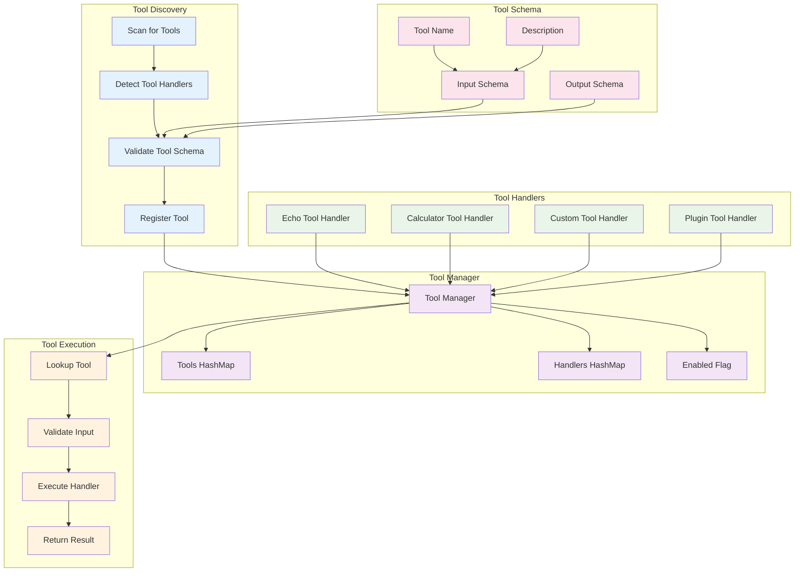
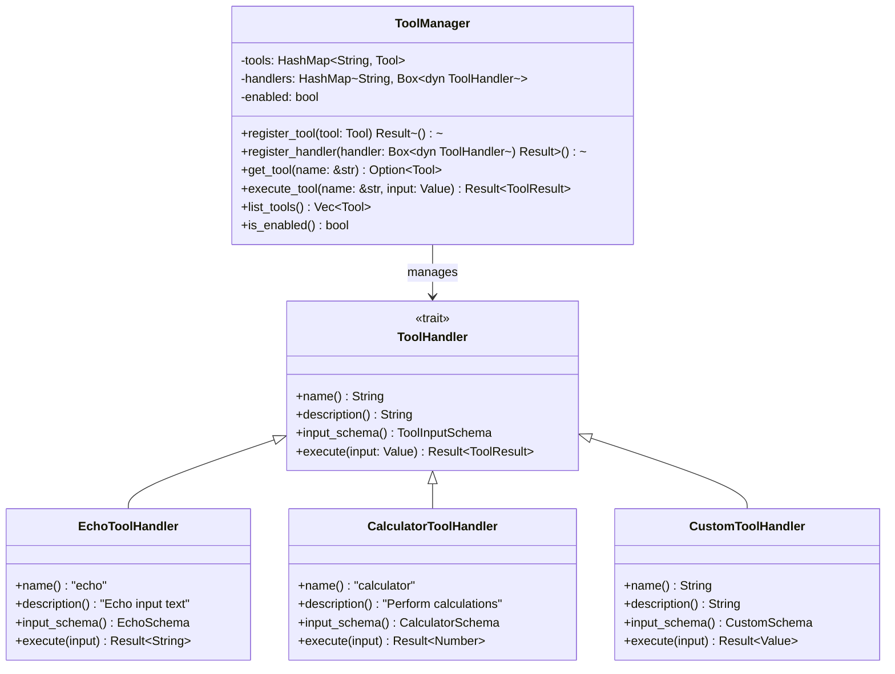

# Tool Registration Flow

This diagram shows the dynamic tool registration system and how tools are discovered, registered, and executed.



## Tool Registration Sequence

```mermaid
sequenceDiagram
    participant App as Application
    participant Builder as McpServerBuilder
    participant TM as Tool Manager
    participant Handler as Tool Handler
    participant Registry as Tool Registry
    participant Validator as Schema Validator

    Note over App, Validator: Tool Registration Process

    %% Application Setup
    App->>+Builder: Create Server Builder
    Builder->>+TM: Initialize Tool Manager
    TM->>TM: Create Empty Collections
    TM->>TM: Set Enabled = true
    TM->>-Builder: Tool Manager Ready

    %% Handler Registration
    App->>+Handler: Create Tool Handler
    Handler->>Handler: Define Tool Schema
    Handler->>Handler: Implement Execute Method
    Handler->>-App: Handler Ready

    App->>+Builder: Register Tool Handler
    Builder->>+TM: Register Handler
    
    %% Schema Validation
    TM->>+Validator: Validate Tool Schema
    Validator->>Validator: Check Required Fields
    Validator->>Validator: Validate Input Schema
    Validator->>Validator: Validate Output Schema
    
    alt Invalid Schema
        Validator-->>TM: Schema Error
        TM-->>Builder: Registration Failed
        Builder-->>App: Error Response
    end
    
    Validator->>-TM: Schema Valid

    %% Tool Registration
    TM->>+Registry: Store Tool Definition
    Registry->>Registry: Add to Tools HashMap
    Registry->>-TM: Tool Stored

    TM->>+Registry: Store Handler
    Registry->>Registry: Add to Handlers HashMap
    Registry->>-TM: Handler Stored

    TM->>TM: Log Registration Success
    TM->>-Builder: Registration Complete
    Builder->>-App: Tool Registered

    %% Dynamic Registration (Runtime)
    Note over App, Validator: Runtime Tool Registration

    App->>+TM: Register New Tool
    TM->>TM: Check if Enabled
    alt Tool Manager Disabled
        TM-->>App: Feature Disabled Error
    end

    TM->>+Validator: Validate New Tool
    Validator->>-TM: Validation Result
    
    alt Validation Failed
        TM-->>App: Validation Error
    end

    TM->>+Registry: Store Tool
    Registry->>Registry: Update Collections
    Registry->>-TM: Storage Complete

    %% Notify Clients
    TM->>TM: Trigger List Changed Event
    TM->>App: Send Notification
    Note right of App: notifications/tools/list_changed

    TM->>-App: Registration Success

    Note over App, Validator: Tool Execution Flow

    %% Tool Execution Request
    App->>+TM: Execute Tool
    TM->>TM: Check if Enabled
    TM->>+Registry: Lookup Tool
    Registry->>Registry: Find by Name
    
    alt Tool Not Found
        Registry-->>TM: Tool Not Found
        TM-->>App: Tool Error
    end
    
    Registry->>-TM: Tool Found

    TM->>+Registry: Get Handler
    Registry->>Registry: Find Handler by Name
    Registry->>-TM: Handler Retrieved

    %% Input Validation
    TM->>+Validator: Validate Input
    Validator->>Validator: Check Against Schema
    
    alt Invalid Input
        Validator-->>TM: Validation Error
        TM-->>App: Invalid Params Error
    end
    
    Validator->>-TM: Input Valid

    %% Execute Tool
    TM->>+Handler: Execute Tool
    Handler->>Handler: Process Input
    Handler->>Handler: Perform Operation
    
    alt Execution Error
        Handler-->>TM: Tool Error
        TM-->>App: Execution Failed
    end
    
    Handler->>-TM: Tool Result

    %% Result Validation
    TM->>+Validator: Validate Output
    Validator->>Validator: Check Result Format
    Validator->>-TM: Output Valid

    TM->>-App: Tool Result
```



## Tool Handler Interface



## Tool Schema Definition

```json
{
  "name": "calculator",
  "description": "Perform mathematical calculations",
  "inputSchema": {
    "type": "object",
    "properties": {
      "operation": {
        "type": "string",
        "enum": ["add", "subtract", "multiply", "divide"],
        "description": "Mathematical operation to perform"
      },
      "a": {
        "type": "number",
        "description": "First operand"
      },
      "b": {
        "type": "number",
        "description": "Second operand"
      }
    },
    "required": ["operation", "a", "b"]
  }
}
```

## Dynamic Registration Process

### 1. Initialization Phase
- Tool Manager is created with empty collections
- Built-in tool handlers are registered during server startup
- Tool schemas are validated against JSON Schema specification

### 2. Handler Registration
```rust
// Register a tool handler
let handler = Box::new(CalculatorToolHandler::new());
tool_manager.register_handler(handler).await?;

// Register the tool definition
let tool = Tool {
    name: "calculator".to_string(),
    description: "Perform calculations".to_string(),
    input_schema: calculator_schema(),
};
tool_manager.register_tool(tool).await?;
```

### 3. Runtime Registration
- New tools can be registered at runtime
- Tool list change notifications are sent to connected clients
- Thread-safe operations using RwLock for concurrent access

### 4. Tool Discovery
Tools are discovered through multiple mechanisms:
- **Static Registration**: Built-in tools registered at startup
- **Plugin System**: Dynamic loading of tool plugins
- **Configuration**: Tools defined in configuration files
- **API Registration**: Tools registered via management API

### 5. Validation Process
- **Schema Validation**: Input/output schemas validated against JSON Schema
- **Name Uniqueness**: Tool names must be unique within the server
- **Handler Verification**: Handler implementation must match tool definition
- **Security Checks**: Tool permissions and access controls

### 6. Execution Pipeline
1. **Tool Lookup**: Find tool by name in registry
2. **Input Validation**: Validate input against tool's input schema
3. **Handler Execution**: Call the tool handler's execute method
4. **Output Validation**: Validate result format
5. **Result Serialization**: Convert result to JSON-RPC response

## Tool Categories

### Built-in Tools
- **Echo Tool**: Simple text echo for testing
- **Calculator Tool**: Mathematical operations
- **File Tool**: File system operations (if enabled)
- **HTTP Tool**: HTTP request operations (if enabled)

### Custom Tools
- **Business Logic Tools**: Domain-specific operations
- **Integration Tools**: External API integrations
- **Utility Tools**: Helper functions and utilities

### Plugin Tools
- **Dynamically Loaded**: Loaded from plugin directories
- **Hot Reloadable**: Can be updated without server restart
- **Sandboxed**: Executed in isolated environments

## Error Handling

### Registration Errors
- **Schema Validation Errors**: Invalid tool schema format
- **Duplicate Name Errors**: Tool name already exists
- **Handler Errors**: Handler implementation issues

### Execution Errors
- **Tool Not Found**: Requested tool doesn't exist
- **Input Validation Errors**: Invalid input parameters
- **Execution Failures**: Tool handler execution errors
- **Timeout Errors**: Tool execution exceeded time limit

## Security Considerations

### Tool Permissions
- **Access Control**: Tools can have permission requirements
- **Resource Limits**: CPU, memory, and time limits per tool
- **Sandboxing**: Isolation of tool execution environments

### Input Sanitization
- **Schema Validation**: Strict input validation against schemas
- **Type Checking**: Runtime type validation
- **Injection Prevention**: Protection against code injection attacks

## Performance Optimization

### Caching
- **Tool Registry Caching**: In-memory tool definition cache
- **Handler Pooling**: Reuse of tool handler instances
- **Result Caching**: Cache results for deterministic tools

### Concurrency
- **Parallel Execution**: Multiple tools can execute concurrently
- **Thread Safety**: All operations are thread-safe
- **Resource Management**: Proper cleanup of tool resources
